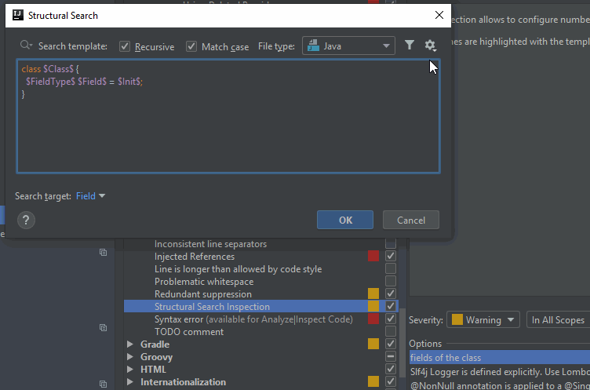

# Structural search and replace updates in IntelliJ in 2019.1

There are a few very exciting changes regarding inspections that I think improves its usability much.

The official release notes can be found here:
- [IntelliJ 2019.1](https://confluence.jetbrains.com/display/IDEADEV/IntelliJ+IDEA+2019.1+(191.6183.87+build)+Release+Notes)
- [IntelliJ 2019.1.1](https://confluence.jetbrains.com/display/IDEADEV/IntelliJ+IDEA+2019.1.1+(191.6707.61+build)+Release+Notes)

### Switch between Search and Replace templates - [IDEA-198496](https://youtrack.jetbrains.com/issue/IDEA-198496)

Now it is possible to switch between search and replace template right from the template editor,
without the need to restart the template creation just to be able to select the template type.

When switching from Search template to Replace template, the template text is copied to the replacement part.

### Exporting templates to Clipboard and importing back to the editor - [IDEA-161879](https://youtrack.jetbrains.com/issue/IDEA-161879)

There are two new options in the template editor's Configuration menu: 
- Export Template to Clipboard
- Import Template from Clipboard

Exporting a template will put the XML representation of the template to the Clipboard, and vice versa, having an XML representation
of a template on the Clipboard will be imported as a template text with the necessary filters in the editor.

Be aware that everything you had in the editor will be overwritten by importing from the Clipboard.

### Cutting and pasting a placeholder no longer loses filter configuration - [IDEA-203074](https://youtrack.jetbrains.com/issue/IDEA-203074)

From now on when you cut (remove all occurrences of) a template variable and paste it back, it keeps its filter configuration.

It seems to be working only when pasting back to the same editor, but not to other templates. In the long run it might be a nice addition to this feature. 

### Templates can be made available globally - [IDEA-168054](https://youtrack.jetbrains.com/issue/IDEA-168054)

When a template is saved using the **Configuration menu > Save Template...** option in the editor it is saved to the list of Existing templates,
but only to the current project, specifically under *\<project folder>/.idea/workspace.xml/\<component name="StructuralSearchPlugin">*.

With the change outlined in this ticket, the option is added to save templates globally, and make them available in other projects. In order to make that happen
you have to add the **ssr.save.templates.to.ide.instead.of.project.workspace** key to IntelliJ's Registry, because by default (for now) it is disabled.

NOTE: I am not aware of how it can be added via the UI, or whether it is an Ultimate Edition feature to configure it using the UI.
