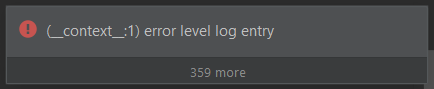

# Script filtering

I've already jumped into some magic about Script filters in the [Mockito cannot Mock/Spy final classes](https://ijnspector.wordpress.com/2019/03/25/mockito-cannot-mock-spy-final-classes/) article.
This time I will give you some general details about how Script filters work and what may be achieved with them (hint: basically anything).

Before you proceed with this article I highly recommend reading [this JetBrains support ticket](https://intellij-support.jetbrains.com/hc/en-us/community/posts/360000045970-Search-and-Replace-Structurally-Script-Constraints-Documentation-)  about Script filters.
It is a well-put-together explanation about that filter and how template variables are handled.

## Basics
The Script filter uses the Groovy language for scripting, so basically any language construct that Groovy supports may probably be used here as well.

## Defining a predicate
As the content of the filter one needs to define a predicate which will be evaluated to true or false. The `return` keyword may be used but not required.
So considering a Script filter as:

```java
AnnotationValue > 5
```

the following is also valid:
```java
return AnnotationValue > 5
```

The Script filter option also has a help tooltip which states "Non-boolean script results will be converted to boolean."

So if you return e.g. the string `"true"` or `"TRUE"` they will also be evaluated to the boolean `true`. 

## import statements

[Here](https://ijnspector.wordpress.com/2019/07/01/using-imports-in-script-filters/) you can find a bit more detailed article about the topic,
but for now it is enough to know that for scripts that require some specific classes to reference, they may be imported but
so far I've been able to import only IntelliJ specific packages.

There are a few Existing templates that also contain import statements, like the one *called fields/variables read*:

```java
Template:
    $Symbol$
    
Filter:
    import com.intellij.psi.*
    import static com.intellij.psi.util.PsiUtil.*
    Symbol instanceof PsiReferenceExpression && isAccessedForReading(Symbol)
```

Right now it is not important what is happening, it is enough to see that an IntelliJ specific class (`PsiReferenceExpression`) is imported with simple wildcard import,
and a utility method (`isAccessedForReading()`) is imported with static import.

## Referencing template variables

As you may already know, template variables can be defined by specifying a variable name within enclosing `$` characters, e.g. the one in the previous section: `$Symbol$`.

However in Script filters they can be referenced without the `$` characters like:

```java
Symbol instanceof PsiReferenceExpression
```

Also, since these variables are handled as PSI nodes, certain values may be retrieved from them (the quotes are from the aforementioned support ticket):

- `Symbol.text`: returns the text/value of the whole template variable/node
    > Say you have a SSR variable that matches a method, for example a toString() method. Then the variable is in fact a PsiMethod node. ... So naturally variable.text will give you the entire text of the method.
    - For a PsiMethod, it returns the whole text of the method, and for an annotation attribute value, it returns that value as a String.
    - Since the text is returned as a String, type conversion might be necessary for further validation as e.g. an Integer.
    
- `Symbol.value`: It returns the value of a node.
    - It is not applicable for all node types. It can be used e.g. when retrieving the value of a literal.

- `Symbol.name`: returns the name of the node, if it has one.
    - It is not applicable (for all node types, at least) for nodes whose text is a literal value:
        > ... If we just need the name of the method, variable.name will suffice. In another case the SSR variable may match some expression, for example a reference to a variable, a PsiReferenceExpression. An expression has no name of course, but retrieving the entire text of the expression, will give us the name of the variable it is referring to.

- `Symbol.parent`: returns the parent Psi... node of `Symbol`, which in case of a PsiMethod type node, is a PsiClass node:
    > Say you have a SSR variable that matches a method, for example a toString() method. Then the variable is in fact a PsiMethod node. Retrieving variable.parent will produce a PsiClass node, and so forth.

You can read more about PSI elements in the official [IntelliJ SDK DevGuide](https://www.jetbrains.org/intellij/sdk/docs/basics/architectural_overview/psi_elements.html).

## \_\_context__ variable
> The **\_\_context__** variable is an artificial variable. All variables used in a pattern can be accessed from the Script Constraints. **\_\_context__** corresponds to the Complete Match variable.

The `__context__` variable may be used in both user defined template variables and in the Complete Match variable as well, however its
meaning differs depending on where it is used.

In Script filters added to user defined template variables (the ones enclosed by `$` symbols, e.g. `$Class$`) they always mean the node represented by that
template variable, so there it doesn't matter if you refer to it by the name of the variable or by `__context__`.

- *classes* existing template:
    ```java
    Template:
        class $Class$ {}

    $Class$ Script filter:
        !__context__.interface && !__context__.enum
    ```

When `__context__` is used in the Script filter of the Complete Match variable, it always refers to the PSI type representing the whole template, regardless
of there is a user defined template variable for that type/node in the template, or there isn't one. Below you can find a few examples, in which template what
the `__context__` variable means in the Complete Match variable. 

| Existing template name                            | Template text                                                                                                                                            | \_\_context__ in Complete Match (PSI type - template variable) |
|---------------------------------------------------|----------------------------------------------------------------------------------------------------------------------------------------------------------|----------------------------------------------------------------|
| fields of class                                   | <pre>class $Class$ { <br>  $FieldType$ $Field$ = $Init$;<br>}</pre>                                                                                      | `PsiClass` - `$Class$`                                         |
| javadoc annotated methods and constructors        | <pre>/**<br> * $Comment$<br> * @$Tag$ $TagValue$<br> */<br>$Type$ $Method$($ParameterType$ $Parameter$);</pre>                                           | `PsiMethod` - `$Method$`                                       |
| javadoc tags                                      | `/** @$Tag$ $TagValue$ */`                                                                                                                               | `PsiMethod` - no template variable                             |
| try statements without resources and catch blocks | <pre>try ($ResourceType$ $resource$ = $init$; $expression$) {<br>  $TryStatement$;<br>} catch($ExceptionType$ $Exception$) {<br>  $CatchStatement$;<br>} | `PsiTryStatement` - no template variable                       |

## Complete Match filters
Filters may be written for Complete Match as well, when no template variable is selected in the editor, though "only" Script filter is allowed,
with which basically anything can be achieved.

Though I haven't been able to totally wrap my head around Complete Match filters there is a practical example I ran into.

Let's say you have a method call, and you want to iterate through its arguments in a Script filter:

```java
$someObject$.$methodCall$($arguments$);
```

If you add the Script filter for the `$arguments$` template variable it will only handle/see the first actual argument. However if you add the filter to Complete Match
it will see the whole list (so far I encountered ArrayList) of arguments on which one can easily iterate through.

At least in this case it is basically stepping back a little and seeing/inspecting the template in its entirety.

## "Debugging" Script filters

There are at least two ways one can find out what is happening inside a Script filter.

### Break the template
You can intentionally make it fail so that IntelliJ gives you an error message. This can be useful e.g. when you want to find out what Psi type a certain template variable is.
You can call a non-existent method on it, then IntelliJ will tell you that that method doesn't exist on that given Psi type.

### Write into a file
An other way is to write expression values into a file to get a type or value of something. It may be a simple Groovy script like this:

```groovy
new File("D:\\scriptfilter.txt").withWriter { out -> out.println someTemplateVariable.getType() }
```

Speaking from experience, this is not the most reliable approach to use, not in terms of the printed content of the file, but rather that writing
to a file is not always triggered, so you have to keep changing stuff in the template until it is triggered.

For a more reliable approach I recommend using the one in the next section.

### Logging to IntelliJ's Event Log
There is special variable called `__log__` which provides an interface for sending information to the Event Log. This variable is also mentioned
in the help tooltip of Script filters:


This variable is implemented in a class called [ScriptLog](https://github.com/JetBrains/intellij-community/blob/5bc2879f65aa90bc06ea43e94698058427b46f69/platform/structuralsearch/source/com/intellij/structuralsearch/impl/matcher/predicates/ScriptLog.java)
and provides the following methods for different log levels:
- `info(Object)`
- `warn(Object)`
- `error(Object)`

Within a Script filter you can simply just use them like `__log__.info('some information')`.

Upon logging there are two visual cues to know that the logging has happened:
- a log entry appears in the Event Log, having red color in case of **error** level,

- a Notification popup appears with the log message and an icon according to the log level:

| Log level | Notification popup                                                       |
|-----------|--------------------------------------------------------------------------|
| info      |    |
| warn      |    |
| error     |  |

The Event Log entry is in the following format: `(<template_variable_name>:<line_number>) <log_message>`, where
- **<template_variable_name>** is the name of the template variable whose Script filter the logging happened in.
It is logged without the enclosing $ symbols. E.g. *method* instead of *$method$*.
- **<line_number>** is the line number within the Script filter on which the logging happened. 

Since the logging methods are called every time a script filter is ran (except when it is tied to a condition in the script), make sure that
you won't spam users with a bunch of log messages and notifications.

## Take into account problematic cases, i.e. exception handling

So far I ran into two cases when exception handling is crucial, thus preventing IntelliJ from throwing exceptions and showing that to the users.

The first one is `NullPointerException` for which Groovy provides the [Safe navigation operator](http://groovy-lang.org/operators.html#_safe_navigation_operator)
so you can easily handle that.

The other one is `NumberFormatException` that can occur e.g. when converting the value of a template variable into an Integer, Double, etc. If that value is not a valid string representation
of a number, or even an entirely different kind of code snippet, this exception will be thrown.

The easiest way to deal with it and prevent showing it to the users is to return false from the script after catching the exception, like this, for a variable called `value`:

```groovy
try {
    value?.text?.toInteger() < 0
} catch (NumberFormatException e) {
    false
}
```

## PSI Viewer

For a detailed overview of the PSI Viewer built-in tool and IntelliJ plugin, head over to [this article](https://ijnspector.wordpress.com/2019/10/27/psi-viewer/).

Here's the official documentation about the tool: https://www.jetbrains.com/help/idea/psi-viewer.html but to make it a bit easier I explain how to enabled it.

Go to **Help > Edit Custom Properties...**, tell IntelliJ to create the file if it hasn't been, then add this line to the file: `idea.is.internal=true`, then restart the IDEA.

From this moment on two additional items should be available in the **Tools menu**:
- View PSI Structure...
- View PSI Structure of Current File...

## Final words

This article is a live document, and is updated when something changes, or a new feature/capability is introduced, or I just find out that I missed something that this tool is already capable of.

And last but not least, a huge Thank you! goes to **Bas Leijdekkers** who provided that great answer on the [JetBrains support ticket](https://intellij-support.jetbrains.com/hc/en-us/community/posts/360000045970-Search-and-Replace-Structurally-Script-Constraints-Documentation-).
That was the best explanation about script filters that I have so far stumbled upon. 