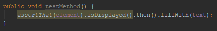

# Statements with or without semicolon

Line ending semicolons are a crucial part of the Java language: they mark the ends of statements.
They have the same importance during the creation of, and using them or not makes difference in case of, SSR templates as well

## Example

Let's have an imaginary test automation framework with fluent assertions and chained method calls with which you can assert things like
whether a WebElement is displayed, fill text fields, etc.

We want to inspect a method call, in this case an `isDisplayed()` assertion, in a chain of method calls.

Example A:
```java
assertThat(element).isDisplayed();
```

Example B:
```java
assertThat(element).isDisplayed().then().fillWith(text);
```

If we want to target the exact statement in *Example A* we may put together a template like this:

```java
assertThat($element$).isDisplayed();
```

(Right now the filters applied on the template variable are not relevant.)

If you use *Complete Match* as the **Search Target** you can see that the semicolon is highlighted too:


But if we want to target only that the `isDisplayed()` assertion is called first after `assertThat()`,
we can do that by simply removing the semicolon from the end of the template meaning that the code snippet (statement) it
searches for doesn't end there:

```java
assertThat($element$).isDisplayed()
```

It is kind of like (not) using the `$` sign at the end of regular expressions.

You can see that in case *Example A* (still using *Complete Match* as the **Search Target**) the semicolon is not highlighted:
 


And in case of *Example B* it is obvious what the matching part is:



## Final words

Use the semicolons wisely or not use them at all because either way it may be useful, especially if used in combination with Replace templates.
