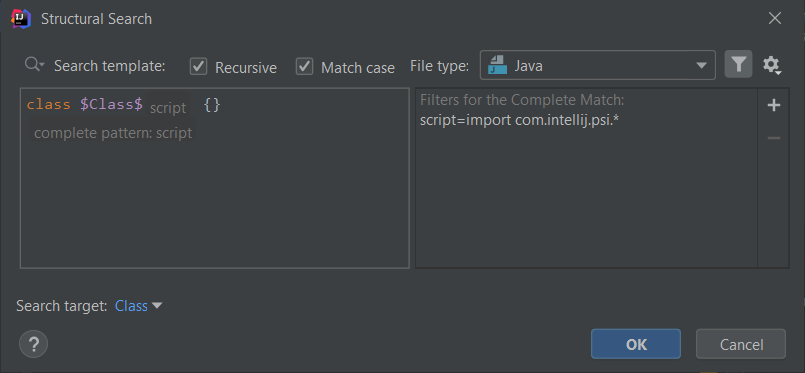

# Structural search and replace updates in IntelliJ in 2019.2

The 2019.2 version of IntelliJ has been released with a miriad of great features and improvements, and among them there are two major updates to the Structural Search and Replace templates.

### Inline template variable filters

From now on the template editor shows filters inline for all template variables regardless of the number number of them.

The following shows the built-in template called *all fields of a class*:

The only exception Script filter. Since it can be very complex and long, if one is added to the variable, only its presence is displayed but not the script text.

It is also worth mentioning that the Complete Match variable is not left out from this feature, it is always displayed at the bottom
of the template editor:

Me, who works with inspections regularly, it is a nice addition and makes my life much easier since I can have a better and quicker overview of the whole template and template configuration without needing to select each individual variable to see its filters.

I admit that for some people this inline display of filters might make understanding the template text a bit less easy but for me it worked well so far. 

However I'm going to create a JetBrains ticket to introduce an option to enable/disabled the inline filters, if there is not one already. That might be useful when the template text is long and/or complex, and when there are many template variables configured with multiple filters.

### Structural Search shows occurrences instantly

When searching via **Edit > Find > Search Structurally...-**, the editor underneath the search dialog shows the results and occurrences of our template instantly for each change in the template, without closing the search dialog.

Though this does not (yet?) work when creating permanent templates via IntelliJ Settings, this makes the designing and testing of templates much easier and less time-consuming.

I really appreciate this change since it was tiresome to close and reopen the template editor in Settings after each change I made.

If you are also interested in what new happened in other areas you can head over to the official What's New in IntelliJ IDEA page.
