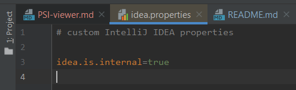
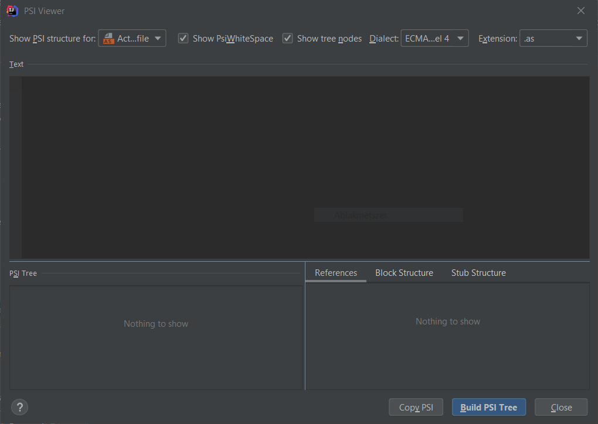
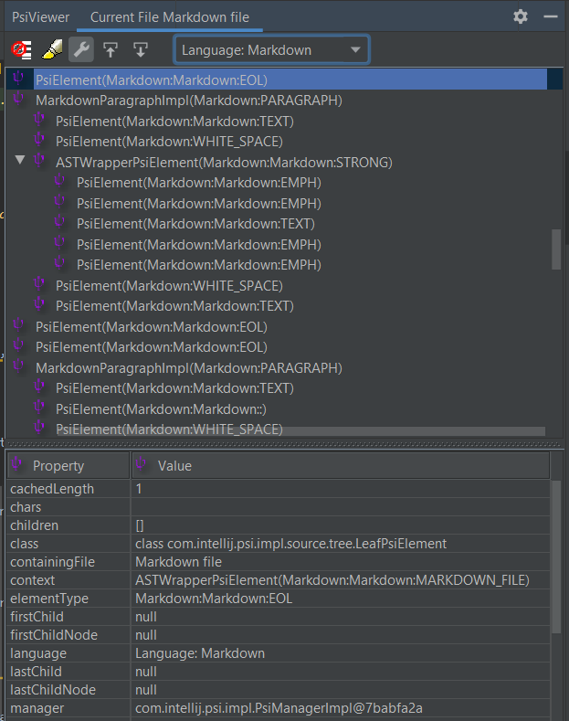

# PSI Viewer

Although I briefly mentioned the PSI Viewer, in the post called [Script filtering](https://ijnspector.wordpress.com/2019/05/21/script-filtering/),
there is more to it, so I would like dedicate this article for that in detail.

This tool can be of help for engineers who are creating/implementing inspections (or maybe even intention actions), be it
in the form of a plugin or just the XML configuration. With it one can inspect the PSI tree of files in a visual way.

To not get confused there are actually two tools called PSI Viewer. One is a tool built into Intellij whose official documentation you can
find here: [PSI Viewer documentation](https://www.jetbrains.com/help/idea/psi-viewer.html).

The other one is a plugin (see [official plugin page](https://plugins.jetbrains.com/plugin/227-psiviewer/)) which you can install via
the plugin browser.

First let's talk about the built-in one.

## PSIViewer (built-in)

### How to enable it?

Since it is turned off by default, here's how you can enable it.

Go to **Help > Edit Custom Properties...**, tell IntelliJ to create the file if it hasn't been,
then add this line to the file: `idea.is.internal=true`, then restart the IDEA.

From this moment on two additional items should be available in the **Tools menu**:
- View PSI Structure...
- View PSI Structure of Current File...

### How to use it?

When selecting **View PSI Structure...** a modal window opens up with its own empty editor.

You can select what type of file or code you want to inspect along with the potential dialect of the select language.

There are also some display options to enable/disable showing `PsiWhiteSpace` nodes and tree nodes.

Then you are good to go to write the code snippet you want to inspect. (The editor provides you many language and language code block options.)
Once you are done click the **Build PSI Tree** button and the generated tree will show up at the bottom part of the window.

It provides 3 different display options:
- References
- Block Structure (no official documentation)
- Stub Structure (official documentation on [Indexing and PSI stubs](https://www.jetbrains.org/intellij/sdk/docs/basics/indexing_and_psi_stubs.html))

The other option you can choose from the Tools menu is **View PSI Structure of Current File...**
which is pretty much the same as **View PSI Structure...** except it populates the editor with the contents of the current file,
and also builds the PSI tree immediately.

There is one thing you need to pay attention to: if you modify the code in this editor, the actual file will be modified as well.

## PsiViewer plugin

This plugin is similar to the built-in tool but it seems to provide more details than that, however it doesn't have an editor section,
which may not be necessary in this case.

You can view the PSI tree in a nice way, and for each node you can browse through the node's properties.

It can jump automatically to the node in the tree where your cursor is at in the editor and as you are altering the code the tree
is updated automatically.

## Final thoughts

It is up to everyone's taste which one they use but
1. I think the built-in tool is disabled by default for a reason,
2. it is more convenient to use the plugin (at least for me) because it can be docked and it shows the nodes' properties.
