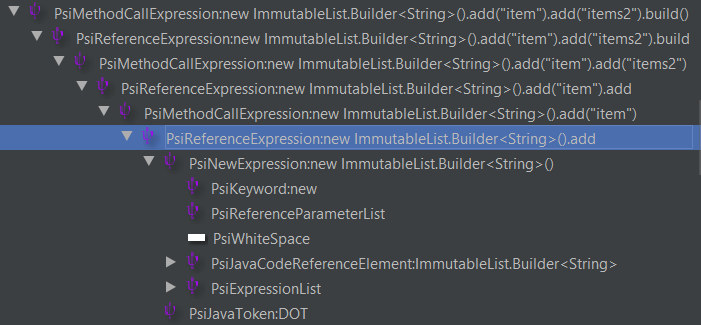
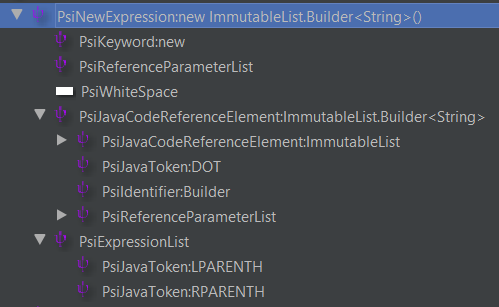
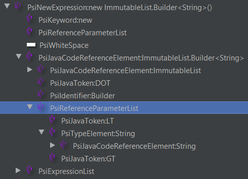
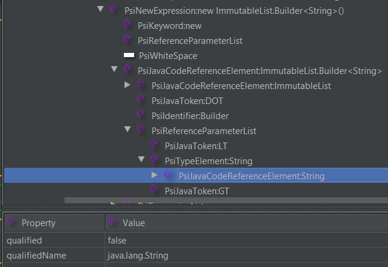
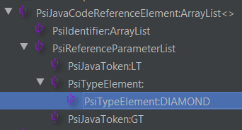
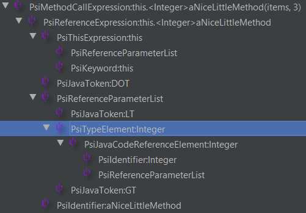

# Get generic type parameters from method calls

## Constructors

In this section, one type I am going to use for demonstration purposes is `ImmutableList.Builder` from the Google Guava library.

For constructor calls I see the following template variations that can be used:

- `new $Type$()`: matches any constructor with or without generic types, and with zero constructor parameters
- `new $Type$<>()`: matches any constructor with zero generic type, and with zero constructor parameters
- `new $Type$<$Generic$>()`: matches any constructor with 0 or more generic type parameters (depending on the Count filter configuration),
    and with zero constructor parameters 
- `new $Type$<$Generic$, $GenericOther$>()`: matches any constructor with exactly 2 generic parameters, and with zero constructor parameters.
    If more template variables are added for the generic types, then it will match constructors with that exact number of generic types.
- `new com.google.common.collect.ImmutableList.Builder<java.lang.String>().$method$($params$)`: explicitly defined type. Matches the specified constructor
    with exactly one additional method call (with any number of parameters). If any additional method call specific template variables are added, then it will
    match that exact number of method calls.
    
The PSI type of `$Generic$` may be one single PsiTypeElement (PsiTypeElement:String), or a list/array of them ([PsiTypeElement:String, PsiTypeElement:String])
depending on the number of actual generic type parameters.

As for constructor parameters, other than not specifying any, you can go with one or more template variables,
each configured with an optional Count filter with 0 or more occurrences:
    - `new $Type$($params$)`
    - `new $Type$($params$, $param2$)`

### Assignments

Of course each template variation mentioned above can be extended with template variables to make them actual variable assignments. For example:

`$Type$ $variable$ = new $Builder$<$Generic$>();` (without the line-ending semicolon the template would be invalid), will match as follows:

- Matches: `ImmutableList.Builder<String> builder = new ImmutableList.Builder<String>();`
- Doesn't match: `List<String> items = new ImmutableList.Builder<String>().add("item").add("items2").build();` (With one or more additional method calls after the constructor).

See the related IDEA tickets: [IDEA-178110](https://youtrack.jetbrains.com/issue/IDEA-178110), [IDEA-197092](https://youtrack.jetbrains.com/issue/IDEA-197092).

For additional method calls you can use the following templates:

| Template | Comments |
|---|---|
| `$Type$ $variable$ = $Builder$($params$);` | It matches regular method calls as well, besides constructors. |
| `$Type$ $variable$ = new $Builder$($params$).$method$($param$);` | `$params$` and `$param$` having a Count filter [0,inf]. |
|  | It would match a code snippet with only one additional method call: `ImmutableList.Builder<String> builder = new ImmutableList.Builder<String>().add("item")` |
|  | But won't match one with multiple additional method calls: `List<String> items = new ImmutableList.Builder<String>().add("item").add("items2").build();` |

### Examples

Here you can find some examples for what code parts different templates match (marked as bold the parts that match): 

| Template text | Code matching |
|---|---|
| `new $Type$()` | `List<String> items = `**`new ImmutableList.Builder<String>()`**`.add("item").add("items2").build();` |
|  | **`new ImmutableList.Builder<String>()`** `.add("item").add("items2").build();` |
|  | `ImmutableList.Builder<String> items = `**`new ImmutableList.Builder<String>()`**; |
|  | **`new ImmutableList.Builder<String>()`**; |
|  | **`new ArrayList<String>()`**; |
|  | **`new Object()`**; |
| `new $Type$<>()` | `List<String> items = `**`new ArrayList<>()`**; |
|  | **`new ArrayList<>()`**; |
| `new $Type$<$Generic$>()` | The number of generic type parameters matching depends on the Count filter configuration applied to `$Generic$`. |
|  | `List<String> items = `**`new ImmutableList.Builder<String>()`**`.add("item").add("items2").build();` |
|  | **`new ImmutableList.Builder<String>()`**`.add("item").add("items2").build();` |
|  | `ImmutableList.Builder<String> items = `**`new ImmutableList.Builder<String>()`**`;` |
|  | **`new ImmutableList.Builder<String>()`**`;` |
|  | **`new ArrayList<String>()`**`;` |
|  | `new Object();` |

### Script filter and PSI

Calls to constructors in most cases (not including the `this` and `super` keywords) involves using the `new` keyword for which IntelliJ has the `PsiNewExpression` PSI type.

Consider the following variable assignment:
```java
List<String> items = new ImmutableList.Builder<String>().add("item").add("items2").build();
```

The PSI tree of this call chain can be traversed the way I mentioned in the article referenced at the beginning, but with one difference: almost at leaf
position you can find a `PsiNewExpression` for `new ImmutableList.Builder<String>()`.



In that you can find the following elements and information:
- a `PsiKeyword` for `new`,
- a `PsiJavaCodeReferenceElement` for the constructor call including the generic type: `ImmutableList.Builder<String>()`.
This element can be retrieved via the `PsiNewExpression.classOrAnonymousClassReference` or `PsiNewExpression.classReference` properties. (They might have the same value.)
- a `PsiExpressionList` containing the constructor parameters, if there's any.



From the `PsiJavaCodeReferenceElement` representing the constructor call, you can find the generic parameters in an underlying `PsiReferenceParameterList`,
which is the last child, so can be retrieved by getting the `PsiJavaCodeReferenceElement.lastChild` property.



At this point you have multiple choices depending on whether you need the fully qualified name of the generic parameter(s) or just their simple names, or something else of them completely

In case of the fully qualified name you can query the underlying `PsiJavaCodeReferenceElement` and get its `qualifiedName` property.



At this stage your Script filter might look something like this:

```groovy
import com.intellij.psi.*;

String type = genericConstructorParamOf(findFirstMethodCall())

PsiMethodCallExpression findFirstMethodCall() {
    PsiExpression methodCall = setterMethod
    
    while (methodCall instanceof PsiMethodCallExpression) {
        methodCall = methodCall.firstChild?.firstChild
    }
    methodCall
}

String genericConstructorParamOf(PsiMethodCallExpression expr) {
    expr
        .firstChild //PsiReferenceExpression: new ImmutableList.Builder<String>().add
        .firstChild //PsiNewExpression: new ImmutableList.Builder<String>()
        .classReference //PsiJavaCodeReferenceElement: ImmutableList.Builder<String>
        .lastChild //PsiReferenceParameterList - result: the object storing the collection of generic types
        .typeArguments[0] //PsiType - result: the first generic type
        .canonicalText //the qualified name of the generic type
}
```

If the constructor has no explicitly defined type parameter, then the PSI tree looks a bit different. Instead of a generic type parameter, `PsiTypeElement`, holding
a concrete type, it is set as a special value, `DIAMOND`.

```java
List<String> elements = new ArrayList<>();
```



Take into account that additional checks and exception handling might also be needed depending on how the method calls, that you are developing the inspections for, can be used.

## Method calls

When it comes to retrieving the generic types of regular method calls, you can basically do it the same way as for constructors, but instead of getting
them from a `PsiNewExpression`, it is the last `PsiReferenceExpression` in the PSI tree branch that stores the type in a `PsiReferenceParameterList`. 

Consider the following Java snippet:

```java
{
    this.<Integer>aNiceLittleMethod(items, 3);
}

private <T> void aNiceLittleMethod(List<String> items, T iAmGeneric) {
}
```

The PSI structure for the method call is as follows (having the generic type parameter highlighted):



You can retrieve the type parameters by querying the `PsiReferenceExpression.typeParameters` property and providing it the desired parameter index.

```groovy
import com.intellij.psi.*;

String type = genericConstructorParamOf(findFirstMethodCall())

PsiMethodCallExpression findFirstMethodCall() {
    PsiExpression methodCall = setterMethod
    
    while (methodCall instanceof PsiMethodCallExpression) {
        methodCall = methodCall.firstChild?.firstChild
    }
    methodCall
}

String genericParamOf(PsiMethodCallExpression expr) {
    expr
        .firstChild //PsiReferenceExpression: this.<Integer>aNiceLittleMethod
        .typeParameters[0] //PsiType: Integer 
        .canonicalText //the qualified name of the generic type
}
```
