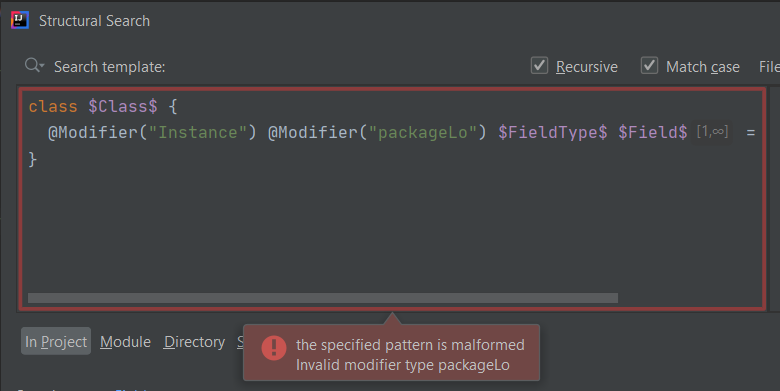

# @Modifier annotation

The official [Structural Search and Replace documentation](https://www.jetbrains.com/help/idea/structural-search-and-replace-examples.html#a3c23264) mentions the ability to use a special annotation,
called `@Modifier` within the template text which states

> ... the @Modifier annotation, which helps describe search target, when there is no way to express it using the natural language means.

This means that, for fields, methods and class you can explicitly use the common modifiers such as `abstract`, `final`, `protected`, etc.
but for the ones that are package-private and/or instance ones, the `@Modifier` annotation is necessary.

## Package-private elements

Package-private fields, methods and classes can be expressed with the following templates.

**package-private fields** (this is also part of the Existing templates):
```java
@Modifier("packageLocal") $FieldType$ $Field$ = $Init$;
```

**package-private methods of a class** (example from the official documentation):
```java
class $Class$ {
    @Modifier("packageLocal") $ReturnType$ $MethodName$($ParameterType$ $Parameter$);
}
```

**package-private classes**:
```java
@Modifier("packageLocal") class $Class$ {}
```

## Instance fields and methods

Instance fields and methods can be expressed with the following templates.

**instance fields of a class** (this is also part of the Existing templates):
```java
class $Class$ {
    @Modifier("Instance") $FieldType$ $Field$ = $Init$;
}
```

**instance methods of a class**
```java
class $Class$ {
    @Modifier("Instance") $ReturnType$ $MethodName$($ParameterType$ $Parameter$);
}
```

**instance initializers** (this is also part of the Existing templates):
```java
@Modifier("Instance") {
    $Statement$;
}
```

## Multiple annotation values

Multiple `@Modifier` annotations or annotation values can be defined for the same field, method or class definition, but it
matters in what form they are defined.

Defining multiple `@Modifier` annotations means a logical AND relationship between them, so a definition like

```java
@Modifier("Instance") @Modifier("packageLocal")
```

will result in finding all e.g. fields that are both instance and package-private fields.

Meanwhile, defining the value within an annotation as

```java
@Modifier({"Instance", "packageLocal"})
```

results in finding all e.g. fields that are either instance or package-private fields.

## Other @Modifier annotation values

Other than `Instance` and `packageLocal`, other modifier keywords may also be provided to the annotation, the supported modifier types
can be found in `com.intellij.structuralsearch.impl.matcher.JavaMatchingVisitor#MODIFIERS`, which are the following:

public, protected, private, static, abstract, final, native, synchronized, strictfp, transient, volatile, default

It is important to note that the modifier type values are case-sensitive.

It's just a hard guess but using the actual Java keywords where it is possible, rather than using them via the `@Modifier` annotation might result in a tiny bit
better performance of the template, because it should be easier and faster to process the keywords themselves than processing the annotation.

## Incorrect annotation values

The editor validates the value provided to the `@Modifier` annotation, so in case an incorrect value is set, it shows an error message like the following:



You can find the validation logic for the modifier types in the template editor at `com.intellij.structuralsearch.JavaStructuralSearchProfile#checkModifier(String)`.

## IntelliJ internals
The following is a not comprehensive list of references to IntelliJ internals that are related to the annotation detailed in this article:

- `com.intellij.structuralsearch.MatchOptions#MODIFIER_ANNOTATION_NAME`
- `com.intellij.structuralsearch.MatchOptions#INSTANCE_MODIFIER_NAME`
- `com.intellij.psi.PsiModifier#PACKAGE_LOCAL`
- `com.intellij.structuralsearch.impl.matcher.JavaMatchingVisitor#visitModifierList(PsiModifierList)`
- `com.intellij.structuralsearch.impl.matcher.compiler.GlobalCompilingVisitor#addFilesToSearchForGivenWord()`
