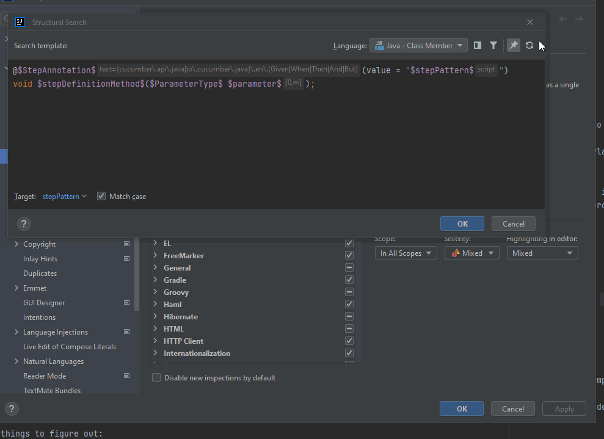

# Replacement variables in Replace Templates

In its simplest form, Replace Templates can be built in a way that the replacement reuses template variables that are defined
in the search template or provides hardcoded values. However, it is possible to provide replacement values as a result of
executing custom logic.

To achieve this you need two things:
- define a (or more) template variable in the replace template part of the inspection. Give it a name that no variable has in the search template part.
This is called a **Replacement variable**.
- add a Script Filter to it (this is the only filter option here) with the desired logic, and make sure the script returns a value,
because that is the value the variable will be replaced with when the quick fix is applied.

## Example

I'm going to use Cucumber-java step definition methods as an example for demonstration.

Let's say you have a step definition method with a Cucumber expression as the step pattern, in which one of the parameter placeholders
has either the opening or curly brace missing:

```java

@Then("the int} image should point to {string")
public void the_image_should_point_to(int index, String url) {
}
```

For this problem you can find the inspection [here](../../inspections/cucumber.md#step-pattern-contains-incomplete-parameter-placeholder).

In its simplest form this inspection is implemented as a Search template, only highlighting the problematic part (the step pattern) but not providing
any quick fix for that. How good that would be!

Let's convert the Search template to a Replace template and implement a Script filter that will correct the step pattern for us.

### The Replace template

The Search template currently is

```java
@$StepAnnotation$(value = "$stepPattern$")
void $stepDefinitionMethod$($ParameterType$ $parameter$)
```

where `$StepAnnotation$` is configured with a Text Filter for the annotation package and name, and `$stepPattern$` is configured with a Script Filter to validate
the pattern's correctness.


You can easily convert it to a Replace template by selecting the **Switch to Replace** option in the **Tools** menu.
This adds the Replace template part to the template editor, and changes the XML representation of the inspection from `searchConfiguration` to `replaceConfiguration`.



It can be done vice versa, so if a Replace template needs to be converted to a Search template, you can use the **Switch to Search** option in the **Tools** menu.

The Replace template part needs to be implemented taking into account the Search Target as well because the quick fix will be applied to the PSI element that the Search
Target represents.

Since our Search Target is `stepPattern` we will need to define a replacement variable for a String literal, which can be a template like this:

```java
"$correctedPattern$"
```

You can see that this variable is named so that it is not present in the Search template part.

In the XML representation it is not stored as a `contstraint` tag but as a `variableDefinition`.


The next step is to add a Script filter to this variable that is going to parse the incorrect step pattern, do some magic with it, and return the corrected pattern String.

In some cases you might find that the replace template part is shown as invalid, but despite that you can save the template. I think it may have something
to do with the template's File Type but I'm not sure what exactly.

## Applying the quick fix

When the quick fix is about to be applied you can see that the suggested quick fix value has already been calculated by the
Script filter. Upon selecting that option the step pattern gets replaced with the new value.


## Variable without Script filter

Although it is not invalid to save a template with a replacement variable not having a Script filter, since
there is no specific value assigned to it, it will simply return null.

But first, the editor warns you that the Script filter is missing for a given variable. 


