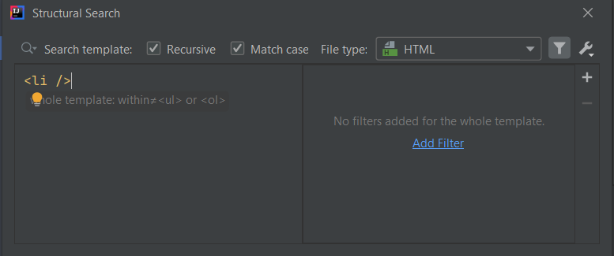
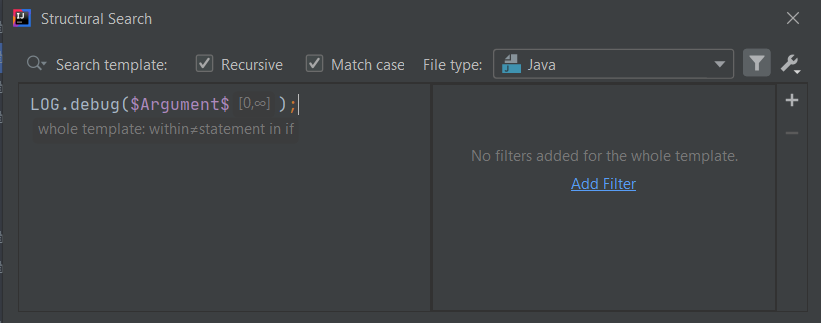

# Contained in constraints

IntelliJ 2018.3 brought with itself a [new GUI](https://ijnspector.wordpress.com/migration-to-intellij-2018-3-ssr-editor/) for Structural Search and Replace templates,
which incorporates a completely different structure.

With this update however, (at least) one particular feature was removed from the editor (but is still available under the hood), because it was rarely used,
and that is the **Contained in constraints** field for the Complete Match variable.

I know very little about this feature and the syntax behind it but what seems to be clear, that you can provide expressions (or other existing templates) for the whole template
which will match or, in case of negation, not match the template to be contained by certain language elements, like statements within a Java if statement,
or certain XML elements inside other XML elements.

## Examples

There are a few existing templates that use this feature:

**\<li> not contained in \<ul> or \<ol>** for HTML



You can see that there is a constraint called **within** present in the template, however its expression cannot be viewed or edited.

Also, in its XML representation there are two things that are related to this constraint:

```xml
<searchConfiguration name="&lt;li&gt; not contained in &lt;ul&gt; or &lt;ol&gt;" text="&lt;li /&gt;" recursive="true" caseInsensitive="true" type="HTML">
    <constraint name="__context__" negateWithin="true" within="&lt;ul&gt; or &lt;ol&gt;" contains="" />
</searchConfiguration>
```

One is the `within` attribute of the `<constraint>` tag which stores the name of another existing template (`<ul> or <ol>`) within which it is applied,
and the `negateWithin` attribute in case the constraint is negated.

- **logging without if** for Java



This is quite similar to the previous template. The "only" difference is that this is for the Java language.

```xml
<searchConfiguration name="logging without if" text="LOG.debug($Argument$);" recursive="true" caseInsensitive="true" type="JAVA" pattern_context="default">
    <constraint name="__context__" negateWithin="true" within="statement in if" contains="" />
    <constraint name="Argument" minCount="0" maxCount="2147483647" within="" contains="" />
</searchConfiguration>
```

## Contained in constraint on user-defined variables

Although, as I recall, the **Contained in constraint** option was not available for user-defined variables, only for Complete Match, the presence of the `within` attribute
in `<constraint>` tags with its empty String value suggests that either there is a way to define such constraint on them, or that it is left there only for backward compatibility reasons.

This is a candidate for more investigation. I will update this section when I find more information on this topic.

## Connection to Reference filters

It might be a valid question whether the Contained in constraint has any connection to Reference filters.
However I wouldn't say it does.

So far, my experience is that this is a different kind of constraint that you can apply than Reference filters. Reference filters check the nature of
user-defined variables rather than what they are or are not surrounded with.

## Resources

You can find a few examples for this feature at:
- [Using 'Contained in Constraints' field in a search](https://www.jetbrains.com/help/idea/structural-search-and-replace-examples.html#056908d5)
- [An interesting question about Structural search "Contained in constraints" syntax](https://intellij-support.jetbrains.com/hc/en-us/community/posts/115000085384-An-interesting-question-about-Structural-search-Contained-in-constraints-syntax)
- [SSR - Is "Contained in Constraints" editable from GUI?](https://intellij-support.jetbrains.com/hc/en-us/community/posts/360008448540-SSR-Is-Contained-in-Constraints-editable-from-GUI-)

In case you would like to dive into the soul of this feature checking out `com.intellij.structuralsearch.MatchVariableConstraint` within the [IntelliJ Community project](https://github.com/JetBrains/intellij-community)
might be a good place to start.
