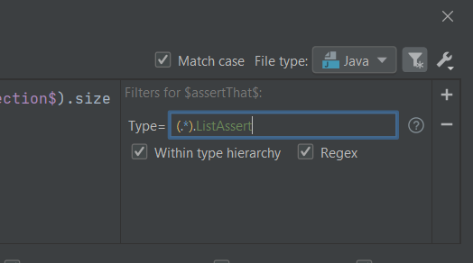

# Using regex groups in Replace templates

There is a JetBrains YouTrack ticket, [IDEA-194766](https://youtrack.jetbrains.com/issue/IDEA-194766) that suggests
that regex groups of Text Filters can be targeted by using indexed template variables, e.g. `$var_1$` for a variable named `$var$`.

And meanwhile it has been fixed in [IDEA-243232](https://youtrack.jetbrains.com/issue/IDEA-243232), see [GitHub commit](https://github.com/JetBrains/intellij-community/commit/345f5a1d121979763d007b8041ff79516edc770a) as well,
and is now available and works in IntelliJ 2020.2.

## Indexed variables

Let's say you'd like to standardize AssertJ assertions for collections, and you want to replace calls like

```java
Assertions.assertThat(aCollection).size().isGreaterThan(5);
```

to

```java
Assertions.assertThat(aCollection).hasSizeGreaterThan(5);
```

The problem is that there are multiple size assertions for collections, but you don't want to create a separate template for each assertion,
rather handle all of them unified in one template. This saves you time of implementing and maintaining this inspection, and saves anyone time and effort
to include them in their projects, and later potentially update them when/if necessary.

In case of creating separate inspections for each of them, a template would look something like this:

**Search template:**

```java
org.assertj.core.api.Assertions.assertThat($collection$).size().isGreaterThan($value$);
```

**Replace template:**

```java
org.assertj.core.api.Assertions.assertThat($collection$).hasSizeGreaterThan($value$);
```

But when it comes to unifying all possible cases you can go with a template like this:

**Search template:**

```java
org.assertj.core.api.Assertions.assertThat($collection$).size().$assertion$($value$);
```

where a Text Filter is added to `$assertion$` with value `is(.*)`, or if you want to be more specific you can include all possible values in the capturing group.

**Replace template:**

```java
org.assertj.core.api.Assertions.assertThat($collection$).hasSize$assertion_1$($value$);
```

Then, in the replace template you replace `$assertion$` with `hasSize$assertion_1$`, where `$assertion_1$` will be resolved to the value of the first capturing from `$assertion$`'s Text Filter.

So, it doesn't matter if the assertion is `isLessThan()`, `isGreaterThan()`, or something else, it will be replaced with the appropriate `hasSize...()` assertion.

Any number is allowed as the index of a variable (the index of the capturing group), starting from 1.

One important note is that, although the returned value of replacement variables can be defined via Script filters, in this case make sure that you don't add a Script filter
for the variable, just define the variable in the Replacement part of the template. 

The XML below is a complete replace template for the inspection in this section:

```xml
<replaceConfiguration name="AssertJ size assertion" text="org.assertj.core.api.Assertions.assertThat($collection$).size().$assertion$($value$);" recursive="false" caseInsensitive="true" type="JAVA" pattern_context="default" reformatAccordingToStyle="true" shortenFQN="true" replacement="org.assertj.core.api.Assertions.assertThat($collection$).hasSize$assertion_1$($value$);">
  <constraint name="__context__" within="" contains="" />
  <constraint name="collection" within="" contains="" />
  <constraint name="value" within="" contains="" />
  <constraint name="assertion" regexp="is(.*)" within="" contains="" />
  <variableDefinition name="assertion_1" />
</replaceConfiguration>
``` 

## Resolving capturing groups in non-Text Filters

Besides Text filters, regex capturing groups defined in the values of Type Filters can also be resolved by indexed replacement variables.

But make sure that the **Regex** checkbox is ticked on the UI for the Type Filter.

 

## Not supported features

### Variables for named capturing groups

Named capturing groups are not supported at the moment, but it may have some potential to have support for that.

In theory, it could be similar to the indexed variables but instead of indexing the referenced template variable, they could be postfixed with the capturing groups' names.

### Regex replacement variables used in Search template

Although it may have potential to use indexed replacement variables in the Search template part of a template,
IntelliJ doesn't have support for that as of version 2020.2.

In the Search template part it is handled simply as another template variable, and not as the specialized version of an already existing one.
