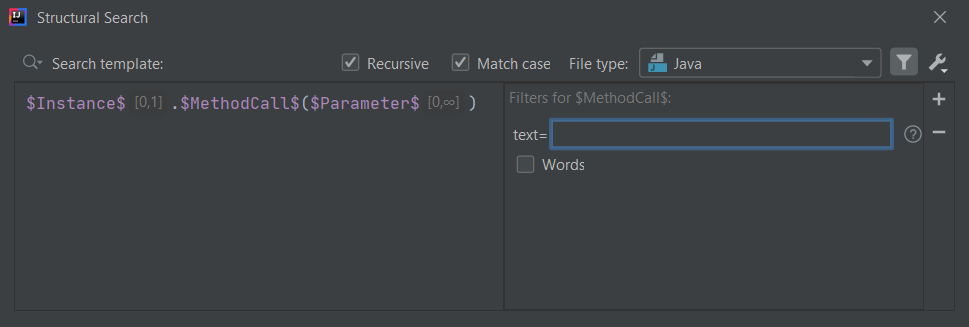
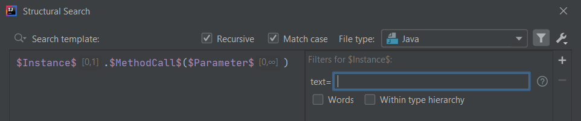

# Text filter

The Text filter is one of the 5 filter types that may be added to user defined variables in Structural Search and Replace templates.

According to the [official documentation](https://www.jetbrains.com/help/idea/search-templates.html#text_filter):
> The Text filter checks the variable against regular expressions or plain text.

## Configuration

Let's consider the following *method call* template:

```java
$Instance$.$MethodCall$($Parameter$)
```

To filter for the text of a template variable/PSI node, you can use the **Text filter** to define the constraint.

The Text filter has 3 configuration options:
- **text**: the actual filter value, a regex
- **Words**: you can match against whole words
- **Within type hierarchy**: to also handle subtypes of a given type



## Text

In this field you can specify a regex pattern that is going to be matched against the text of the template variable, or more specifically
the actual language element that the variable is resolved to.

Matching against different nodes' texts differs depending on the type of the PSI node.

### Targeting literal values

In case of targeting String literals there are two ways to define variables:
- `$variable$`: in this case the variable can mean nodes other than String literals too
- `"$variable$"`: specified between double-quotes. In this case the variable will only match if a String literal is found.

In both cases, if there is an input String e.g. `"stringLiteral"`, both of their texts will be `"stringLiteral"` including the double-quotes.

When it comes to number and boolean literals the text of variables for input values like `3` (as Integer) or `false` (as boolean) will be
`3` and `false`, both as Strings, without double-quotes.

### Type references: classes, interfaces, enums

If you consider the above mentioned *method call* template, the `$Instance$` variable may be an instance of a type, or a type itself as well.

In the latter case you have to take into account that a type's, e.g. `java.lang.String`, text is not just `String` but the fully qualified name `java.lang.String`,
so you need to make sure the text pattern you specify matches against that fully qualified name.

### Invert condition

You can invert the condition by adding an `!` (exclamation mark) at the beginning of the filter value, like `!java.lang.String`:

```xml
<constraint name="Instance" regexp="java.lang.String" minCount="0" negateName="true" within="" contains="" />
```

## Words

Enabling this option results in performing a "whole words only" search (quoting from [regular-expressions.info](https://www.regular-expressions.info/wordboundaries.html)).

In that case the actual regex pattern will not be the one that you specify as the filter value, but that value is embedded in additional regex:

```java
.*?\\b(?:" + realRegexp + ")\\b.*?;
```

where `realRegexp` is a variable that has the value specified in the filter.  

You can find the related code in `com.intellij.structuralsearch.impl.matcher.predicates.RegExpPredicate#compilePattern`.

So, as a result, specifying the filter value as e.g. `word` and enabling the Words option, it will match the following input value:

```java
this.someMethod("this is a word");
```

but not this one

```java
this.someMethod("this is a longerword");
```

## Within type hierarchy

When a template variable corresponds to a Java type (class, interface, enum, record) name, there is an additional option in the filter called **Within type hierarchy**.



When this option is enabled, subtypes of the specified type (but not supertypes) are also considered during match, contrary to when it is disabled, in that case
code elements are matched only against that specific type.

```xml
<constraint name="Instance" regexp="java.lang.String" withinHierarchy="true" minCount="0" within="" contains="" />
```

## Text filter UI

If you are interested in the Text filter's UI structure you can check out the `com.intellij.structuralsearch.plugin.ui.filters` package,
specifically the class `TextFilter`. 
