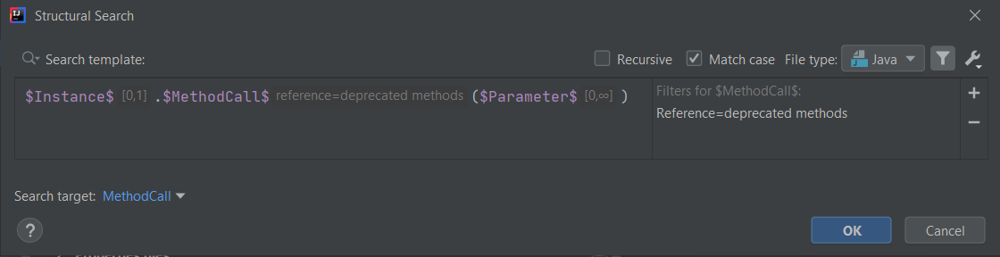

# Reference filter

The Reference filter is one of the 5 filter types that may be added to user defined variables in Structural Search and Replace templates.

According to the [official documentation](https://www.jetbrains.com/help/idea/search-templates.html#reference_filter):
> The Reference filter lets you reference some other search template in the variable.

## Configuration



The reference will always contain the name of a preconfigured or saved template, and you can use auto-completion to fill out this field.

One example is the **method calls to deprecated methods** existing template:

```java
$Instance$.$MethodCall$($Parameter$)
```

with its XML representation:

```xml
<searchConfiguration name="method calls to deprecated methods" text="$Instance$.$MethodCall$($Parameter$)" recursive="true" caseInsensitive="true" type="JAVA" pattern_context="default">
    <constraint name="__context__" within="" contains="" />
    <constraint name="Instance" minCount="0" within="" contains="" />
    <constraint name="MethodCall" reference="deprecated methods" target="true" within="" contains="" />
    <constraint name="Parameter" minCount="0" maxCount="2147483647" within="" contains="" />
</searchConfiguration>
```

You can see that the `$MethodCalls$` variable stores as reference the name of the **deprecated methods** existing template, whose template text is:

```java
@Deprecated
$ReturnType$ $Method$($ParameterType$ $Parameter$);
```

### Selecting a template as Reference filter

When editing a Reference filter of a template variable, a code-completion list is displayed upon typing,
and can also be triggered using the **Ctrl+Space** shortcut key.

This list displays all templates found for the typed keyword, not only the ones that may actually be valid/usable for the given template variable's actual type.

### Invert condition

You can invert the condition by adding an `!` (exclamation mark) at the beginning of the filter value, like `!deprecated methods`,
which in the XML representation adds the `negateReference="true"` attribute to the template:

```xml
<constraint name="MethodCall" reference="deprecated methods" target="true" negateReference="true" within="" contains="" />
```

This will find all non-deprecated method calls.

### Referencing between languages

Referencing also works between different programming/markup languages. If you take, for instance, the existing template called
**xml attribute referencing Java class**:

```xml
<$tag$ $attribute$="$value$"/>
```

it, in its `$value$` variable, references the template called **classes, interfaces & enums**:

```java
class $ClassInterfaceEnum$ {}
```

To also give an actual example, this template will mark the following XML snippet:

```xml
<sometag attr="com.myproject.AwesomeClass" />
```

but not

```xml
<sometag attr="AwesomeClass" />
```

so in this case, it must be defined with the fully qualified name in order to match.

### "Invalid" templates as References

When one selects as a reference a template that is not applicable for the template variable (or the underlying PSI element), nothing will happen,
simply the template will not match against any code snippet.

## Reference filter UI

If you are interested in the Reference filter's UI structure you can check out the [`com.intellij.structuralsearch.plugin.ui.filters`](https://github.com/JetBrains/intellij-community/tree/master/platform/structuralsearch/source/com/intellij/structuralsearch/plugin/ui/filters) package,
specifically the class [`ReferenceFilter`](https://github.com/JetBrains/intellij-community/blob/master/platform/structuralsearch/source/com/intellij/structuralsearch/plugin/ui/filters/ReferenceFilter.java). 

## Closing thoughts

There are a few uncertainties as to how exactly the Reference filter works under the hood, so please take the contents of this article with a grain of salt,
and if you encounter different behaviour somewhere, please let me know.
