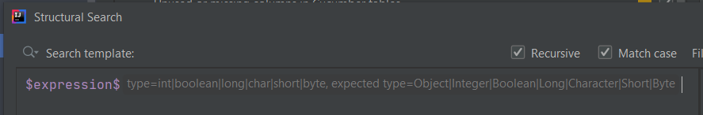

# Expected/Formal type filter

There are a few, boxing/unboxing (and even casting) related, Existing templates that contain a filter configuration that,
although is not customizable via the editor, it is still displayed to the users, and can be configured via the XML representation of templates These are:

- boxed expressions
- unboxed expressions
- boxing in method calls
- unboxing in method calls

In the editor it is displayed as **Expected type**, while in the XML representation it is called `nameOfFormalType`. Given the template called *boxed expressions*,
it looks like as follows:

**Editor:**



**XML template:**

```xml
<searchConfiguration name="boxed expressions" text="$expression$" recursive="true" caseInsensitive="true" type="JAVA" pattern_context="default">
    <constraint name="__context__" within="" contains="" />
    <constraint name="expression" nameOfExprType="int|boolean|long|char|short|byte" nameOfFormalType="Object|Integer|Boolean|Long|Character|Short|Byte" within="" contains="" />
</searchConfiguration>
```

This value can be a regular expression (like the one above), the name of a type (Boolean), or a fully qualified name of a type (com.project.SomeType, or the one below):

```xml
<searchConfiguration name="boxed expressions" text="$expression$" recursive="true" caseInsensitive="true" type="JAVA" pattern_context="default">
    <constraint name="__context__" within="" contains="" />
    <constraint name="expression" nameOfExprType="int" nameOfFormalType="java.lang.Integer" within="" contains="" />
</searchConfiguration>
```

You can find some configuration logic in the class [`com.intellij.structuralsearch.MatchVariableConstraint`](https://github.com/JetBrains/intellij-community/blob/master/platform/structuralsearch/source/com/intellij/structuralsearch/MatchVariableConstraint.java)
within the intellij-community GitHub project.

## Negate the expression

It is also possible negate the expression, although not via the editor.

You can add the `negateFormalType` attribute to the desired template variable as `negateFormalType="true"`:

```xml
<searchConfiguration name="boxed expressions" text="$expression$" recursive="true" caseInsensitive="true" type="JAVA" pattern_context="default">
    <constraint name="__context__" within="" contains="" />
    <constraint name="expression" nameOfExprType="int|boolean|long|char|short|byte" nameOfFormalType="Object|Integer|Boolean|Long|Character|Short|Byte" negateFormalType="true" within="" contains="" />
</searchConfiguration>
```

## Expected type filter without a Type filter

The Expected type filter works without the regular Type filter too, in that case given the following simple template text and code snippet:

```
$expression$
```

```java
Integer number = 32;
```

the highlighted part will be `32`.

## Casting

As it turns out, besides boxing/unboxing, the Expected type filter works for regular casting as well.

Let's say you have a class and a subclass of it:

```java
class SuperClass {
}

class SubClass extends SuperClass {
}
```

With the following template configuration:

```xml
<searchConfiguration name="Casting to SubClass" text="$expression$" recursive="true" caseInsensitive="true" type="JAVA" pattern_context="default">
    <constraint name="__context__" within="" contains="" />
    <constraint name="expression" nameOfExprType="com\.project\.SuperClass" nameOfFormalType="com.project.SubClass" within="" contains="" />
</searchConfiguration>
```

- Type filter value: `com.project.SuperClass` (on the UI), `com\.project\.SuperClass` (in the XML)
- Expected type filter value: `com.project.SubClass` 

the following code snippet, specifically the `superClass` expression, will be marked as problematic:

```java
SuperClass superClass = new SubClass();
SubClass subClass = (SubClass) superClass;
```

## Within hierarchy

Setting the `formalTypeWithinHierarchy="true"` constraint attribute as well, any target type within a class's hierarchy will also be taken into account.

So, for example, using the previous examples and having one additional class:

```java
class SubSubClass extends SubClass {
}
```

both of the following `superClass` expressions will be highlighted:

```java
SuperClass superClass = new SubClass();

SubClass subClass = (SubClass) superClass;
SubSubClass subSubClass = (SubSubClass) superClass;
``` 

## Additional resources

If you are looking for how the Existing templates are configured under the hood, you can look into [`com.intellij.structuralsearch.JavaPredefinedConfigurations`](https://github.com/JetBrains/intellij-community/blob/master/java/structuralsearch-java/src/com/intellij/structuralsearch/JavaPredefinedConfigurations.java)
in the intellij-community GitHub project.

If you want to know more about other hidden filter types, you can also check out the article called [Contained in constraints](../44-contained-in-constraints/44-contained-in-constraints.md).
