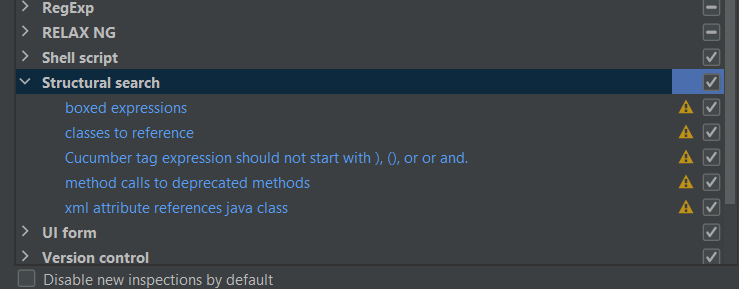
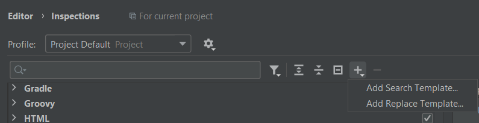
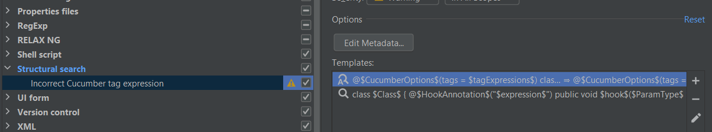
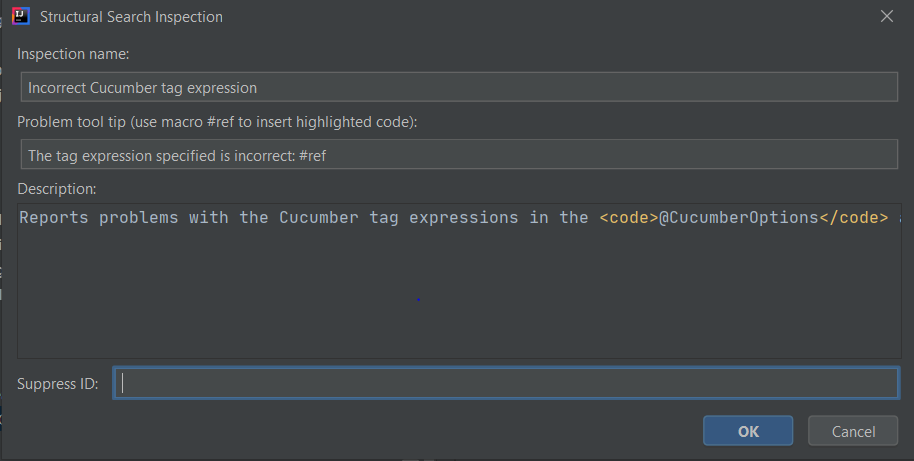

# Structural Search and Replace updates in IntelliJ 2020.2

With IntelliJ 2020.2 comes a major update on the [Structure Search and Replace templates](https://www.jetbrains.com/idea/whatsnew/).

They became slightly restructured, so that now users are able to define multiple templates for each inspection, and
each inspection can have its own severity.

There are also some new configuration options added. Let's see in more detail what JetBrains devs have cooked for us.

## Multiple templates per inspection

First, it's important to distinguish the terms *inspection* and *template*.

Inspections are common coding problems for what there can be one or more different checks, meanwhile templates are one
or more different checks for the same problem.

For example, there can be an inspection called *Incorrect Cucumber tag expression* which can be validated in the `@CucumberOptions`
annotation, or in any of the hook annotations (`@Before`, `@After`, etc.). Inside the inspection one template might validate the
tags in the `@CucumberOptions` annotation, another one in the hook annotations, or a third one somewhere else, if necessary.

### Restructuring of inspections

The first prominent change is that **Structural Search Inspection** is now moved out of **General** into its own
category and is now called **Structural Search**.

Along with that, inspections can be added into this category via a new Add button at the top window toolbar:

Since before 2020.2 **Structural Search Inspection** was stored on inspection level, rather as a category, setting
severity for different templates were not possible.

Now, that there can be multiple Structural Search inspections added, each inspection can specify its own severity.

Finally, each inspection can store multiple search and replace templates.

In the XML representation of `<searchConfiguration>` and `<replaceConfiguration>` tags there is a new attribute called `order`,
which holds an Integer (starting from 1) as a String value, and reflects the order of templates as they are shown on the Settings UI.

Whether the order also means order of precedence in terms of execution, I have no information on.

## Inspection meta data

Each inspection now contains editable metadata, most are newly added in this version of IntelliJ:

- **Inspection name**: the name that is displayed under the **Structural Search** category in the Settings.
- **Problem tooltip**:
This is the text of the tooltip that is shown in the editor when the mouse is hovered over a highlighted code snippet.
In this field you can even insert the `#ref` macro which will be resolved to the highlighted code, so you can define somewhat
dynamic tooltip messages.
- **Description**: in this field you can compose an HTML document that serves as the description of the inspection
shown in the top right section of the inspection details.
- **Suppress ID**: from now on it is also possible to suppress the inspection in case of certain warnings. Quoting from the
[IntelliJ documentation](https://www.jetbrains.com/help/idea/creating-custom-inspections.html):
> provide a suppress ID if necessary `(@SuppressWarnings("suppress id"))`. The default suppress ID for custom inspections is `SSBasedInspection`.

## Final thoughts

For some of the newly added features, like the `#ref` macro and the suppress ID, I will probably write separate article providing more details and examples on how they work.
