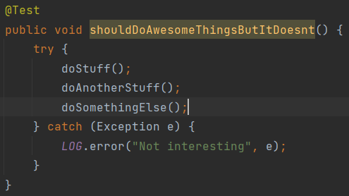
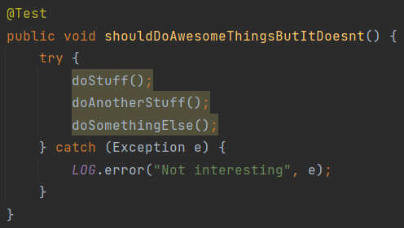

# try-catch and error logging in unit tests

On a recent project I ran into some nasty code quality both in production and test code. Looking at them, at first I cried a little bit, then got over it, then cried a little bit more…

One prominent issue was that entire unit test methods were wrapped in try-catch(Exception) blocks, and the only thing the catch blocks did was to log an error.

**Example:**

```java
@Test
public void shouldTestSomething() {
    try {
        //do stuff
        //do another stuff
        //do something else
    } catch (Exception e) {
        LOG.error("Some not that specific error message", e);
    }
}
```

This, of course, is not a good practice because it covers up all problems that occur during test execution, resulting in false positives.

The solution: use `assertTrue(true)`. The result: green tests, nice reports, job done, everyone happy. The End

Due to the state of the project, creating an IntelliJ plugin would have been an overkill, so I turned to the SSR templates with the aim to push them
to the project's git repository within the .idea folder. It took me a total of 3 minutes to compose the template.


You can find the XML representation of this template on [GitHub](../../inspections/junit.md).

It basically targets JUnit 4 `@Test` methods whose entire contents are wrapped in try-catch blocks catching any type of exception, and handling it only by logging something with slf4j.

My first thought was to have the method name highlighted which is subtle but visible enough to be noticed.



BUT… given that this issue was quite reoccurring, I decided to have the whole body (the `$statements$` variable) of the try block highlighted to make engineers annoyed enough,
so that they want to deal with it somehow: either by fixing it, OR in worse case, figuring out how to turn off this inspection.



Whether my evil plan worked, I can only hope. (evil laugh)
