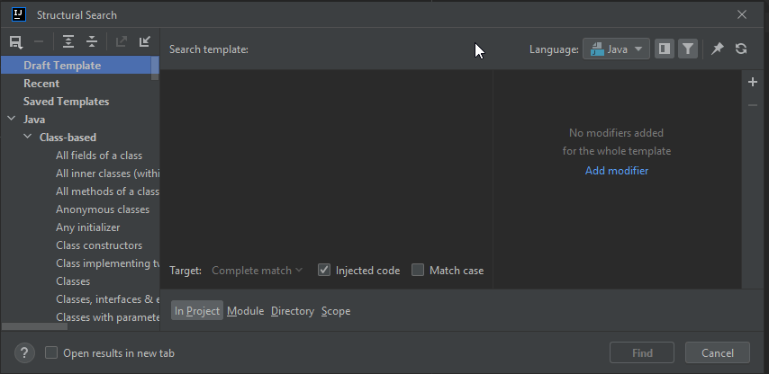
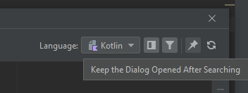
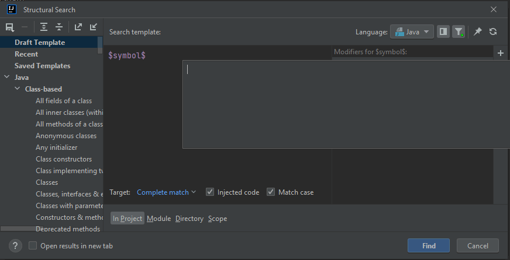

# Structural Search and Replace updates in IntelliJ 2022.1

Back in 2022.1 EAP 6, JetBrains announced that they
[redesigned the SSR edit dialog](https://blog.jetbrains.com/idea/2022/03/intellij-idea-2022-1-eap-6/#Updated_Structural_Search_and_Replace_dialog).

## Templates sidebar

The list of all templates is now available on the sidebar, instead of in a separate dialog. It is much easier to use those
templates, and at the same time it kind of encourages users to use them because they are just right there.

One tiny but nice aspect that I want to highlight is, when you select a language, and that language
has templates in the sidebar, that language folder becomes highlighted/selected.

## Pin dialog

There is a new **Pin Dialog** icon at top right, so that when the users perform a search, the dialog remains open.

This change is very welcome, especially in light of that by default the **Search Structurally...** menu action
doesn't have a shortcut key assigned, thus it was cumbersome to open the dialog again.

## Code completion in Script filters

Although I don't know if this change was added in EAP 6 or sometime earlier (maybe way earlier), it is nice to see that
coding in the Script filter dialog can be a pleasant experience.

The Script filter editor can provide code completion in the following cases that I noticed so far:
- language keywords
- live templates
- types from the current project's classpath

The last item is especially useful, since in many cases, when it comes to implementing complex Script filters, one has to
work with the IntelliJ Platform's code base.

Now, since the types are available only from the project's classpath, to have
code completion for types in the IntelliJ Platform, one has to use the Search and Replace dialog in an IntelliJ plugin project.

This may be a little inconvenient, but of course, the lack of code completion does not affect the functionality of the Script filter, only the user experience during implementation.

