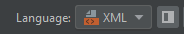
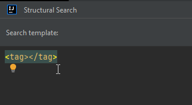

# XML and HTML templates

In this article I will give you details and examples on how XML and HTML specific structural search templates can be assembled. I will use the predefined templates coming from IntelliJ, extended with my own examples to cover different aspects.

You can also find details about XML and HTML based templates in the [IntelliJ and other IDE documentations](https://www.jetbrains.com/help/idea/structural-search-and-replace-examples.html#examples-for-html-and-xml).

First off, to be able to create a template for these markup languages, you need to select XML, HTML or one of their dialects from the language dropdown, if you are going for a specific document type



## XML templates

### Tags

You can define a tag just like in XML, as `<tag>`, or, if you want to make the tag name customizable, define it using a template variable, as `<$tag$>`.

The following examples all match both self-closing tags, and the opening tag (practically the complete tag) of `<tag></tag>` elements:

```xml
<$tag$>
<$tag$/>
<$tag$></$tag$>
```

Distinguishing between ordinary and self-closing tags is not possible.

For now, it also seems that targeting the closing tag of an element is not possible either. Trying to target it using a template variable, either doesn't match anything, or matches the whole element, including the opening tag.

#### Editor convenience

Just like in actual XML documents, when either the opening or closing tag is modified, the corresponding opening or closing tag is modified too.



#### Partial tag names and namespaces

If you want to specify tags mixed with literal value and template variable, for example `<xs:$tag$/>`, it is considered an invalid template. You have to go with `<$tag$/>` as the template, and a Text filter for `$tag$`.

When it comes to targeting namespaces, they aren't any different from ordinary tags. The tag name is just a text, so you can simply specify them, given an *xs* namespace, as `<xs:element/>` or `<$tag$>` with a Text filter with value *xs:element*.

#### XML Prolog

Unfortunately, XML prologs like `<?xml version="1.0" encoding="UTF-8" ?>` don't seem to be supported, not even in this simple format: `<?xml ?>`, or as a Text filter value *\?xml \?* for the template `<$prolog$>`.

### Attributes

You can define XML attributes in two ways, either as

```
<$tag$ $attribute$>
```

or, if you are also interested in the attribute value, then as

```
<$tag$ $attribute$="$value$">
```

#### Attribute count

When it comes to specifying the attribute count, it works the following way:
- by default (without a Count filter on the `$attribute$`) it finds tags with any number of attributes,
- if one specifies a Count filter, it finds tags according to that filter.

However, there is a little trickery. Let's say, you add a Count filter with *[2,inf]* as value. If `$attribute$` is selected as target, the template highlights any attribute, not just tags that contain at least 2 attributes. Having the `$tag$` or `$value$` as target, it works properly.

NOTE: whether this is a bug, or is expected, given that it's the combination of a template variable as target and a filter on that same variable, is not clear yet.

#### Attribute values

As mentioned in the previous section, tags with attribute values can be specified as

```
<$tag$ $attribute$="$value$">
```

However,

```
<$tag$ $attribute$=$value$>
```

without double-quotes around the value, is considered an invalid template, and the template editor gives you an *Attribute value expected* error message.

If you have attribute values, in which certain characters are escaped, for example

```
<pluginProperties location="settings &gt; editor" .../>
```

you can target them as simple text

```
<$tag$ $attribute$="settings &gt; editor"/>`
```

### Tag values

In its almost simplest form, `<$tag$></$tag$>`, the template matches any tag with or without an actual value, and with or without embedded tags.

You can narrow down the results by specifying an actual value as `<$tag$>$value$</$tag$>`, which will match tags with a value, but not with embedded tags.

You can also define a Count filter for the value:
- using *[0,inf]* matches tags with/without a value/embedded tag/comment
- using *[1,inf]* matches tags with at least one value/embedded tag/comment
- using greater than 1 as the minimum value matches tags with a value, or at least the specified number of embedded tags/comment

A non-zero minimum count makes sense only in case of embedded tags and comments, since each of them counts as a separate element.

### Embedded tags

It is kind of straightforward to target embedded tags, for example as

```
<$tag$><$embtag$></$tag$>
<$tag$><$embtag$></$embtag$></$tag$>
```

however, in their default states, these templates don't seem to match with anything.

To actually match, one has to add a Count filter with at least 0 as its minimum value.

### Comments

Comments may be targeted using the

```
<!--$comment$-->
```

template. The presence of whitespaces around the template variable is optional, it works even as `<!--    $comment$    -->`. However, it doesn't match anything without the variable, in the `<!-- -->` form.

## HTML templates

### DOCTYPE

I tried to match them as `<!DOCTYPE >`, and with attributes as well, `<!DOCTYPE $attribute$>`, even with a Count filter, but they don't seem to be supported.

### Case-sensitivity

Tags in both XML and HTML documents match in a case-sensitive way, the case of tag names does matter.

### Special predefined templates

There is a predefined template in the Structural search editor called *<li> not contained in <ul> or <ol>*, which uses a filter type that is not available for customization on the UI.

I mentioned more details about this in the post called [Contained in constraints](https://ijnspector.wordpress.com/2020/06/11/contained-in-constraints/).