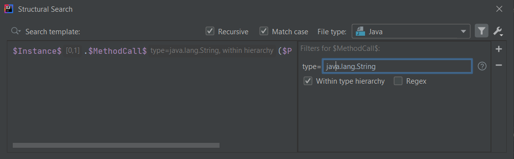

# Type filter

The Type filter is one of the 5 filter types that may be added to user defined variables in Structural Search and Replace templates.

According to the [official documentation](https://www.jetbrains.com/help/idea/search-templates.html#type_filter):
> The Type filter adds a type of the value or expression that is expected for the specified variable.

NOTE: a part of this article contains some parts of the article called [Context dependent filters](../28-Context-dependent-filters/28-Context-dependent-filters.md)
but that one in itself is still a valid article because it covers variables from a different perspective.

## Configuration

Let's consider the following *method call* template that can return some type, or in other words, be evaluated to some type.

```java
$Instance$.$MethodCall$($Parameter$)
```

To filter for the type (or a type as a regex pattern) you can use the **Type filter** to define the constraint.

The Type filter has 3 configuration options:
- **type**: the actual filter value
- **Within type hierarchy**: to also handle subtypes of the given type
- **Regex**: when you'd like to specify a regex pattern as the type (probably for multiple types, packages, etc.)



## Type

With having disabled the Regex option you can either specify the fully qualified name of the type as e.g. `java.lang.String` or
just the simple name of it as `String`. In the latter case IntelliJ will fully match the specified value with the name of the type.
So if the specified value is `String` than it will only match types called `String`, and not others like `StringBuffer` and the like.

In this case the XML part of the `$MethodCall$` variable is as follows:

```xml
<constraint name="MethodCall" nameOfExprType="java\.lang\.String" target="true" within="" contains="" />
```

You can invert the condition by adding an `!` (exclamation mark) at the beginning of the filter value, like `!java.lang.String`:

```xml
<constraint name="MethodCall" nameOfExprType="java\.lang\.String" target="true" negateExprType="true" within="" contains="" />
```

or using the simple type name `!String`:

```xml
<constraint name="MethodCall" nameOfExprType="String" target="true" negateExprType="true" within="" contains="" />
```

You can also define multiple type values as a "|"-separated list of values, according to the editor help tooltip:

> The type of the matched expression is checked against the provided "|"-separated patterns.

An example filter value may be `java.lang.String|java.lang.Integer`:

```xml
<constraint name="MethodCall" nameOfExprType="java\.lang\.String|java\.lang\.Integer" target="true" within="" contains="" />
```

or you can use only the simple type name like `java.lang.String|Integer`:

```xml
<constraint name="MethodCall" nameOfExprType="java\.lang\.String|Integer" target="true" within="" contains="" />
```

Inverting the condition works for the whole pattern only, and not for each "|"-separated value, so, in case of defining the filter value as
`!java.lang.String|!java.lang.Integer` the XML part of it will be

```xml
<constraint name="MethodCall" nameOfExprType="java\.lang\.String|!java\.lang\.Integer" target="true" negateExprType="true" within="" contains="" />
```

## Regex

Although you can set values to be handled as a regex pattern, IntelliJ is clever, and if a value
is not an actual regex pattern, or it is not necessary to be handled as a regex pattern, upon saving the filter it unticks the Regex option.

However, if you consider the following regex pattern: `java.util.(LinkedList|ArrayList)` as the filter value, you will get the following results
depending on the status of the Regex option:

**Regex disabled:**

```xml
<constraint name="MethodCall" nameOfExprType="java\.util\.\(LinkedList|ArrayList\)" target="true" within="" contains="" />
```

**Regex enabled:**

```xml
<constraint name="MethodCall" nameOfExprType="java.util.(LinkedList|ArrayList)" target="true" within="" contains="" />
```

You can see that in case Regex is disabled, additional escaping is done on the filter value when saved in the XML configuration.

## Within type hierarchy

When this option is enabled, subtypes of the specified type (but not supertypes) are also considered during match, contrary to when it is disabled, in that case
code elements are matched only against that specific type.

```xml
<constraint name="MethodCall" nameOfExprType="java\.lang\.String" exprTypeWithinHierarchy="true" target="true" within="" contains="" />
```

## Disabled Type filter option

Certain Java language elements doesn't evaluate to any value, but only has a name, to name a couple of them:
- Class
- Annotation
- Field type
- Field name

In case of template variables that reflect these elements/nodes, Type filter is not available, so that users are not mislead about what is a valid construct and what is not.

If you want to specify the reference to the type, you can use Text filter setting the full reference to the class, interface, etc.

## Type filter UI

If you are interested in the Type filter's UI structure you can check out the `com.intellij.structuralsearch.plugin.ui.filters` package,
specifically the class `TypeFilter`. 
