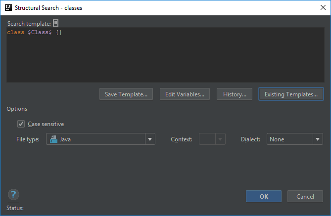
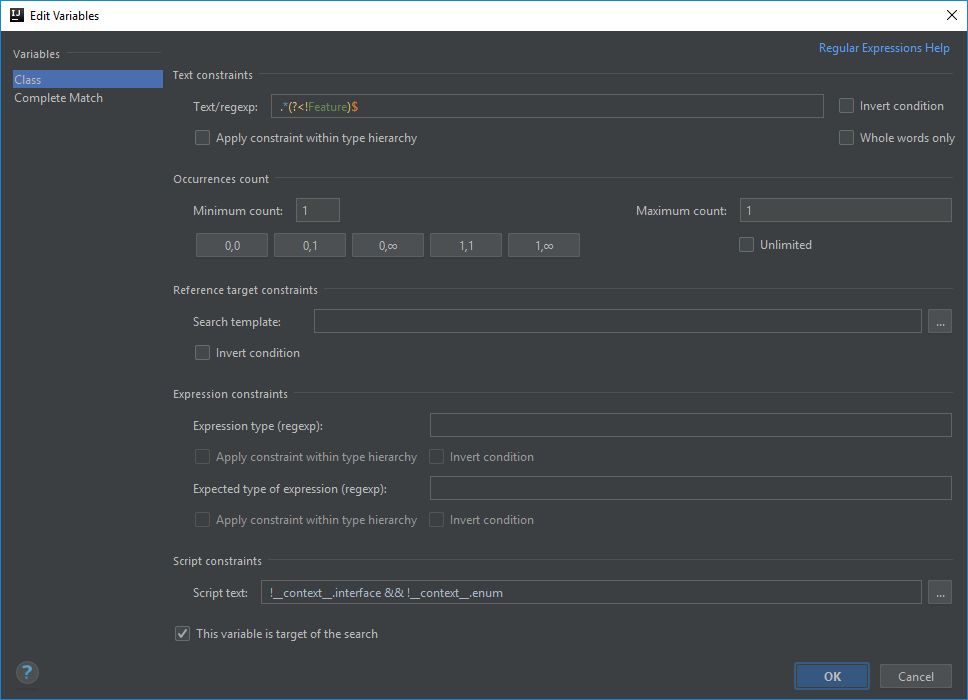
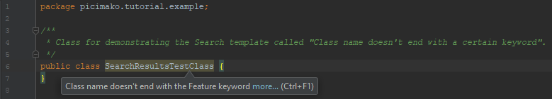

# Class name doesn't end with a certain keyword

As a context for this and some of the future tutorials, I will use an imaginary test automation framework that supports writing BDD style acceptance tests. It has custom annotations, naming conventions, structure, etc.

Running BDD style tests one needs a Gherkin file (with *.feature* extension), a test class that is associated with the execution of the Gherkin file's contents,
also one or more step definition classes (which may be separate from the test class) for providing implementation and support methods for the feature file.

## Creating the template
If you have automation in place and there are a bunch of test classes, there is at least some form of naming convention put in place on the project. One might be that test classes need to have *Feature* postfix,
e.g. `SearchResultsFeature.java`, since we are talking about BDD features.

Some people may forget about this rule, and you want to prevent committing incorrectly named files to pull requests, and save time for them and for yourself as well.

First, let's just create a simple signal for classes being named incorrectly, then later we can extend the collection of criteria.

For that, at the right side of the pane mentioned in the [Enable custom templates](/picimako/intellij-inspections/wiki/Enable-custom-templates) article, click the green + icon, and *Add Search Template...*.
You can find details about the functionality of each fields at https://www.jetbrains.com/help/idea/structural-search-and-replace-dialogs.html.

I encourage using the *Existing Templates...*, it can save you time and energy not needing to think about how the hell a certain thing needs to be implemented.

In this example, since we want to validate the names of classes, choose the template named *classes*. It should look like this:
```java
class $Class$ {}
```



Variables in these templates can be defined with any names enclosed by two **$** signs. The built-in ones are lowercase with uppercase first letter. In many cases I define them as all uppercase, so that they are more distinguishable.
Each variable automatically appears in the **Edit Variables...** dialog.

In this template, the `$Class$` variable is already defined, which represents the name of the class. The empty class body doesn't mean an actual body, but instead that it doesn't matter what the class contains. It can be empty, or a thousand lines long.

So to validate the names of the classes, a pattern needs to be defined for the `$Class$` variable, for which you need to free your inner regex expert self.

Signaling of a code issue happens when all the criteria set in the template are met. Considering this, the class name's criteria needs to be that it doesn't end with *Feature*. Here is a possible regex to match against that:
```
.*(?<!Feature)$
```
meaning anything, not followed by *Feature* at the end of the class name.

You can simply paste this value to the **Text/regexp** field under the **Text constraints** section.

> The expression `(?<!a)b` is called Negative Lookbehind. You can find some details about it [here](https://www.regular-expressions.info/lookaround.html).



There are a few other settings as well in this dialog. Just to give you a short explanation about them (I will give specific examples working with them too later):
- The **Minimum count** and **Maximum count** fields are defined as the following:
    > Number of occurrences defines how many sequential elements (in a parameter, declaration or statement list) a variable can include and whether a variable is required to be present in a pattern or not.

    In my understanding, since our regex is defined in a way that it restricts the template to the end of the class name,
    having them at 1-1 is perfect for the template to work.
    It wouldn't have any difference if the minimum count gets decreased or the maximum count gets increased (e.g. 0, 1 or 1, 2 respectively),
    however if you increase both the minimum and maximum counts e.g. to 2, 2 (2, 1 wouldn't make much sense) it won't find a match for class names not ending with the Feature keyword.

- The script `!__context__.interface && !__context__.enum` validates that the inspected class is not an interface and not an enum.
- **This variable is target of the search** being ticked means that IntelliJ will highlight that part of the template in case of a match

Now you just need to save your template, give it a meaningful description, and you are good to go. Make sure to test that it indeed signals class names that don't end with the word *Feature*.

The actual code highlight looks like below:



At this point you might be asking *"But the project shouldn't only consist of classes with Feature postfixed names."*, and that is correct. This example was just to give you a glimpse of what can be achieved. We will improve this template further along the way.

## Finalization
Some tips:
- make sure you give your template a descriptive name, since when an issue is found and a part of the code is highlighted, hovering the mouse over that highlight displays the description given for that template.
- test that the inspection only works for code sections that you intended it to work for.
- test that the inspection doesn't work for code sections that you didn't intend it to work for.

Below you can find the XML representation of the template created, so that you can easily copy and paste it into your project specific templates.

```xml
<searchConfiguration name="Class name doesn't end with the Feature keyword" text="class $Class$ {}" recursive="false" caseInsensitive="true" type="JAVA">
    <constraint name="Class" script="&quot;!__context__.interface &amp;&amp; !__context__.enum&quot;" regexp=".*(?&lt;!Feature)$" target="true" within="" contains="" />
</searchConfiguration>
```
