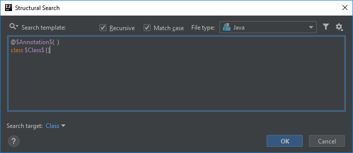
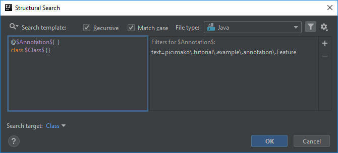
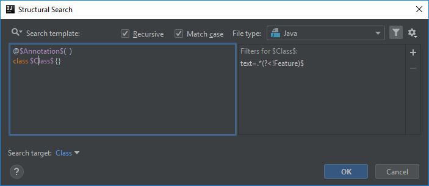
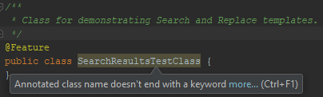

# Annotated class name doesn't end with a keyword

This example is an extension of the [previous post](https://ijnspector.wordpress.com/2018/10/15/class-name-doesnt-end-with-a-certain-keyword/).

Using the test automation framework context from that, the framework somehow needs to know what kind of classes it can execute.

For that purpose we can say that executable Feature classes are annotated with a custom `@Feature` annotation,
besides having the *Feature postfix in class names as a naming convention.

I placed the annotation under the `picimako.tutorial.example.annotation.Feature` package for the sake of this example.

To apply our inspection only to actual Feature classes, we will add another criteria to narrow down the classes examined.
We can leverage the existing templates, and use the one named *annotated classes*:
```java
@$Annotation$( )
class $Class$ {}
```



## Annotation variable
Besides the `$Class$` variable, in this template there is another one called `$Annotation$` for the class level annotation, which we will be able to configure via different filters.

So to make sure that only actual executable Feature classes are inspected, we need to define the annotation first. The trick here, compared to the class name, is that
this time you need to specify the reference of the annotation (`picimako.tutorial.example.annotation.Feature`) and not just its name (*Feature*) because there might be other annotation(s) with the same name somewhere else,
used for different purposes.

Thus, you need to add a Text filter with this value:
```
picimako\.tutorial\.example\.annotation\.Feature
```

Notice the escaping of dots. Though packages in Java are always separated by dots, escaping them makes it a bit more fail-proof, not allowing values like `examples-gherkin:annotation=Feature`.

That's all. Based on my experience having no Count filter means 1-1 min and max values. Even when you add a Count filter with 1-1 values it won't appear in the list of defined filters.



## Class name criteria
Now that we are done configuring the annotation, we can move on to the class name.

Since we still want to find class names that doesn't end with *Feature*, we can use the same regex as we used in the [last example](https://ijnspector.wordpress.com/2018/10/15/class-name-doesnt-end-with-a-certain-keyword/):
```
.*(?<!Feature)$
```



## Finalization
If you want to make sure that this template is only applied to classes, you need to add a Script filter as well to the `$Class$` variable with the following value: `!__context__.interface && !__context__.enum`, because the template used this time doesn't include it by default.

The inspection will appear as following in the IDE:



Below you can find the XML representation of the template created, so that you can easily copy and paste it into your project specific templates.

```xml
<searchConfiguration name="Annotated class name doesn't end with a keyword" text="@$Annotation$(  )&#10;class $Class$ {}" recursive="true" caseInsensitive="true" type="JAVA">
    <constraint name="__context__" within="" contains="" />
    <constraint name="Annotation" regexp="picimako\.tutorial\.example\.annotation\.Feature" within="" contains="" />
    <constraint name="Class" regexp=".*(?&lt;!Feature)$" target="true" within="" contains="" />
</searchConfiguration>
```
