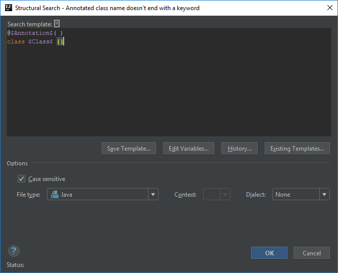
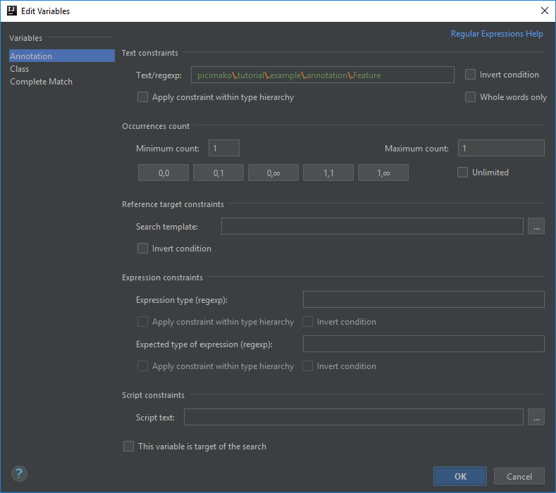
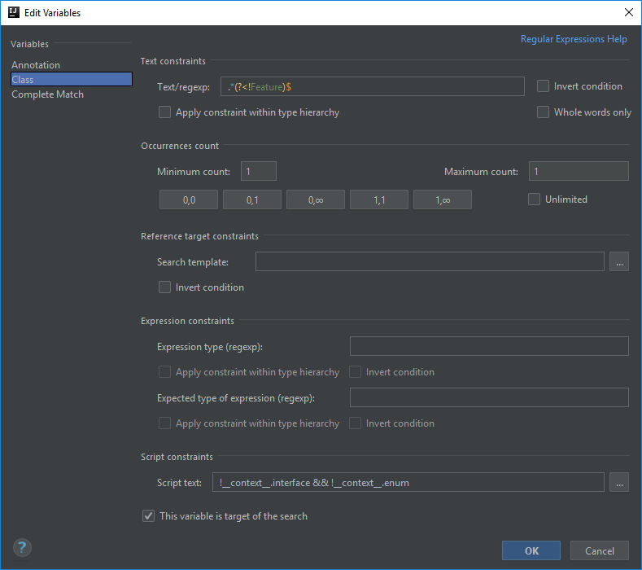
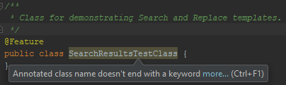

# Annotated class name doesn't end with a keyword

This example is an extension of the [previous post](https://ijnspector.wordpress.com/2018/10/15/class-name-doesnt-end-with-a-certain-keyword/).

Using the test automation framework context from that, the framework somehow needs to know what kind of classes it can execute.

For that purpose we can say that executable Feature classes are annotated with a custom `@Feature` annotation,
besides having the *Feature postfix in class names as a naming convention.

I placed the annotation under the `picimako.tutorial.example.annotation.Feature` package for the sake of this example.

To apply our inspection only to actual Feature classes, we will add another criteria to narrow down the classes examined.
We can leverage the existing templates, and use the one named *annotated classes*:
```java
@$Annotation$( )
class $Class$ {}
```



## Annotation criteria
Besides the `$Class$` variable, in this template there is another one called `$Annotation$` for the class level annotation, which we will be able to configure in the *Edit Variables* dialog.

So to make sure that only actual executable Feature classes are inspected, we need to define the annotation first. The trick here, compared to the class name, is that
this time you need to specify the reference of the annotation (`picimako.tutorial.example.annotation.Feature`) and not just its name (*Feature*) because there might be other annotation(s) with the same name somewhere else,
used for different purposes.

Thus, the **Text/regexp** field will have this value:
```
picimako\.tutorial\.example\.annotation\.Feature
```

Notice the escaping of dots. Though packages in Java are always separated by dots, escaping them makes it a bit more fail-proof, not allowing values like `examples-gherkin:annotation=Feature`.

> TIP: if you are not sure whether your regex is correct, you can quickly check it via the light bulb icon appearing at the left hand side of the field: 

Make sure you set the **Minimum count** and **Maximum count** fields to 1-1 to ensure that the class name is only validated when the Feature annotation is present.



## Class name criteria
Now that we are done with configuring the annotation, we can move on to the class name.

Since we still want to find class names that doesn't end with *Feature*, we can use the same regex as we used in the [last example](https://ijnspector.wordpress.com/2018/10/15/class-name-doesnt-end-with-a-certain-keyword/):
```
.*(?<!Feature)$
```



## Finalization
If you want to make sure that this template is only applied to classes, you need to manually insert the following script: `!__context__.interface && !__context__.enum` as the `$Class$` variable's Script constraint, because the template used this time doesn't include it by default.

The inspection will appear as following in the IDE:



Below you can find the XML representation of the template created, so that you can easily copy and paste it into your project specific templates.

```xml
<searchConfiguration name="Class, having name ending with Feature, does not extend a certain class" text="class $Class$ extends $Parent$ {}" recursive="false" caseInsensitive="true" type="JAVA">
    <constraint name="Class" script="&quot;!__context__.interface &amp;&amp; !__context__.enum &amp;&amp; Class.getName() != &quot;picimako.tutorial.example.BaseFeature&quot; &amp;&amp; Class.getName() != &quot;picimako.gherkin.model.scenario.ScenarioOutline&quot;&quot;" target="true" within="" contains="" />
    <constraint name="Parent" regexp="picimako\.tutorial\.example\.BaseFeature" minCount="0" maxCount="0" within="" contains="" />
    <constraint name="__context__" within="" contains="" />
</searchConfiguration>
```
