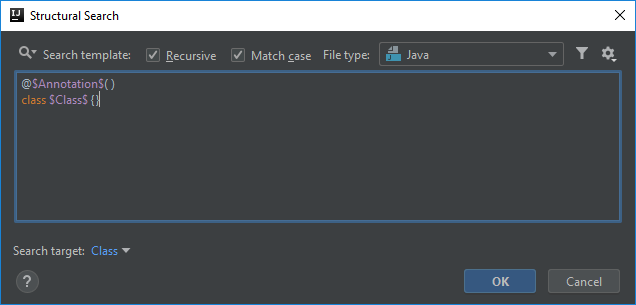
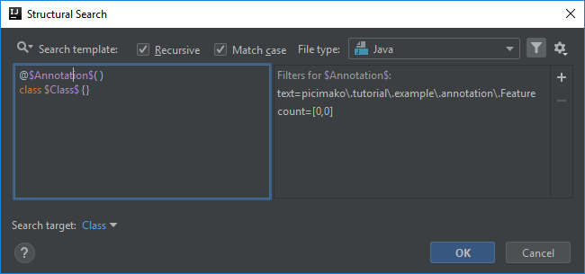
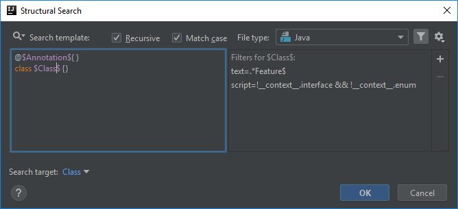
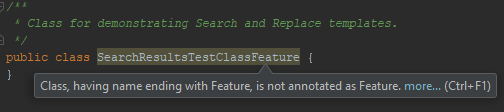

# Class having name ending with Feature is not annotated as Feature

This example builds on [Class-name-doesn't-end-with-a-certain-keyword](../Class-name-doesn't-end-with-a-certain-keyword/Class-name-doesn't-end-with-a-certain-keyword.md)
and [Annotated-class'-name-doesn't-end-with-a-keyword](../Annotated-class'-name-doesn't-end-with-a-keyword/Annotated-class'-name-doesn't-end-with-a-keyword.md).

So you might also want to check for the opposite that we did in the [last post](../Annotated-class'-name-doesn't-end-with-a-keyword/Annotated-class'-name-doesn't-end-with-a-keyword.md).
It may not be enough to check whether a class with an annotation applied doesn't have a certain name, but also that a class with a certain name doesn't have a necessary annotation applied.

For this example we are again using the *annotated classes* predefined template:
```java
@$Annotation$( )
class $Class$ {}
```



## Annotation variable

Since this example still uses the same annotation as the previous one, we keep the Feature annotation pattern, and still use
```
picimako\.tutorial\.example\.annotation\.Feature
```

### Minimum/maximum occurrences
This time however the configuration differs a little bit. Instead of checking if the annotation is present, we need to make sure that the class name is only validated
when the Feature annotation is missing.

For that we can add a Count filter for the `$Annotation$` variable.

In the last example we set it to 1-1, meaning the annotation can be applied only once to a class.
But in this example, to have the inspection applied only when the annotation is missing, we need to change both count fields to 0. In other words it means that the template is only applied
when there is at least 0 and at most 0 Feature annotation applied to a class.



## Class variable
Since we only want to signal that a required annotation is missing, when the class name ends with Feature, we need to construct that pattern in a Text filter accordingly.
A viable solution is:
```
.*Feature$
```

This regex pattern might not be the most optimal, but for now this seems to be one of simplest, if not the, simplest one.



## Finalization

The inspection will appear as following in the IDE:



Below you can find the XML representation of the template created, so that you can easily copy and paste it into your project specific templates.

```xml
<searchConfiguration name="Class, having name ending with Feature, is not annotated as Feature." text="@$Annotation$( )&#10;class $Class$ {}" recursive="false" caseInsensitive="true" type="JAVA">
    <constraint name="Annotation" regexp="picimako\.tutorial\.example\.annotation\.Feature" minCount="0" maxCount="0" within="" contains="" />
    <constraint name="Class" script="&quot;!__context__.interface &amp;&amp; !__context__.enum&quot;" regexp=".*Feature$" target="true" within="" contains="" />
</searchConfiguration>
```
