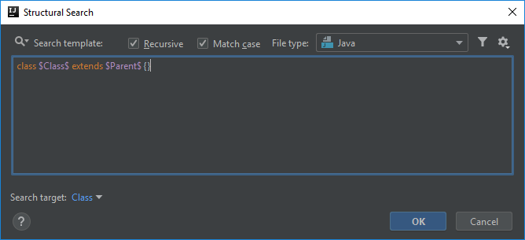
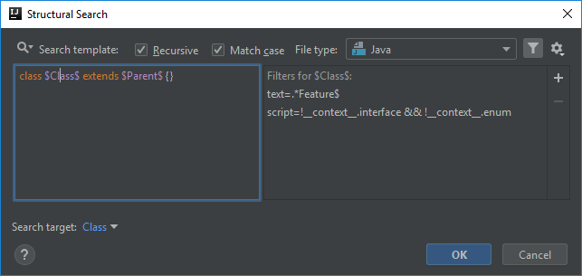
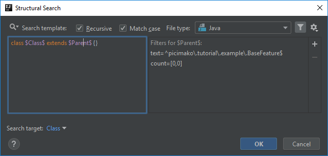

# Class, having name ending with Feature, does not extend a certain class

Let's say that contrary to the example in the [previous post](https://ijnspector.wordpress.com/2018/10/17/class-having-name-ending-with-feature-is-not-annotated-as-feature/), a Feature class is not recognized as a runnable one based on if it is annotated as `@Feature`,
rather if it extends a certain class that contains common setup, execution, teardown or other kind of logic. And we also keep the naming convention (Feature suffix in the classname) as a condition to target potential Feature classes.

For this example let's have the base class named `picimako.tutorial.example.BaseFeature`.

To start off with the creation process, we are going to use one of the predefined templates called *direct subclasses*:
```java
class $Class$ extends $Parent$ {}
```



## Class variable
To target only classes which has the Feature suffix in their names, add a Text filter to the `$Class$` variable and set it as following:
```
.*Feature$
```

If you want to exclude interfaces and enums also add the `!__context__.interface && !__context__.enum` script constraint.

To make the code highlighting a bit clearer, select *Class* from the **Search target** dropdown. By doing this the highlighting will look like


instead of


Below you can find the properties of the `$Class$` variable:



## Parent variable
The criteria for the `$Parent$` variable consists of two parts.

The first one is to define the class that needs to be extended. To do that add a Text filter with this value:
```
^picimako\.tutorial\.example\.BaseFeature$
```

Then, since this template should mark the target only when the parent class is missing, also add a Count filter with 0-0 values, in other words,
`$Parent$` should be preset at least 0 and at most 0 times.



## Class name refinement
You may have noticed that the template with the conditions so far marks `BaseFeature` too as a matching target.

Unfortunately this is the part I haven't been able to figure out how to solve.

I've been trying to fabricate a suitable regular expression, and also have been trying to match it using the script constraint but with no success yet.

If it doesn't bother you that the parent class is marked as well, you can use the template in its current form. Also if you have any suggestion, either for the regex or the script, I'm open to them.
Regardless of that I will revisit this template sometime in the future.

## Finalization

The inspection will appear as following in the IDE:


Below you can find the XML representation of the template created, so that you can easily copy and paste it into your project specific templates.

```xml
<searchConfiguration name="Class, having name ending with Feature, does not extend a certain class" text="class $Class$ extends $Parent$ {}" recursive="false" caseInsensitive="true" type="JAVA">
    <constraint name="Class" script="&quot;!__context__.interface &amp;&amp; !__context__.enum&quot;" regexp=".*Feature$" target="true" within="" contains="" />
    <constraint name="Parent" regexp="^picimako\.tutorial\.example\.BaseFeature$" minCount="0" maxCount="0" within="" contains="" />
    <constraint name="__context__" within="" contains="" />
</searchConfiguration>
```
