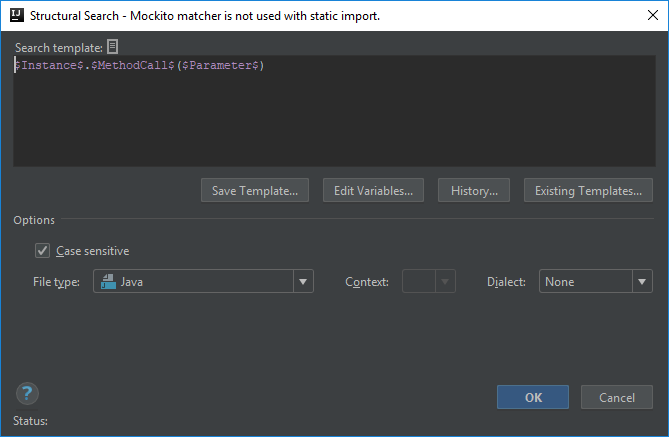
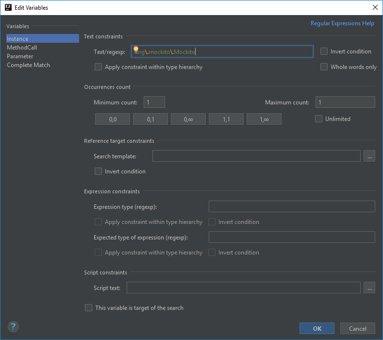
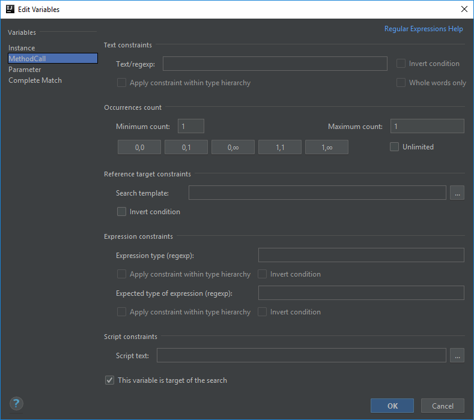
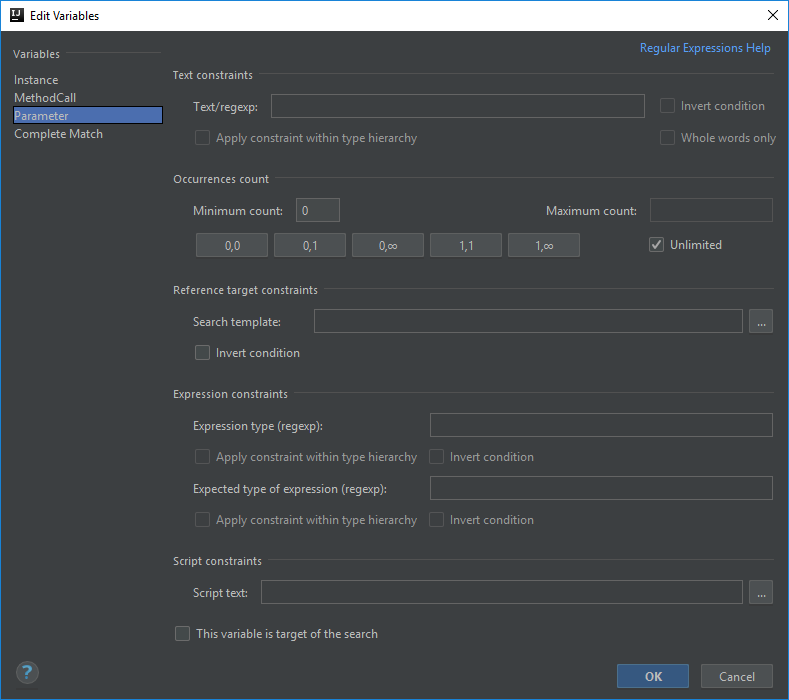

# A static method is not used with static import

This example is going to be much easier than the previous ones, but in some later posts I will return to the test automation framework based templates.

## Static imports
I personally really like my code readable, organized and overall aesthetic. That being said in many cases I prefer static imports in case of static methods rather than having the class name
written multiple times within a class. This is probably more prominent in test classes with the different assertion methods.

Since the predefined templates are a good place to start, we will do that again, and use the one called *method calls*:
```java
$Instance$.$MethodCall$($Parameter$)
```



This template has three variables, and as usual I'm going to explain how to configure each one of them.

## Instance criteria
Let's say you want to signal non-static imports in case of methods from `org.mockito.Mockito`, because having them imported statically makes the tests much more readable.

In order to do that you need to configure the *$Instance$* variable's **Text/regexp** field to only match methods when they are called from `org.mockito.Mockito`.

Then leave the **Minimum count** and **Maximum count** fields at 1-1, since there is only one class that you can call a method from at a time.



## Method call criteria
For the method itself there is no special criteria required unless you would like to static import certain methods.

For now leave the **Text/regexp** field empty, so that all methods of the `Mockito` class is highlighted if not imported statically.

Also leave the Minimum and Maximum count fields at 1-1, since there is only one method that you can call at a time.

But to make the signaling of the template more prominent, tick the **This variable is target of the search** checkbox,
so that when something matches this template, only the method call is highlighted, not the whole row for example.



## Method parameters
Since the method parameters are not relevant in this case, only the class and methods that are referenced, we can allow any number of parameters, meaning the Minimum count should be set to 0, the Maximum count should be set to unlimited.



## Finalization
When the template is ready the code highlight in case of a non-statically imported method looks like this:


Below you can find the XML representation of the template created, so that you can easily copy and paste it into your template collection.

```xml
<searchConfiguration name="Mockito method is not used with static import." text="$Instance$.$MethodCall$($Parameter$)" recursive="false" caseInsensitive="true" type="JAVA">
  <constraint name="__context__" within="" contains=""/>
  <constraint name="Instance" regexp="org\.mockito\.Mockito" within="" contains=""/>
  <constraint name="MethodCall" target="true" within="" contains=""/>
  <constraint name="Parameter" minCount="0" maxCount="2147483647" within="" contains=""/>
</searchConfiguration>
```