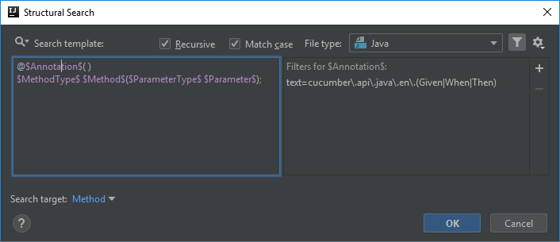
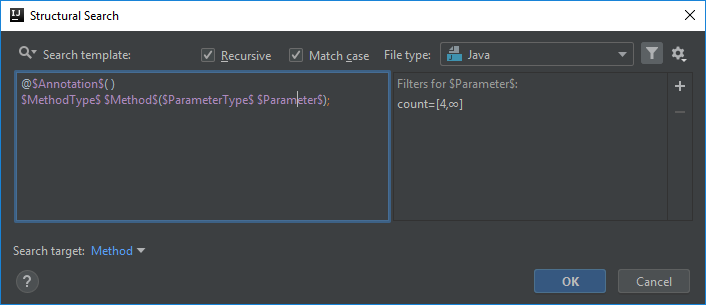

# BDD step definition method has more than X arguments

Though both [Java Checkstyle](http://checkstyle.sourceforge.net/config_sizes.html#ParameterNumber) and [PMD](https://pmd.sourceforge.io/pmd-5.5.3/pmd-java/rules/java/codesize.html#ExcessiveParameterList) has rules for validating the parameter count of methods,
they are both applied to the whole project and are not really customizable to target different types of methods.

On the project I was working on, applications had BDD style acceptance tests in separate maven modules that usually had their own checkstyle rules set up.
The max allowed method parameter count was 5 or 6 as I recall, however steps in BDD scenarios would usually be too long having 5 or 6 parameters, so we advised developers
to maximize it in 3 and split the steps to multiple ones in such cases.

Of course there were still pull requests open with more than 3 method parameters in step definition methods, so I come up with an inspection that only targets step definition methods.

## Template creation
Test automation frameworks that support BDD style acceptance tests usually use specific annotations, like e.g. Cucumber uses `@Given`, `@When` and `@Then`,
among others to recognize step definition methods.

For this template we are going to use the predefined template called *annotated methods*:
```
@$Annotation$( )
$MethodType$ $Method$($ParameterType$ $Parameter$);
```


It may seem a bit more complicated than previous templates but I can assure you it's not that difficult regardless of the number of variables to configure.

## Annotation variable
First you need to define the annotation, or annotations, depending on for which type of step definition methods you want to limit the number of parameters.

I will configure this template for cucumber-jvm's `@Given`, `@When` and `@Then` annotations, but of course you can also add the `@And` and `@But` annotations,
or any other from other languages.

That being said let's add a Text filter to set the annotation references. I set it as following:

```java
cucumber\.api\.java\.en\.(Given|When|Then)
```



## Method type and Method variables
These two variables are easy. Neither the method type nor the method name are relevant, you can basically leave them as they are.

The only configuration that is beneficial is to select *MethodType* as the **Search target**, so that only the method name is highlighted in case of a find.

## Parameter type and Parameter variables
These two parameters are similarly easy to configure as the previous, however these are the ones that define the core of this template.

So what we want to achieve is that any step definition method that has more than 3 parameters is highlighted. For that you need to add a Count filter.

To make this template work, set them to 4-Unlimited in case of both the `$ParameterType$` and `$Parameter$` variables, so that if the method has at least 4 parameters, the inspection is applied.
They need to be handled together as a parameter list with different number of type and name definitions is not a valid construction.

NOTE: For some reason though the XML representation of the inspection contains the count filter values for both variables, the inspection editor UI displays them only for the `$Parameter$` variable.

#### Parameter



## Finalization
When the template is complete, the code highlight looks like the following:


Below you can find the XML representation of the template created, so that you can easily copy and paste it into your template collection.
```xml
<searchConfiguration name="Step definition method has more than 3 parameters. Consider reorganizing or splitting steps." text="@$Annotation$( )&#10;$MethodType$ $Method$($ParameterType$ $Parameter$);" recursive="true" caseInsensitive="true" type="JAVA">
    <constraint name="Annotation" regexp="cucumber\.api\.java\.en\.(Given|When|Then)" within="" contains="" />
    <constraint name="MethodType" within="" contains="" />
    <constraint name="Method" target="true" within="" contains="" />
    <constraint name="ParameterType" minCount="4" maxCount="2147483647" within="" contains="" />
    <constraint name="Parameter" minCount="4" maxCount="2147483647" within="" contains="" />
    <constraint name="__context__" within="" contains="" />
</searchConfiguration>
```