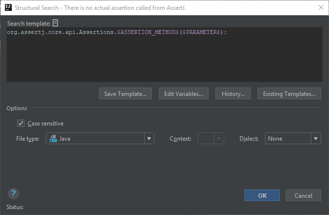
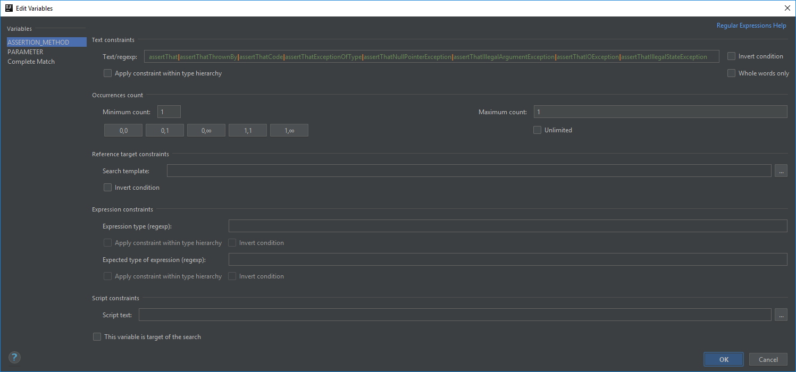
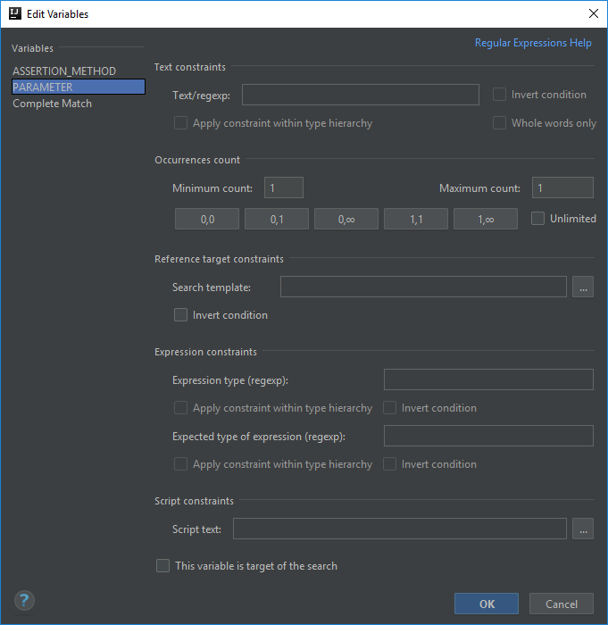

# There is no actual assertion called from AssertJ

AssertJ is a library that provides ["a rich set of assertions"](http://joel-costigliola.github.io/assertj/) in a fluent way and for multiple popular libraries.

One of the main classes from which you can call fluent assertions is `org.assertj.core.api.Assertions`.
It differs from other assertion libraries like Hamcrest in that the `assert...()` methods doesn't execute the assertion, but wrap the target object and you can
call assertion methods on that along with configuring the assertions beforehand in various ways.

The issue that I ran into is that one may forget to call an actual assertion method after calling `assert...()` which will do no assertion, therefore make e.g. a unit test false positive.

## Template creation

In case of this template I started with the predefined template called *method calls*:

```java
$Instance$.$MethodCall$($Parameter$)
```

However this time I took a little bit different route configuring it.

First I specified the class reference not within the `$Instance$` variable, but in the template text itself:

```java
org.assertj.core.api.Assertions.$MethodCall$($Parameter$)
```

then I modified the remaining variables to all uppercase, and renamed `MethodCall` to `ASSERTION_METHOD`. This way they are more prominent and clear:

```java
org.assertj.core.api.Assertions.$ASSERTION_METHOD$($PARAMETER$);
```

Please note that the template wouldn't work if you just define the template as
```java
Assertions.$ASSERTION_METHOD$($PARAMETER$);
```
because IntelliJ won't find the class. If you want the template to work for multiple Assertions classes in different libraries, you can leave the template text
in its predefined format and define a regexp in the `$Instance$` variable.



## Assertion method
The only thing I configured in the `$ASSERTION_METHOD$` variable is the regexp to define the methods that need to be checked:

```
assertThat|assertThatThrownBy|assertThatCode|assertThatExceptionOfType|assertThatNullPointerException|assertThatIllegalArgumentException|assertThatIOException|assertThatIllegalStateException
```

I basically listed all assert methods from the `Assertions` class.



## Parameter
There is no special configuration required for this variable. I left the minimum and maximum counts at 1-1, because all assert methods in the mentioned class accept only one parameter.



## Finalization

As for the code highlighting I decided to get the complete match highlighted, as a false positive test is a bit more serious issue, so that the inspection is more visible to anyone reading the code.
This is partly because of there is no option (yet) to define the inspection severity level per template.

If it doesn't suit your taste you can mark the `$ASSERTION_METHOD$` as the target of the search instead.


Below you can find the XML representation of the template created, so that you can easily copy and paste it into your template collection.

```xml
<searchConfiguration name="There is no actual assertion called from AssertJ." text="org.assertj.core.api.Assertions.$ASSERTION_METHOD$($PARAMETER$);" recursive="false"
                           caseInsensitive="true" type="JAVA">
    <constraint name="ASSERTION_METHOD"
                regexp="assertThat|assertThatThrownBy|assertThatCode|assertThatExceptionOfType|assertThatNullPointerException|assertThatIllegalArgumentException|assertThatIOException|assertThatIllegalStateException"
                within="" contains=""/>
    <constraint name="PARAMETER" within="" contains=""/>
</searchConfiguration>
```