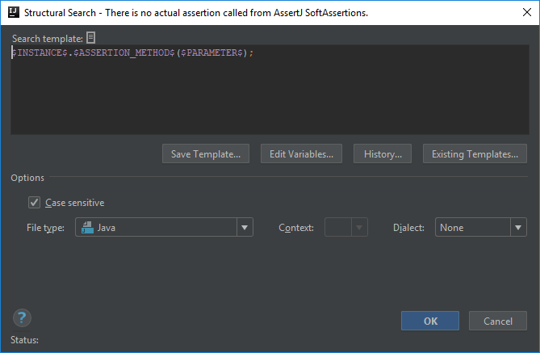
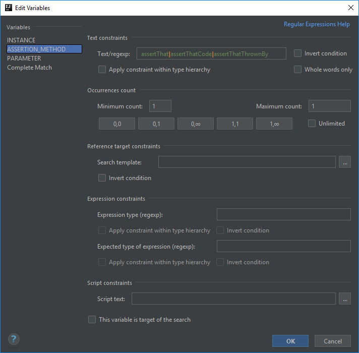
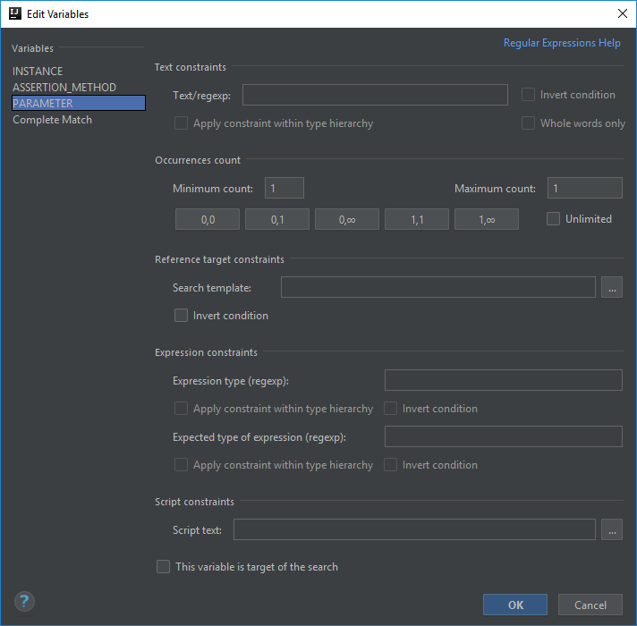

# There is no actual assertion called from AssertJ SoftAssertions
In AssertJ "[Using soft assertions, AssertJ collects all assertion errors instead of stopping at the first one.](http://joel-costigliola.github.io/assertj/assertj-core-features-highlight.html#soft-assertions)"

Since you can call assertions the same way from `org.assertj.core.api.SoftAssertions` as you can do it from `org.assertj.core.api.Assertions`,
it can result in making the same mistakes calling no actual assertion method on it.

## Template creation
In this template I combined the one in the [previous post](https://ijnspector.wordpress.com/2018/10/29/there-is-no-actual-assertion-called-from-assertj/)
```java
org.assertj.core.api.Assertions.$ASSERTION_METHOD$($PARAMETER$);
```
with the predefined template called *method calls*:
```java
$Instance$.$MethodCall$($Parameter$)
```
which resulted in
```java
$INSTANCE$.$ASSERTION_METHOD$($PARAMETER$);
```



However there's going to be a little trick configuring this one.

## Instance
Since assertion methods in `SoftAssertions` are not static, in order to collect multiple assertions you need to instantiate a `SoftAssertions` object to which you can add various assertions.

Because of this the name of the instance doesn't matter, so we don't need to set anything in the **Text/regexp** field of the `$INSTANCE$` variable, however we need to make sure
that the object we are inspecting is actually an instance of `SoftAssertions`. In order to do that we are going to use the **Expression type (regex)** field in the **Edit Variables** dialog.

The official documentation defines the purpose of that field as the following:
> if the calculated [*template*] variable is an expression, this constraint checks its type. For instance, for the foo($a$) expression the type of the method parameter would be checked.

So basically the type of the expression (specifically the `$INSTANCE$` variable) will be
```java
org\.assertj\.core\.api\.SoftAssertions
```

Just a quick note: I'm not yet familiar how exactly the **Apply constraint within type hierarchy** option works, but so far this template works without enabling that option.


## Assertion_Method
In case of the `$ASSERTION_METHOD$` variable the only constraint we have is the names of the methods, so we are going to set its **Text/regexp** field.

Based on the `assert...` methods that may be called from `SoftAssertions` it will be the following regexp:
```
assertThat|assertThatCode|assertThatThrownBy
```



## Parameter
There is no special configuration required for this variable. Just like in case of `Assertions`,
I left the minimum and maximum counts at 1-1, because all assert methods in the mentioned class accept only one parameter.



## Finalization

The target of the search is again the complete match to have a more prominent code highlighting:


Below you can find the XML representation of the template created, so that you can easily copy and paste it into your template collection.

```xml
<searchConfiguration name="There is no actual assertion called from AssertJ SoftAssertions." text="$INSTANCE$.$ASSERTION_METHOD$($PARAMETER$);" recursive="false"
                       caseInsensitive="true" type="JAVA">
    <constraint name="ASSERTION_METHOD" regexp="assertThat|assertThatCode|assertThatThrownBy" within="" contains=""/>
    <constraint name="PARAMETER" within="" contains=""/>
    <constraint name="INSTANCE" nameOfExprType="org\.assertj\.core\.api\.SoftAssertions" within="" contains=""/>
</searchConfiguration>
```