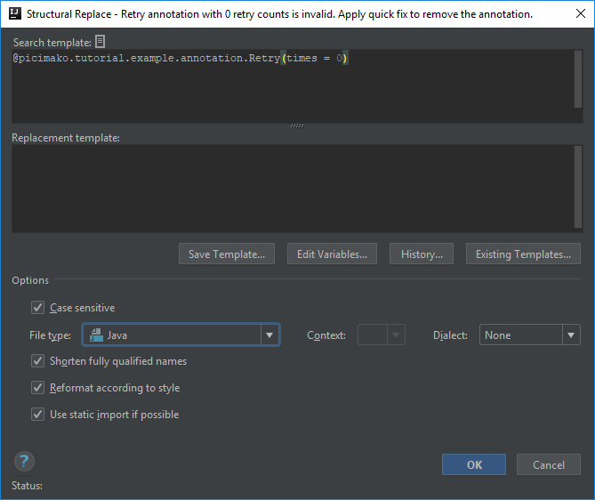
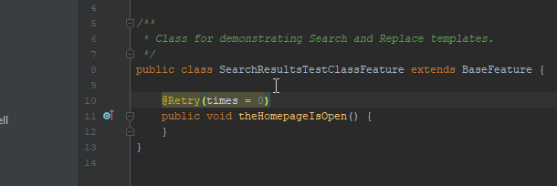
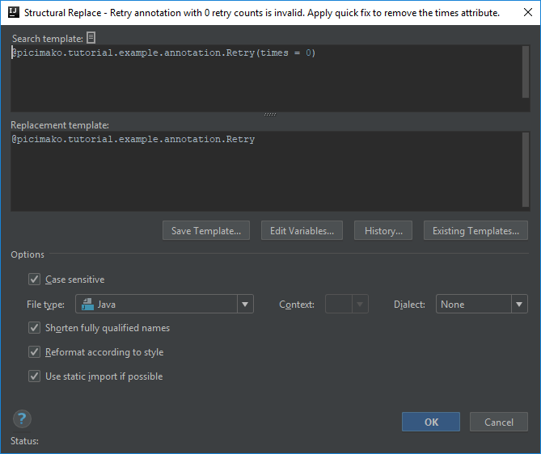
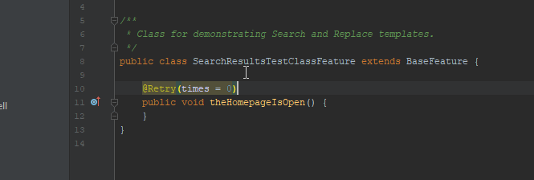

# Annotation with a certain attribute value is invalid

So far I've been posting only Search templates but this one is going to be a Replace template, which means we are not only going to search for a code problem but also
provide a quick fix for it as well.

On the last project I was working on, there were stability issues on the test environments with a few things, e.g. some backend services. So we needed to come up with a solution that
would trigger an action multiple times if necessary to be able to validate the requirements.

For the test methods we created a simple custom annotation called `@Retry` which had a **times** attribute with which you could specify the number of times the retry needed to happen.
Its default value was set to 1 for convenience.

I'm going to use this annotation for this template and for one or more I'm going to post later.

## Possible misuses of the annotation
There are a couple ways this annotation can be used incorrectly:
- The times attribute is set to 0.
- The times attribute is set to 1 explicitly, which is signaled by IntelliJ but I think it is not visible enough.
- The times attribute is set explicitly to a too high value (which value should be determined by the team members)

Obviously these scenarios should be handled by the code that handles the `@Retry` annotation but preventing such issues is always better, so why not create inspections for them?

I going to go into details of the first one, checking for *times = 0*.

## Template creation
This template differs from the previous ones I posted in that this one is going to be a Replace template.

It can be created at the same place where search templates, you just need to select **Add Replace Template...** in the Add menu.

The editor is also a bit different this time. Instead of one text field there are two. In the first one you can define the template that you are searching for, in the second one
you can define the value/template that you want to replace the code to when a search matches, as a simple quick fix.

Of course the choice is still yours whether you want to apply the quick fix or not, but you will be able to reach it from the *Alt + Enter* menu.

### Creating the search template part
The base of this template is a predefined one called *annotations*
```java
@$Annotation$
```

and I added brackets with an empty body to it based on the template called *annotated classes*

```java
@$Annotation$( )
class $Class$ {}
```

So the starting point looks like this:

```java
@$Annotation$( )
```

Since I know the exact reference of the annotation I want to work with I had two choices: either define the annotation within the `$Annotation$` variable,
or define it explicitly in the template text. I did the latter (given that the annotation is placed in the `picimako.tutorial.example.annotation` package):
```java
@picimako.tutorial.example.annotation.Retry( )
```

Then since the crucial part of this inspection is the value of the **times** attribute we can specify it explicitly as *times = 0* within the braces:
```java
@picimako.tutorial.example.annotation.Retry(times = 0)
```

### Creating the replacement template
There are multiple options what could be done as a quick fix when the `@Retry` annotation is specified with 0 times value, but first I decided to go with removing the annotation entirely
since if you don't want to do a retry, you don't need the annotation at all.

In that case the Replacement template part should be left empty.



The code highlight and the replacement happens as the following:



### Adding another quick fix option
If you don't want to settle with only one option to offer as a quick fix, you can create more Replace templates with the same search template text, but with different replacement templates.

Another replacement for this template would be to remove the explicit attribute specification and leave only the annotation itself, in which case the default **times** value, 1 would be used:
```java
@picimako.tutorial.example.annotation.Retry
```



You just need to save it with a different name and there you go, two separate quick fixes for the same problem. Then the code highlight and the replacement happens as the following:



## Finalization
Below you can find the XML representations of the templates created, so that you can easily copy and paste them into your template collection.

Retry annotation with 0 retry counts is invalid. Apply quick fix to remove the annotation:
```xml
<replaceConfiguration name="Retry annotation with 0 retry counts is invalid. Apply quick fix to remove the annotation." text="@picimako.tutorial.example.annotation.Retry(times = 0)"
    recursive="false" caseInsensitive="true" type="JAVA" reformatAccordingToStyle="true" shortenFQN="true" useStaticImport="true" replacement="" />
```

Retry annotation with 0 retry counts is invalid. Apply quick fix to remove the times attribute:
```xml
<replaceConfiguration name="Retry annotation with 0 retry counts is invalid. Apply quick fix to remove the times attribute." text="@picimako.tutorial.example.annotation.Retry(times = 0)"
    recursive="false" caseInsensitive="true" type="JAVA" reformatAccordingToStyle="true" shortenFQN="true" useStaticImport="true" replacement="@picimako.tutorial.example.annotation.Retry" />
```