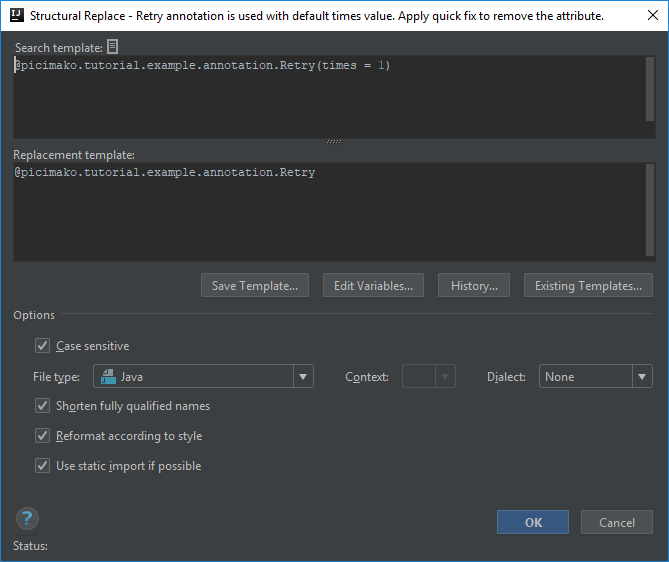
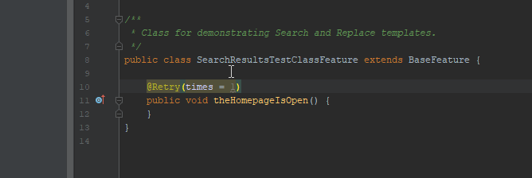

# Annotation is used with default attribute value
Please note that this post is an extension of [Annotation with a certain attribute value is invalid](https://ijnspector.wordpress.com/2018/11/05/annotation-with-a-certain-attribute-value-is-invalid/).

I'm going to cover one template within this post that I mentioned in the previous one, regarding the `@Retry` annotation:
> *The times attribute is set to 1 explicitly, which is signaled by IntelliJ but I think it is not visible enough.*

## Template creation
The search template part of this template is similar to the one mentioned in the previous example. The only difference is the value of the **times** attribute.

If you search for the annotation being set to 1 (the default value) it will be:

```java
@picimako.tutorial.example.annotation.Retry(times = 1)
```

In terms of the replacement a straightforward solution is to remove the attribute and only leave the annotation and work with the default value implicitly:
```java
@picimako.tutorial.example.annotation.Retry
```



## Finalization

The code highlighting and the quick fix will happen as following when applied:



Below you can find the XML representation of the template created, so that you can easily copy and paste it into your template collection.

```xml
<replaceConfiguration name="Retry annotation is used with default times value. Apply quick fix to remove the attribute." text="@picimako.tutorial.example.annotation.Retry(times = 1)" recursive="false" caseInsensitive="true" type="JAVA" reformatAccordingToStyle="true" shortenFQN="true" useStaticImport="true" replacement="@picimako.tutorial.example.annotation.Retry">
    <constraint name="__context__" target="true" within="" contains="" />
</replaceConfiguration>
```