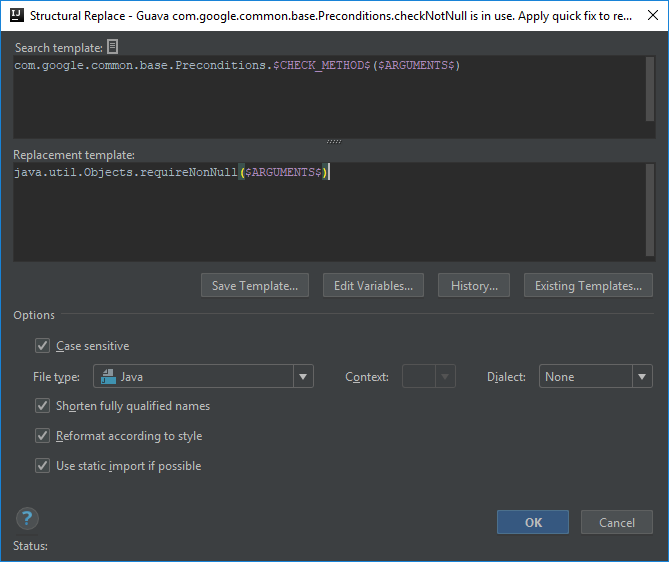
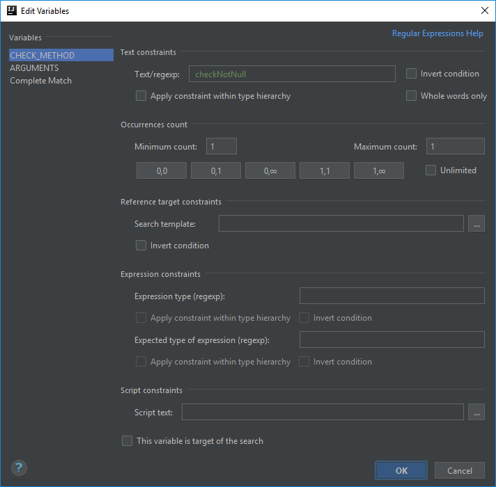
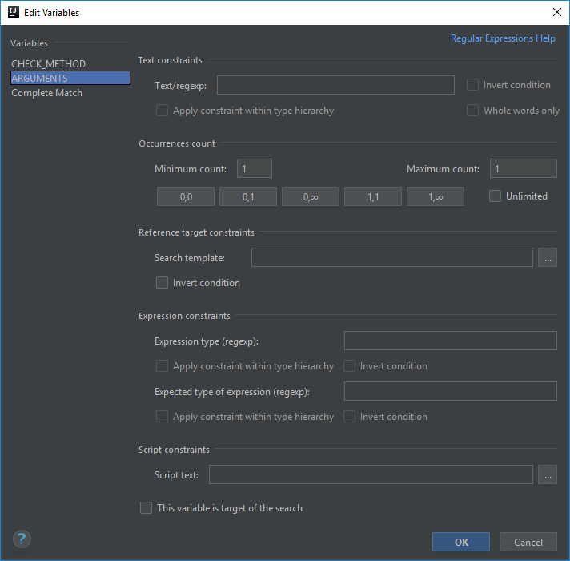
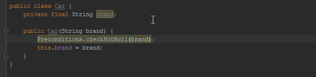
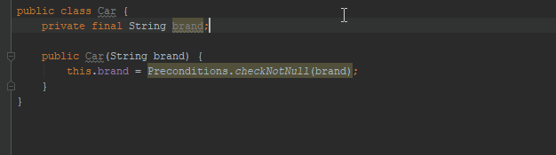

# Use native Java Objects.requireNonNull instead of Guava Preconditions.checkNotNull
Using solutions from the native Java library is always preferred over using them from separate libraries.
A good example of this is preferring `java.util.Optional` over `com.google.common.base.Optional` which actually is signaled by IntelliJ.

Obviously there are other examples of this rule, so I'm going to explain the creation of a template to replace the usages of `com.google.common.base.Preconditions.checkNotNull`
to `java.util.Objects.requireNonNull`.

## Template creation
In case of this template I started with the predefined template called *method calls*:

```java
$Instance$.$MethodCall$($Parameter$)
```

Then I renamed the variables and replaced the `$Instance$` variable with the explicit reference of the Guava `Preconditions` class:

```java
com.google.common.base.Preconditions.$CHECK_METHOD$($ARGUMENTS$)
```

In the replacement template you can use the same variables as you defined in the search template section, but only those.
If you use a variable in the replacement section that is not defined in the search template you get the following message at the bottom of the editor dialog:
*Status: Unsupported replacement pattern Replacement variable X is not defined.*

In this template the `$ARGUMENTS$` variable remains unchanged, and since we should use the native Java based solution, I replaced the `$CHECK_METHOD$` variable to the explicitly defined `java.util.Objects.requireNonNull`.

```java
java.util.Objects.requireNonNull($ARGUMENTS$);
```



## Check_Method variable
The only thing that is crucial in case of this variable is the name of the method we are searching for, which is *checkNotNull*, therefore the **Text/regexp** constraint will be

```
checkNotNull
```

or you may want to use

```
^checkNotNull$
```



## Arguments variable
While `Preconditions.checkNotNull()` has multiple signatures with different parameter lists, `Objects.requireNonNull()` doesn't have matching method signatures for all of them.
Therefore in this template I decided to set the minimum and maximum counts to 1-1, thus searching only for the method with only one parameter.

Of course after this tutorial you will be able to easily create Replace templates for the matching method pairs.



## Finalization
This template finds usages of the `checkNotNull` method both as a statement



and in assignments as well:



Below you can find the XML representation of the template created, so that you can easily copy and paste it into your template collection.

```xml
<replaceConfiguration name="Guava com.google.common.base.Preconditions.checkNotNull is in use. Apply quick fix to replace it to java.util.Objects.requireNonNull." created="1521563590516" text="com.google.common.base.Preconditions.$CHECK_METHOD$($ARGUMENTS$)"
    recursive="false" caseInsensitive="true" type="JAVA" reformatAccordingToStyle="true" shortenFQN="true" useStaticImport="true" replacement="java.util.Objects.requireNonNull($ARGUMENTS$)">
    <constraint name="__context__" within="" contains="" />
    <constraint name="ARGUMENTS" within="" contains="" />
    <constraint name="CHECK_METHOD" regexp="checkNotNull" within="" contains="" />
</replaceConfiguration>
```
