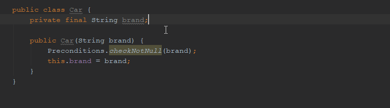

## Structural search and replace updates in Intellij in 2018.2

In my previous post called [Use native Java Objects.requireNonNull instead of Guava Preconditions.checkNotNull](ijnspector.wordpress.com/2018/11/12/use-native-java-objects-requirenonnull-instead-of-guava-preconditions-checknotnull/)
there was a case that I wanted to go into detail about how and why it is incorrect to do it that way, however after updating Intellij to 2018.2.5 that specific case doesn't work incorrectly anymore, which surprised me and throws my reasoning out on the window.
I will get back to this at the end of this post, but first I would like to mention some of the inspections related updates that I find quite interesting.

The full list of changes can be found at https://confluence.jetbrains.com/display/IDEADEV/IntelliJ+IDEA+2018.2+Release+Notes.

## New features and improvements
An interesting new feature is [IDEA-191915 - finding switch statements: allow counted branches](https://youtrack.jetbrains.com/issue/IDEA-191915) which now allows you
to create template for switch statements and validate against the number of branches within them.

From usability point of view probably the most prominent is [IDEA-187826 - Find Structurally: remove Unlimited checkbox](https://youtrack.jetbrains.com/issue/IDEA-187826) in which the
Unlimited checkbox and the preset buttons (0,0; 0,1; ...) are removed, and from now on you can define an Unlimited value by clearing the count field. For some reason the watermark in that case
displays **1** which I find confusing given that the empty field should mean an unlimited value.

A nice addition to the template editor is [IDEA-189236 - Open variable settings directly from search/replacement template in Structural search](https://youtrack.jetbrains.com/issue/IDEA-189236)
after which if one focuses the cursor on a variable in the editor, opening up the Edit variables dialog will directly open the settings of that particular variable.

An other one, [IDEA-189234 - Misleading "available variable" if var is optional in structural search groovy code snippets](https://youtrack.jetbrains.com/issue/IDEA-189234) seems to be rather a bugfix than a usability improvement
in which case if you had a variable and it was set optional, in the script editor dialog, that variable was shown as available, however in my understanding it wasn't initialized, therefore threw an exception
when one wanted to reference it.

## Bug fixes
There are a couple more bugfixes that I find interesting and interesting to know about.

### [IDEA-129336 - Structural search pattern not found because of comment](https://youtrack.jetbrains.com/issue/IDEA-129336)
This one rather seems to have been closed with accepting the provided workaround on it, than having it actually fixed. I haven't tried it.
But it is good to know that one might need to take inline comments into account when creating templates.

### [IDEA-189473 - improve java 9 var matching](https://youtrack.jetbrains.com/issue/IDEA-189473)
Though I'm not yet familiar with the new `var` keyword in Java 9, this ticket improves the var-int (and I guess other types as well, and also vice-versa) type inference
regarding search templates.

### [IDEA-190519 - replace structurally creates wrong code, when using static import](https://youtrack.jetbrains.com/issue/IDEA-190519)
I've had problems with this before and I'm happy that it is finally fixed. This ticket basically fixes the static import used in case of method references.

Previously a static imported method reference for e.g. `org.apache.commons.lang3.StringUtils.isNotEmpty` looked like `::isNotEmpty`, but now it gets properly replaced as `StringUtils::isNotEmpty`.

### [IDEA-187436 - Malformed pattern warning expected on incorrect use of variables](https://youtrack.jetbrains.com/issue/IDEA-187436)
With time I would have probably ran into this issue but it is a nice extra information (about which I cannot recall any information from the official documentation) that a template variable
must be a complete identifier like `$instance$.$getproperty$()` and not like `$instance$.get$property$()`.

## Configuring the target of the search
So back to the topic I started this post with. The following would have been the description of why that particular template wouldn't have been worked with having the method name as the target of the search.

> There is something I've just realized during creating this template about setting the target of the search.

> When I first created this template I went with Complete Match which worked fine, but this time when I revisited it I wanted to simplify the code highlight by setting the `$CHECK_METHOD$` variable as the target of the search.
> While this way only the method name is highlighted, the replace doesn't work properly.

> I'm only guessing here, but although IntelliJ finds the code snippet set in the inspection's Search template section, since the target of the of the search is the `$CHECK_METHOD$` variable, during replacement it won't find the `$ARGUMENTS$`
> variable, thus replacing the code to

> ```java
> java.util.Objects.requireNonNull()
> ```

> missing the arguments and applying neither the reformatting not the static import.

> 

> So the solution is to keep the Complete match as the target of the search, and you'll get the proper code replacement.

However since 2018.2, at least in this case, you can also go with the method as the target of the search, and the replacement will still happen properly.


If you have a template idea regarding any of the feature improvements and bugfixes, or any other area, please let me know. I love a challenge.
