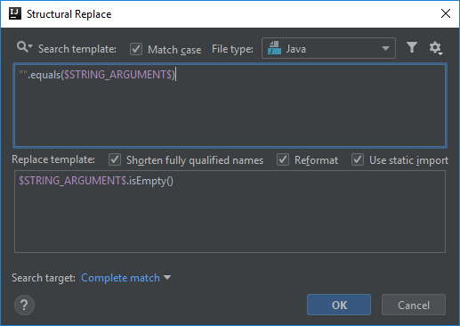
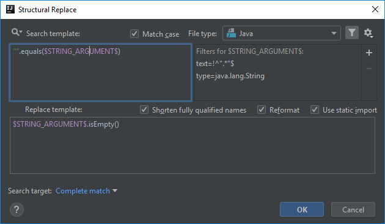
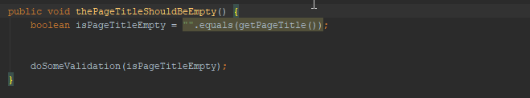

# "".equals() call can be replaced with String.isEmpty()
There is a built-in inspection in IntelliJ under Java > Performance called *'String.equals("")'* which is described as:
> *Reports .equals() being called to compare a String with an empty string. It is normally more performant to test a String for emptiness by comparing its .length() to zero instead.*

This means that when you have a code snippet like

```java
someStringParam.equals("");
```

it can be replaced with

```java
someStringParam.isEmpty();
```

However its opposite is also true that a string comparison like

```java
"".equals(someStringParam);
```

can be replace with

```java
someStringParam.isEmpty();
```

though there is no built-in inspection for that, at least not in the Community version of IntelliJ.

## Template creation
You can start the creation using the predefined template called *method calls*:

```java
$Instance$.$MethodCall$($Parameter$)
```

What I did to create the final search template is
- I replaced the `$Instance$` variable with `""`,
- I replaced the `$MethodCalls$` variable with the `equals` string explicitly,
- and renamed the `$Parameter$` variable to `$STRING_ARGUMENT$` to make it a bit more clear.

```java
"".equals($STRING_ARGUMENT$)
```

The replacement part is also an easy one, we just want to call `isEmpty()` on `$STRING_ARGUMENT$`:

```java
$STRING_ARGUMENT$.isEmpty()
```



## String_Argument variable
There are multiple conditions this variable have to meet in order to make the template work.

The first one is that the variable have to have the type `java.lang.String`. You may remember the same thing from the *[There is no actual assertion called from AssertJ SoftAssertions](https://ijnspector.wordpress.com/2018/10/29/there-is-no-actual-assertion-called-from-assertj/)* post.
If you don't, please make sure that you read the Instance section of that post.

To apply the condition we need to add a Type filter to this variable with the following value:

```
java\.lang\.String
```

However there is one more thing that is also worth adding. It doesn't make sense to compare string literals to `""`, thus the text constraint of this variable needs to be configured as well to not match against literals, only variables.

First you need to create a regexp for string literals (values starting and ending with the `"` character). I assembled the one below:

```
^".*"$
```

But leaving the configuration in its current state would match calls to `equals` like

```java
"".equals("")
"".equals("someStringValue")
```

therefore we need to negate the regexp by adding an `!` at the beginning of it. This will tell IntelliJ to look for occurrences that is not like the regexp specified.



## Finalization

In its final form this template will only match calls like

```java
"".equals(someString)
```

where `someString` is an instance of `java.util.String`.



Below you can find the XML representation of the template created, so that you can easily copy and paste it into your template collection.

```xml
<replaceConfiguration name="&quot;&quot;.equals() call can be replaced by String.isEmpty()" text="&quot;&quot;.equals($STRING_ARGUMENT$)" recursive="false" caseInsensitive="true" type="JAVA" reformatAccordingToStyle="true" shortenFQN="true" useStaticImport="true" replacement="$STRING_ARGUMENT$.isEmpty()">
    <constraint name="STRING_ARGUMENT" regexp="^&quot;.*&quot;$" nameOfExprType="java\.lang\.String" expressionTypes="java.lang.String" negateName="true" within="" contains="" />
    <constraint name="__context__" within="" contains="" />
</replaceConfiguration>
```
