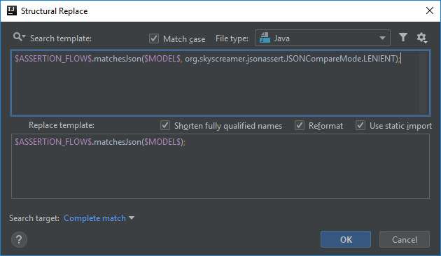
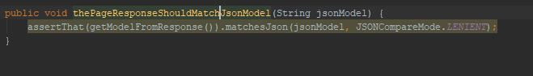

# Default JSON comparison mode is LENIENT, no need to specify explicitly

Let's say you have a test automation framework and you designed a fluent assertion API to compare JSON documents using the [JSONassert](https://github.com/skyscreamer/JSONassert) library.
You also design a method that accepts an optional `JSONCompareMode` parameter to configure the strictness of the comparison:

```java
JsonAssertionFlow matchesJson(String model, JSONCompareMode jsonCompareMode);
```

You also want JSONCompareMode.LENIENT to be the default one, so you implement the following variant of the method:

```java
default JsonAssertionFlow matchesJson(String model) {
    return matchesJson(model, JSONCompareMode.LENIENT);
}
```

Then an inspection seems obvious to create, that whenever someone calls the method with the explicit `JSONCompareMode.LENIENT` parameter value, he/she should be notified that the
method call can be simplified.

## Template creation
Again you can start the creation with the predefined template called *method calls*:

```java
$Instance$.$MethodCall$($Parameter$)
```

What I did is
- I renamed the `$Instance$` variable to `$ASSERTION_FLOW$`,
- renamed `$Parameter$` to `$MODEL$`,
- then replaced the `$MethodCall$` variable explicitly with the method's name `matchesJson`, since this is the only method this template will look for.
- and I automatically added the `;` at the end because the list of provided quick fixes depend on where the cursor is
    and it's just easier to jump to the end of the line rather than one character back

```java
$ASSERTION_FLOW$.matchesJson($MODEL$);
```

Then I added another parameter to the method specifying `JSONCompareMode.LENIENT`:

```java
$ASSERTION_FLOW$.matchesJson($MODEL$, org.skyscreamer.jsonassert.JSONCompareMode.LENIENT);
```

Finally, the replacement template for this will be the method call with only the model parameter:

```java
$ASSERTION_FLOW$.matchesJson($MODEL$);
```



## ASSERTION_FLOW and MODEL variables
There is no additional configuration needed for these two variables in order to work, you can leave everything in its default state.

If you come across that another method signature matches this template from a different assertion flow, or the model parameter may be multiple types and you want to restrict the
template to certain types, you can define Type filter for them to make them work that way.

## Finalization

Below you can find an application of the quick fix for this template:



Below you can find the XML representation of the template created, so that you can easily copy and paste it into your template collection.

```xml
<replaceConfiguration name="Default JSON comparison mode is LENIENT, no need to specify explicitly." text="$ASSERTION_FLOW$.matchesJson($MODEL$, org.skyscreamer.jsonassert.JSONCompareMode.LENIENT);" recursive="false" caseInsensitive="true" type="JAVA" reformatAccordingToStyle="true" shortenFQN="true" useStaticImport="true" replacement="$ASSERTION_FLOW$.matchesJson($MODEL$);">
    <constraint name="__context__" target="true" within="" contains="" />
    <constraint name="ASSERTION_FLOW" within="" contains="" />
    <constraint name="MODEL" within="" contains="" />
</replaceConfiguration>
```
