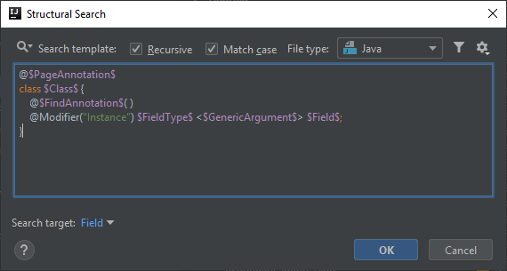
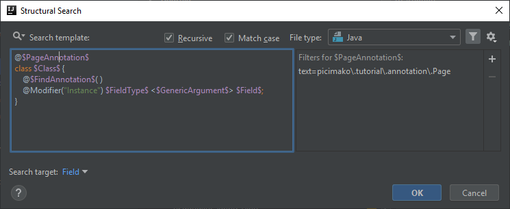
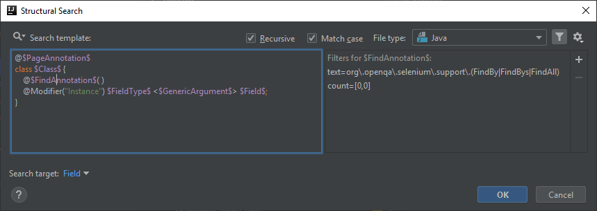
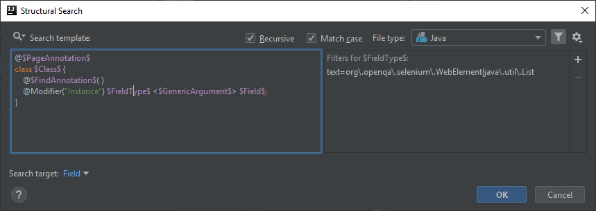
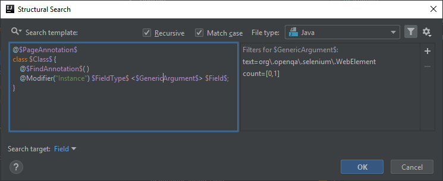
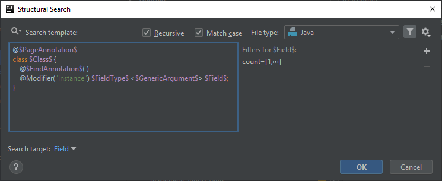

# WebElement type fields in page object classes are not annotated with FindBy/FindBys/FindAll
This post builds on *[Class containing FindBy/FindBys/FindAll annotated field(s) is not annotated with page object annotation](https://ijnspector.wordpress.com/2018/11/23/class-containing-findby-findbys-findall-annotated-fields-is-not-annotated-with-page-object-annotation/)* so make sure you read that one first.

The imaginary test automation framework I outlined in the last post uses the Page Object pattern to store `WebElement`s in dedicated classes.

It may happen that while the class definition is correct, having the `@Page` annotation applied, a `WebElement` or a `List<WebElement>` field is not annotated with one of the
`@Find...` annotations, thus not getting initialized by Selenium.

As a reminder below you can see what a correct page object class would look like:

```java
@Page
public class Homepage {

    @FindBy(css = "#image")
    public WebElement image;

    @FindBys({
        @FindBy(className = "menu"),
        @FindBy(className = "element")
    })
    public List<WebElement> menuElements;

    @FindAll({
        @FindBy(css = ".footer"),
        @FindBy(css = ".element")
    })
    public List<WebElement> footerElements;
}
```

## Template creation
The template of this inspection is the same as the one created in the previous post, however its configuration will differ:

```java
@$PageAnnotation$
class $Class$ {
    @$FindAnnotation$( )
    @Modifier("Instance") $FieldType$ <$GenericArgument$> $Field$;
}
```



## PageAnnotation variable
Since we are targeting page object classes, this variable needs to be configured accordingly setting a Text filter to

```
picimako\.tutorial\.annotation\.Page
```



## Class variable
You can leave it at its default state, as there is no additional configuration needed.

## Annotation variable
We are targeting `WebElement` and `List<WebElement>` type instance fields which are not annotated as `@Find...`, therefore we first need to set a Text filter to

```
org\.openqa\.selenium\.support\.(FindBy|FindBys|FindAll)
```

then to configure it as missing, the minimum and maximum counts of its Count filter need to be set to 0-0.



## FieldType, GenericArgument and Field variables
`$FieldType$` and `$GenericArgument$` need to be configured very similarly to the previous example, to be able to target both `WebElement` and `List<WebElement>` type fields.

Thus the Text filter of `$FieldType$` will be
```
org\.openqa\.selenium\.WebElement|java\.util\.List
```

and the same filter of `$GenericArgument$` will be

```
org\.openqa\.selenium\.WebElement
```

The Count filter of `$GenericArgument$` is still 0-1 to make it optional to match both desired types.

Also set `$Field$` as the target of the search to make it highlighted in case of a match.







### Highlighting all matching fields
Though the template is still a correct one if you don't add Count filters to `$FieldType$` and `$Field$` (you look for only one occurrence), it can be improved a little bit.
What happens in this case, when multiple fields in a page object class lack one of the necessary annotations, is that only the first such field gets highlighted.


In order to highlight all matching fields, the maximum count of both `$FieldType$` and `$Field$` needs to be set to *Unlimited* (clearing the max field), looking for any number of occurrences.


## Finalization
Below you can find the XML representation of the template created, so that you can easily copy and paste it into your template collection.

```xml
<searchConfiguration name="WebElement/List&lt;WebElement&gt; type field is not annotated as FindBy, FindBys or FindAll" text="@$PageAnnotation$&#10;class $Class$ {&#10;    @$FindAnnotation$( )&#10;    @Modifier(&quot;Instance&quot;) $FieldType$ &lt;$GenericArgument$&gt; $Field$;&#10;}" recursive="false" caseInsensitive="true" type="JAVA">
    <constraint name="PageAnnotation" regexp="picimako\.tutorial\.example\.annotation\.Page" within="" contains="" />
    <constraint name="Class" within="" contains="" />
    <constraint name="FindAnnotation" regexp="org\.openqa\.selenium\.support\.(FindBy|FindBys|FindAll)" minCount="0" maxCount="0" within="" contains="" />
    <constraint name="FieldType" regexp="org\.openqa\.selenium\.WebElement|java\.util\.List" maxCount="2147483647" within="" contains="" />
    <constraint name="Field" maxCount="2147483647" target="true" within="" contains="" />
    <constraint name="GenericArgument" regexp="org\.openqa\.selenium\.WebElement" minCount="0" within="" contains="" />
</searchConfiguration>
```
