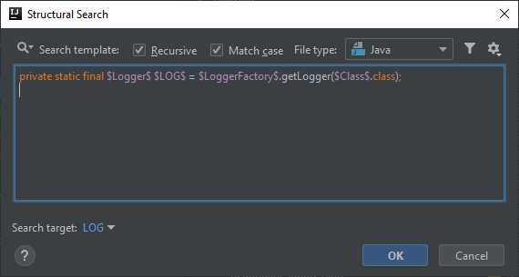
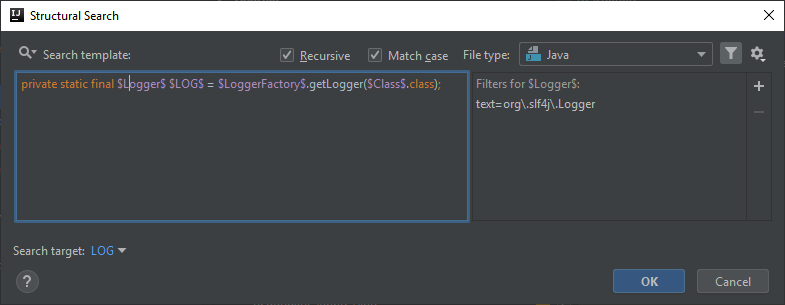
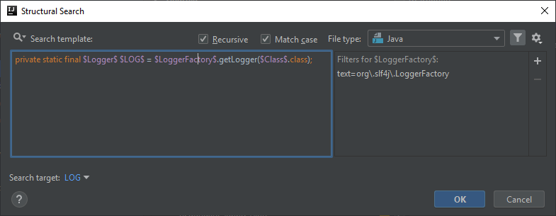

# Slf4j Logger is defined explicitly. Use Lombok @Slf4j annotation instead.
For the next couple of posts I'm going to switch from Selenium and give you some inspections that you can use for the [Lombok](https://projectlombok.org) library.

Lombok is designed to remove boilerplate code and auto-generate it for you via using custom Lombok annotations.

It has a [bunch of logging specific annotations](https://projectlombok.org/features/log) that you can use depending on what logging library you use,
and it will create a private static final field that you can use automatically.

Though these annotations make debugging more difficult, they remove the possibility to mess up manually creating such fields.
In case of the `@Slf4j` annotation it creates the following field:

```java
private static final org.slf4j.Logger log = org.slf4j.LoggerFactory.getLogger(LogExample.class);
```

in which there are three different types that you may mess up by using types having the same name but importing them from different packages/libraries.

The inspection I'm going to explain this time is going to search for private static final logger fields and tell us to use Lombok's `@Slf4j` annotation instead.

## Template creation
In case of this template I didn't use a predefined template, instead I took the exact definition of a typical Slf4j logger field
and replaced the important parts with template variables.

```java
private static final $Logger$ $LOG$ = $LoggerFactory$.getLogger($Class$.class);
```



## Logger variable
The only condition for this variable is the reference to Slf4j's `Logger` type which is

```
org\.slf4j\.Logger
```

Other than that you leave it as it is.



## LoggerFactory variable
Similarly to the `$Logger$` variable the only condition is to find Slf4j's `LoggerFactory` type

```
org\.slf4j\.LoggerFactory
```



## LOG variable
I didn't specify any condition for this variable, because it may be named differently by different developers in different classes, like *LOG*, *LOGGER* or something else.

However to make the inspection a bit more clearer, where the issue is, I marked this variable as the target of the search.

## Class variable
I intentionally didn't specify the class type to be the same as the enclosing class, since you may have already mistakenly used another class as that parameter value.
So the only thing that matters in this inspection is the type of the Logger and LoggerFactory.

## Finalization


Below you can find the XML representation of the template created, so that you can easily copy and paste it into your template collection.

```xml
<searchConfiguration name="Slf4j Logger is defined explicitly. Use Lombok @Slf4j annotation instead." text="private static final $Logger$ $LOG$ = $LoggerFactory$.getLogger($Class$.class);&#10;" recursive="false" caseInsensitive="true" type="JAVA">
    <constraint name="__context__" within="" contains="" />
    <constraint name="Logger" regexp="org\.slf4j\.Logger" within="" contains="" />
    <constraint name="LoggerFactory" regexp="org\.slf4j\.LoggerFactory" within="" contains="" />
    <constraint name="LOG" target="true" within="" contains="" />
    <constraint name="Class" within="" contains="" />
</searchConfiguration>
```
