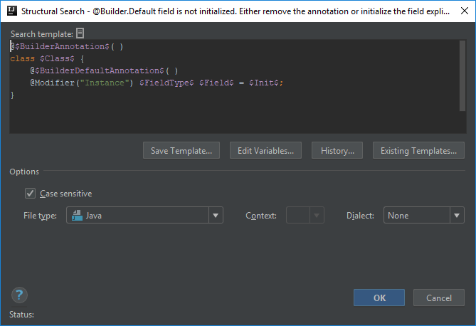
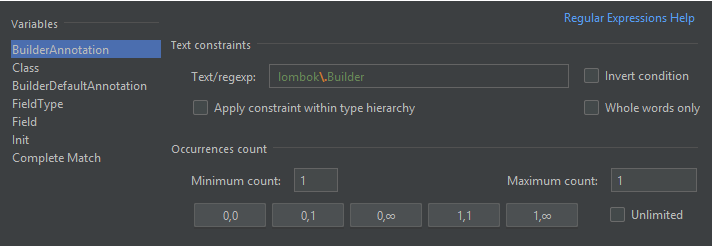
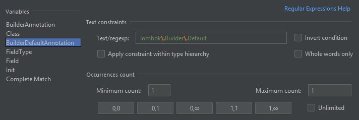
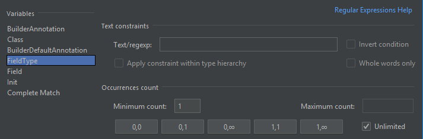
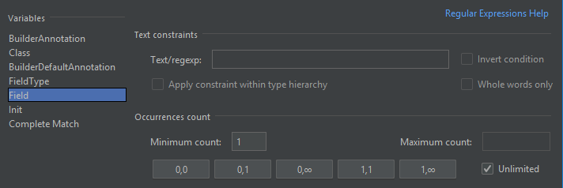
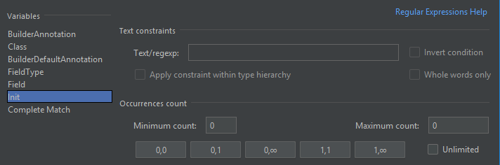

# Lombok @Builder.Default field is not initialized
Lombok has a [Builder annotation](https://projectlombok.org/features/Builder) with which you can auto-generate a whole builder implementation of a class.
That annotation needs to be applied on class level:

```java
@Builder
public class Unicorn {
    private final String name;
    private final Color color;

    ...
}
```

If you want to provide default values for fields as well, you can do it by adding the `@Builder.Default` annotation to the necessary field(s) and initialize them explicitly:

```java
@Builder
public class Unicorn {
    private final String name;
    @Builder.Default
    private final Color color = Color.PINK;

    ...
}
```

However if the `@Builder.Default` annotation is present on a field, but the field is not initialized, it may mean two things:
- either you don't want to specify a default value and rely on Java's default values, in which case the annotation is unnecessary
- or you just forgot to define the default value

This is the issue I'm going to explain how to create an inspection for.

## Template creation
In this template I combined two predefined ones

- *annotated classes*
    ```java
    @$Annotation$( )
    class $Class$ {}
    ```

- and *instance fields of the class*
    ```java
    class $Class$ {
        @Modifier("Instance") $FieldType$ $Field$ = $Init$;
    }
    ```

I did some simple modifications to them. First I renamed the `$Annotation$` variable to `$BuilderAnnotation$` to make its purpose clearer, then added `$BuilderDefaultAnnotation$` to the field definition.

```java
@$BuilderAnnotation$( )
class $Class$ {
    @$BuilderDefaultAnnotation$( )
    @Modifier("Instance") $FieldType$ $Field$ = $Init$;
}
```



## BuilderAnnotation and BuilderDefaultAnnotation variables
We are looking for `@Builder.Default` annotated instance fields in `@Builder` annotated classes, so first let's define the conditions for these two variables.

The only crucial thing in case of both variables is the reference to these annotations which means we need to configure their **Text/regexp** fields accordingly.

For `$BuilderAnnotation$` it needs to be defined as

```
lombok\.Builder
```

and for `$BuilderDefaultAnnotation$` it will be

```
lombok\.Builder\.Default
```

Any other configuration can be left at their default states.





## Class variable
The class name is not important in this template, so no additional configuration is required.

## FieldType and Field variables
These two variables are only important for their number of occurrences. The minimum and maximum counts of both needs to be set to 1-Unlimited,
otherwise if you leave them at 1-1, IntelliJ will look for only the first match, thus highlight only the first match.

Also I marked `$Field$` as the target of the search, thus having only the field name highlighted in case of a match.





## Init variable
In this inspection we are looking for fields that are not initialized explicitly, therefore we need to configure this variable as a missing one,
which means the minimum and maximum counts need to be set to 0-0.



## Finalization

It is worth mentioning that this template is not perfect. Though `@Builder.Default` fields can be initialized with an explicit default value,
in case of fields that are also `@Singular` ones, explicit initialization is not necessary as Lombok by default initializes them as empty collections.

I haven't been able to figure how to add the missing `@Singular` annotation as an extra condition because defining an additional template variable referencing this annotation
as having its counts set to 0-0 doesn't work for some reason. I will revisit this inspection later.


Below you can find the XML representation of the template created, so that you can easily copy and paste it into your template collection.

```xml
<searchConfiguration name="@Builder.Default field is not initialized. Either remove the annotation or initialize the field explicitly." text="@$BuilderAnnotation$( )&#10;class $Class$ {&#10;    @$BuilderDefaultAnnotation$( )&#10;    @Modifier(&quot;Instance&quot;) $FieldType$ $Field$ = $Init$;&#10;}" recursive="false" caseInsensitive="true" type="JAVA">
    <constraint name="BuilderAnnotation" regexp="lombok\.Builder" within="" contains="" />
    <constraint name="Class" within="" contains="" />
    <constraint name="FieldType" maxCount="2147483647" within="" contains="" />
    <constraint name="Field" maxCount="2147483647" target="true" within="" contains="" />
    <constraint name="Init" minCount="0" maxCount="0" within="" contains="" />
    <constraint name="BuilderDefaultAnnotation" regexp="lombok\.Builder\.Default" within="" contains="" />
</searchConfiguration>
```
