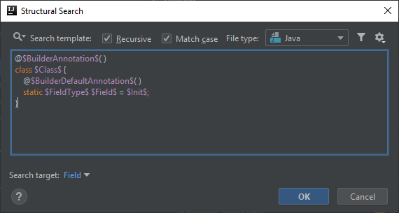
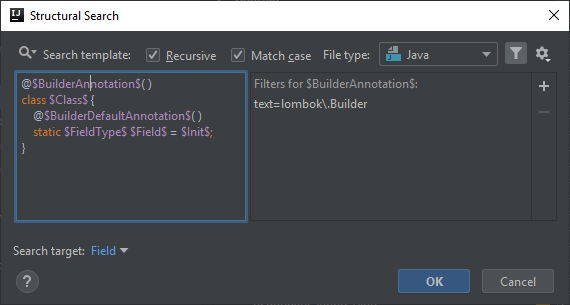
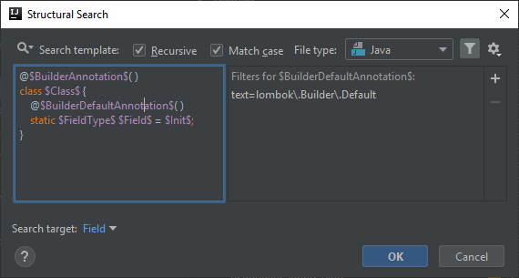
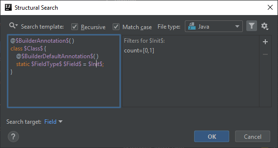

# Static field in a @Builder class is annotated as Lombok @Builder.Default
Please make sure you read the [previous post](https://ijnspector.wordpress.com/2018/12/03/lombok-builder-default-field-is-not-initialized/) before you proceed with this one. The template then and now are very similar, so I'm not going to go into that much detail this time.

As far as my experience goes with Lombok, the `@Builder.Default` annotation has effect only on instance fields but not on static ones because it doesn't make sense to
use builder methods to modify static fields.

Therefore an inspection can be created to signal the usage of this annotation applied on static fields.

## Template creation
The template for this inspection is almost the same as for the one in the previous post, there is only a slight change in it.

The last template targeted instance fields using the `@Modifier` annotation, but since this time we are looking for static fields I replaced the modifier with the `static` keyword.

I also removed the `$SingularAnnotation$` variable since it is irrelevant for this inspection.

```java
@$BuilderAnnotation$( )
class $Class$ {
    @$BuilderDefaultAnnotation$( )
    static $FieldType$ $Field$ = $Init$;
}
```



## BuilderAnnotation and BuilderDefaultAnnotation variables
We are looking for `@Builder.Default` annotated static fields in `@Builder` annotated classes, so in order to target those, both variables' Text filter
need to be configured with the proper references to those annotations:

For `$BuilderAnnotation$` it is

```
lombok\.Builder
```

and for `$BuilderDefaultAnnotation$` it is

```
lombok\.Builder\.Default
```





## Class variable
The class name is not important in this template, so no additional configuration is required.

## FieldType and Field variables
In case of these two variables only their number of occurrences are important.
The counts of both need to be set to 1-Unlimited, so that all matches get highlighted not just the first one.

I also marked `$Field$` as the target of the search, so only the field name gets highlighted in case of a match.


## Init variable
This variable is optional, since we are not looking for either if it is present, or if it is missing, so to make it optional just set its minimum count to 0 and leave the maximum count at 1.



## Finalization
This is how the IDE signals the template match:


Below you can find the XML representation of the template created, so that you can easily copy and paste it into your template collection.

```xml
<searchConfiguration name="Static field in a @Builder class is annotated as @Builder.Default, which has no effect. It can be removed." text="@$BuilderAnnotation$( )&#10;class $Class$ {&#10;    @$BuilderDefaultAnnotation$( )&#10;    static $FieldType$ $Field$ = $Init$;&#10;}" recursive="false" caseInsensitive="true" type="JAVA">
    <constraint name="BuilderAnnotation" regexp="lombok\.Builder" within="" contains="" />
    <constraint name="Class" within="" contains="" />
    <constraint name="BuilderDefaultAnnotation" regexp="lombok\.Builder\.Default" within="" contains="" />
    <constraint name="FieldType" maxCount="2147483647" within="" contains="" />
    <constraint name="Field" maxCount="2147483647" target="true" within="" contains="" />
    <constraint name="Init" minCount="0" within="" contains="" />
    <constraint name="__context__" within="" contains="" />
</searchConfiguration>
```
