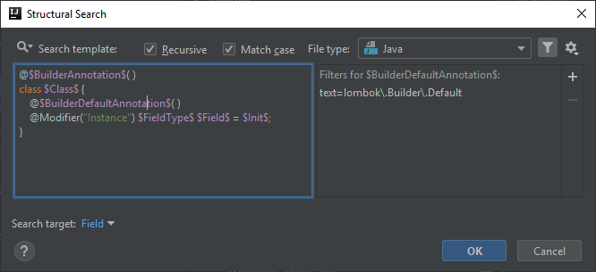

# Field in a non-@Builder class is annotated as @Builder.Default
Please note that this post builds on the previous two posts, [this](https://ijnspector.wordpress.com/2018/12/03/lombok-builder-default-field-is-not-initialized/) and [this](https://ijnspector.wordpress.com/2018/12/07/static-field-in-a-builder-class-is-annotated-as-lombok-builder-default/).

It can happen that you annotate an instance field as Lombok's `@Builder.Default` but you don't add `@Builder` to the class, which may mean two things:
- you actually want to create a builder and you just forgot to add the `@Builder` annotation,
- or you don't want to create a builder but for some reason you added `@Builder.Default` in which case it should be removed, because it won't have any effect.

## Template creation
The template is almost the same as it was in [*Lombok @Builder.Default field is not initialized*](https://ijnspector.wordpress.com/2018/12/03/lombok-builder-default-field-is-not-initialized/) (removed `$SingularAnnotation$`) but of course there will be changes in its configuration.

```java
@$BuilderAnnotation$( )
class $Class$ {
    @$BuilderDefaultAnnotation$( )
    @Modifier("Instance") $FieldType$ $Field$ = $Init$;
}
```


## BuilderAnnotation and BuilderDefaultAnnotation variables
This time we want to tell IntelliJ to search for `@Builder.Default` annotated instance fields in classes that are not annotated as `@Builder`.

The configuration of `$BuilderDefaultAnnotation$` doesn't change compared to previous templates, it still need to be configured with the reference of the annotation:

```
lombok\.Builder\.Default
```

While `$BuilderAnnotation$` still needs to be configured with the reference to the `@Builder` annotation

```
lombok\.Builder
```

it needs to be set as missing, thus setting both the minimum and maximum counts to 0-0.




## Class variable
The class name is not important in this template, so no additional configuration is required.

## FieldType and Field variables
In case of these two variables only their number of occurrences are important. The counts of both need to be set to 1-Unlimited, so that all matches get highlighted not just the first one.

I also marked `$Field$` as the target of the search, so only the field name gets highlighted in case of a match.


## Init variable
This variable is optional, since we are not looking for either if it is present, or if it is missing. So to make it optional just set its minimum count to 0 and leave the maximum count at 1.


## Finalization
You can find how the IDE signals the template match:


Below you can find the XML representation of the template created, so that you can easily copy and paste it into your template collection.

```xml
<searchConfiguration name="Field in a non-@Builder class is annotated as @Builder.Default. It has no effect, thus can be removed." text="@$BuilderAnnotation$( )&#10;class $Class$ {&#10;    @$BuilderDefaultAnnotation$( )&#10;    @Modifier(&quot;Instance&quot;) $FieldType$ $Field$ = $Init$;&#10;}" recursive="false" caseInsensitive="true" type="JAVA">
    <constraint name="BuilderAnnotation" regexp="lombok\.Builder" minCount="0" maxCount="0" within="" contains="" />
    <constraint name="Class" within="" contains="" />
    <constraint name="BuilderDefaultAnnotation" regexp="lombok\.Builder\.Default" within="" contains="" />
    <constraint name="FieldType" maxCount="2147483647" within="" contains="" />
    <constraint name="Field" maxCount="2147483647" target="true" within="" contains="" />
    <constraint name="Init" minCount="0" within="" contains="" />
</searchConfiguration>
```
