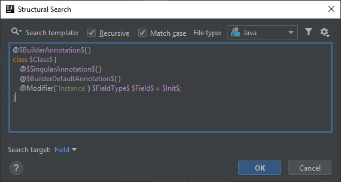
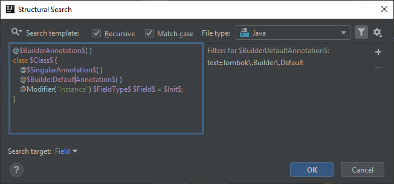
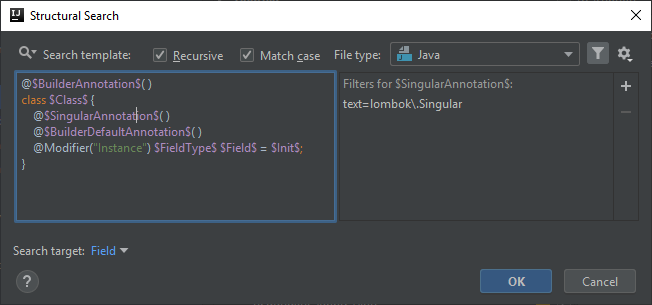
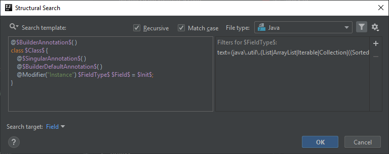
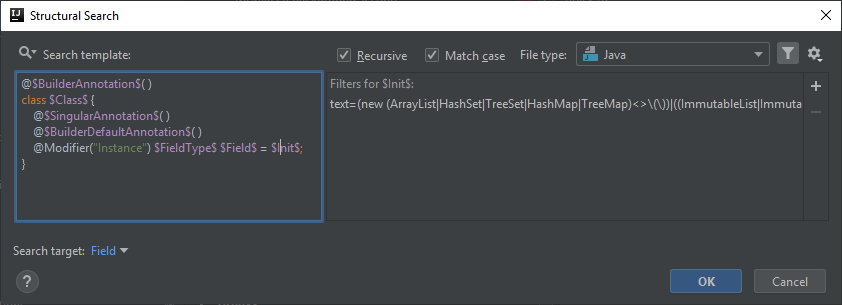
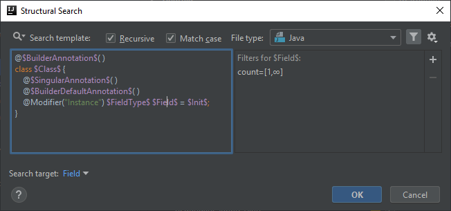

# A @Singular field is explicitly initialized as an empty collection
Lombok has an annotation called [`@Singular`](https://projectlombok.org/features/Builder) as an extra feature for `@Builder`. The official documentation defines its functionality as the following:

> By annotating one of the parameters (if annotating a method or constructor with @Builder) or fields (if annotating a class with @Builder) with the @Singular annotation, lombok will treat that builder node as a collection, and it generates 2 'adder' methods instead of a 'setter' method.

Based on my experience, these collections are initialized as empty collections under the hood, so it doesn't need to be done explicitly.

## Template creation
The template is very similar to the ones I posted previously regarding Lombok `@Builder`, however there are a few additions to it.

The first one is that in case of the instance fields that we are inspecting, we need to add the `@Singular` annotation as well as a condition,
also need to configure the field related variables to check for explicit initialization.

```java
@$BuilderAnnotation$( )
class $Class$ {
    @$SingularAnnotation$( )
    @$BuilderDefaultAnnotation$( )
    @Modifier("Instance") $FieldType$ $Field$ = $Init$;
}
```



## BuilderAnnotation, Class and BuilderDefaultAnnotation variables
These can be left untouched compared to previous examples.




## SingularAnnotation variable
In this template our targets are instance fields that have both the `@Singular` and `@Builder.Default` annotations applied.

There is no predefined template that would give us a hint how to handle multiple annotation criteria, so at first, based on the existing templates,
I thought multiple annotations need to be handled in a single annotation template variable. It turned out that it is not the case.
You can add multiple annotation specific template variables to fields, classes, etc. and define their conditions separately.

Thus in addition to `$BuilderDefaultAnnotation$` I also added `$SingularAnnotation$` which I configured (in its Text filter) to look for
the reference of the corresponding annotation:

```
lombok\.Singular
```



## FieldType, Field and Init variables
Our targets in this template, besides `@Singular` and `@Builder.Default` instance fields, are fields that have any of the collection types supported by Lombok's `@Singular` annotation
and at the same time they are initialized as empty collections (any of the supported ones).

Based on this information `$FieldType$`'s Text filter needs to be configured to match the supported Java and Guava collection types:

```
(java\.util\.(List|ArrayList|Iterable|Collection|((Sorted|Navigable|Hash|Tree|)(Set|Map))))
|(com\.google\.common\.collect\.Immutable(Collection|List|Set|SortedSet|Map|BiMap|SortedMap|Table))
```



At the same time `$Init$` needs to be configured similarly to match the initialization of an empty collection of any supported types:

```
(new (ArrayList|HashSet|TreeSet|HashMap|TreeMap)<.*>\(\))|(Immutable(List|Map|BiMap|SortedMap|Set|SortedSet|Table)\.of\(\))|((List|Map|Set)\.of\(\))
```



To have all matching fields highlighted, not just the first one, set the minimum and maximum counts to 1-Unlimited in case of both `$FieldType$` and `$Field$`.



## Finalization
The code highlight in the IDE will look like as the following:


Below you can find the XML representation of the template created, so that you can easily copy and paste it into your template collection.

```xml
<searchConfiguration name="Explicit @Singular field initialization as empty collection can be removed, @Singular itself initializes it as an empty collection." text="@$BuilderAnnotation$( )&#10;class $Class$ {&#10;    @$SingularAnnotation$( )&#10;    @$BuilderDefaultAnnotation$( )&#10;    @Modifier(&quot;Instance&quot;) $FieldType$ $Field$ = $Init$;&#10;}" recursive="false" caseInsensitive="true" type="JAVA">
    <constraint name="SingularAnnotation" regexp="lombok\.Singular" within="" contains="" />
    <constraint name="BuilderDefaultAnnotation" regexp="lombok\.Builder\.Default" within="" contains="" />
    <constraint name="FieldType" regexp="(java\.util\.(List|ArrayList|Iterable|Collection|((Sorted|Navigable|Hash|Tree|)(Set|Map))))|(com\.google\.common\.collect\.Immutable(Collection|List|Set|SortedSet|Map|BiMap|SortedMap|Table))" maxCount="2147483647" within="" contains="" />
    <constraint name="Field" maxCount="2147483647" target="true" within="" contains="" />
    <constraint name="Init" regexp="(new (ArrayList|HashSet|TreeSet|HashMap|TreeMap)&lt;&gt;\(\))|((ImmutableList|ImmutableMap|ImmutableBiMap|ImmutableSortedMap|ImmutableSet|ImmutableSortedSet|ImmutableTable)\.of\(\))" within="" contains="" />
    <constraint name="BuilderAnnotation" regexp="lombok\.Builder" within="" contains="" />
    <constraint name="Class" within="" contains="" />
</searchConfiguration>
```

UPDATE: Added pre-Java7 (no type inference in diamond operator) and Java9-> (List.of(), Map.of(), Set.of()) support to the `$Init$` variable.