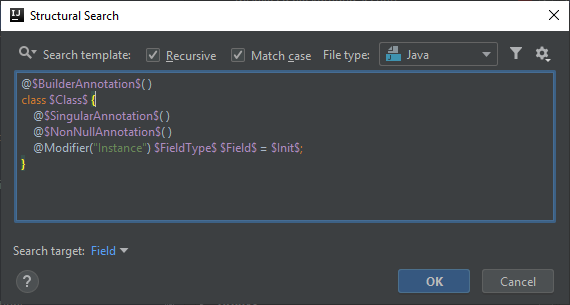
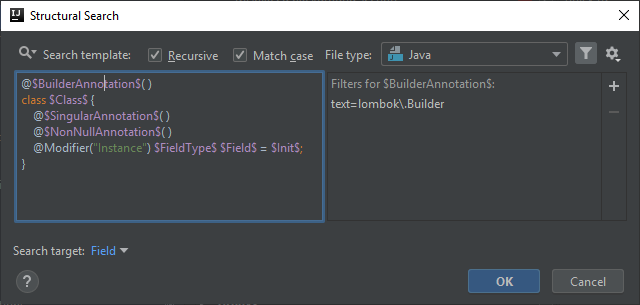
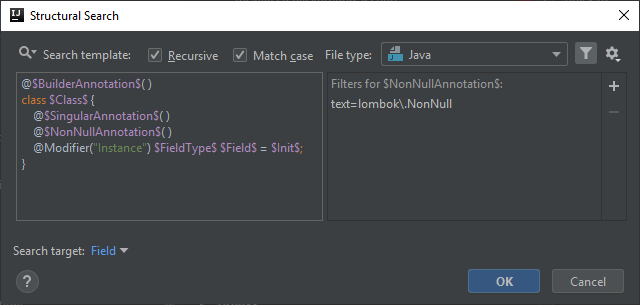
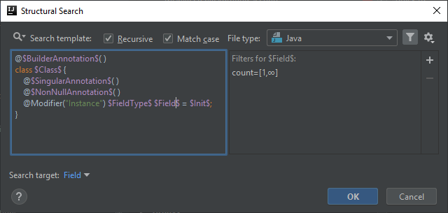
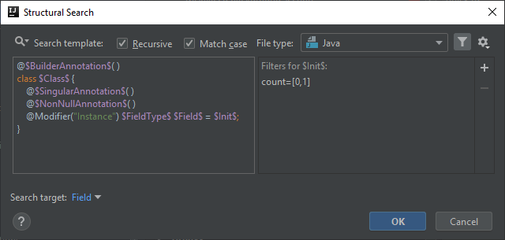

# Lombok @NonNull annotation is superfluous on a @Singular field
Lombok has its own [`@NonNull`](https://projectlombok.org/features/NonNull) annotation, which according to its Javadoc

> If put on a parameter, lombok will insert a null-check at the start of the method / constructor's body, throwing a
> `NullPointerException` with the parameter's name as message. If put on a field, any generated method assigning a value to this field will also produce these nullchecks.

This is a nice feature, however using it on a `@Singular` field is unnecessary. Since the `@Singular` annotation initializes the collection as an empty one, and generates adder methods
instead of a setter one, there is no way that the collection itself could be set as `null`. Whether the collection can store null values is a different topic.

## Template creation
This template is very similar to previous ones. We are looking for `@Singular` instance fields in `@Builder` classes that also have the `@NonNull` annotation applied.

Thus I added the `$NonNullAnnotation$` template variable, but also removed the `$BuilderDefaultAnnotation$` because based on the original documentation `@Singular` can be applied without having `@Builder.Default` on a particular field.

```java
@$BuilderAnnotation$( )
class $Class$ {
    @$SingularAnnotation$( )
    @$NonNullAnnotation$( )
    @Modifier("Instance") $FieldType$ $Field$ = $Init$;
}
```



## BuilderAnnotation and Class variables
These can be left unchanged compared to previous templates. (`$Class$` is at its default state.)



## SingularAnnotation variable
We are looking for `@NonNull` annotated fields only when the field is `@Singular` so this variable needs to reference the Singular annotation,
thus its Text filter is going to be:

```
lombok\.Singular
```


## NonNullAnnotation variable
We are looking for `@Singular` fields that are also annotated as `@NonNull` so we need to configure this variable to reference Lombok's `@NonNull` annotation:

```
lombok\.NonNull
```



## FieldType, Field and Init variables
The only condition for `$FieldType$` and `$Field$` is their number of occurrences which is at least one, so the minimum and maximum counts need to be set to 1-Unlimited.

Since it doesn't matter if the fields are initialized or not, the `$Init$` variable can be set to optional by setting its counts to 0-1.

I also set `$Field$` to be the target of the search, thus only highlighting the field's name in case of a match.
It occurred to me that although the target of the search influences how and to what the quick fix is applied to in case of Replace templates,
it might also affect how the Minimum and Maximum counts of certain variables need to be configured. The counts may change depending on what is the target of the search.
However I need to do some experimenting with this.





## Finalization
The highlighting in the IDE will look like this:


Below you can find the XML representation of the template created, so that you can easily copy and paste it into your template collection.

```xml
<searchConfiguration name="@NonNull annotation is applied to a @Singular field. @Singular fields have no way to be set as null." text="@$BuilderAnnotation$( )&#10;class $Class$ {&#10;    @$SingularAnnotation$( )&#10;    @$NonNullAnnotation$( )&#10;    @Modifier(&quot;Instance&quot;) $FieldType$ $Field$ = $Init$;&#10;}" recursive="false" caseInsensitive="true" type="JAVA">
    <constraint name="Class" within="" contains="" />
    <constraint name="BuilderAnnotation" regexp="lombok\.Builder" within="" contains="" />
    <constraint name="FieldType" maxCount="2147483647" within="" contains="" />
    <constraint name="Field" maxCount="2147483647" target="true" within="" contains="" />
    <constraint name="Init" minCount="0" within="" contains="" />
    <constraint name="SingularAnnotation" regexp="lombok\.Singular" within="" contains="" />
    <constraint name="NonNullAnnotation" regexp="lombok\.NonNull" within="" contains="" />
</searchConfiguration>
```
