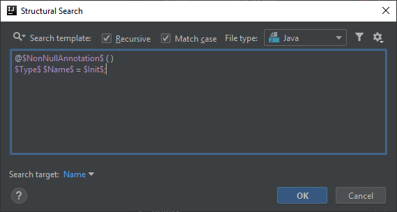
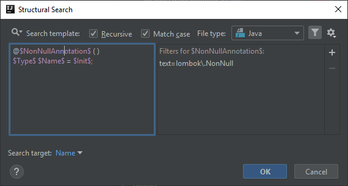
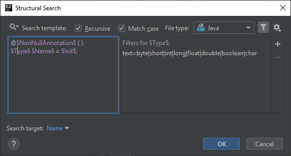
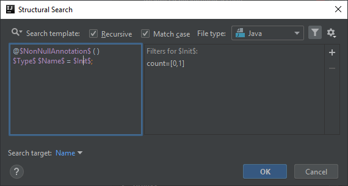

# Primitive type field, method parameter or local variable is annotated as Lombok @NonNull
Lombok's [`@NonNull`](https://projectlombok.org/features/NonNull) annotation is a nice feature generating null checks for you. However since primitive types cannot have null as value, the `@NonNull` annotation is not applicable to fields, method parameters and local variables.

In this article I will create a template for checking the `@NonNull` annotation on primitive types, which will work for fields, method parameters and local variables as well (`@NonNull` is allowed to be applied on local variable declarations too).

## Template creation
You can start the creation with the predefined template called *annotated fields*:

```java
class $Class$ {
  @$Annotation$( )
  $FieldType$ $Field$ = $Init$;
}
```

What I did is I got rid of the class definition, so that the template becomes flexible and applicable to not only fields of classes, but method parameters and local variables as well.
I also renamed most of the variables, so that they reflect that the template is rather generic and flexible.

```java
@$NonNullAnnotation$ ( )
$Type$ $Name$ = $Init$;
```



## NonNullAnnotation variable
We are looking for the `@NonNull` annotation therefore this variable's Text filter needs to be configured with its reference:

```
lombok\.NonNull
```



## Type variable
Since we would like the template to signal the usage of the `@NonNull` annotation only on primitive types, we need to configure `$Type$` accordingly. I listed all the available Java primitive types in the regex below:

```
byte|short|int|long|float|double|boolean|char
```



## Name variable
The only configuration that is necessary for this variable is to set it as the target of the search, to have it highlighted, but other than that it doesn't matter what the name of the field/parameter/variable is.

## Init variable
This part is optional (minimum and maximum counts set to 0-1) for two reasons:
- in case of fields and local variables there may or may not be an initialization part
- in case of method parameters an initialization (default value) is not allowed in Java (at least not yet)



## Finalization
The highlight will look like as below in case of different matches:

#### Fields


#### Method parameters


#### Local variables


For some reason in case of local variables the inspection seems to run twice which I haven't been able to figure out why. I guess that is the reason behind showing the inspection message twice.

Below you can find the XML representation of the template created, so that you can easily copy and paste it into your template collection.

```xml
<searchConfiguration name="Primitive type field, method parameter or local variable is annotated as Lombok @NonNull." text="@$NonNullAnnotation$ ( )&#10;$Type$ $Name$ = $Init$;" recursive="false" caseInsensitive="true" type="JAVA">
    <constraint name="NonNullAnnotation" regexp="lombok\.NonNull" within="" contains="" />
    <constraint name="Init" minCount="0" within="" contains="" />
    <constraint name="Type" regexp="byte|short|int|long|float|double|boolean|char" within="" contains="" />
    <constraint name="Name" target="true" within="" contains="" />
</searchConfiguration>
```
