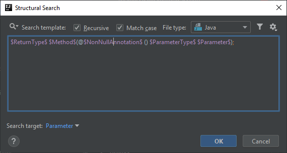
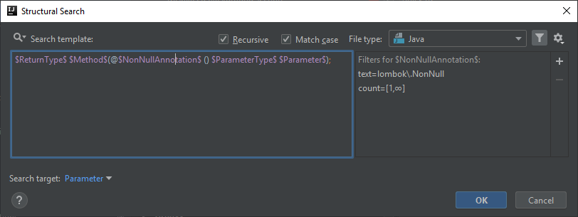
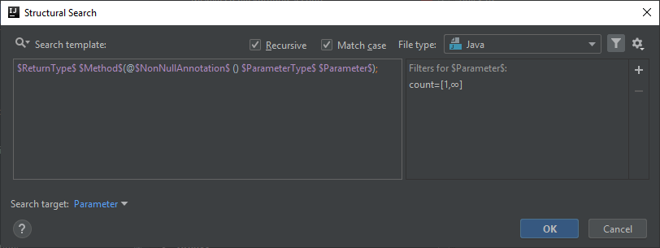

# Lombok @NonNull annotation is used on a method parameter
Lombok's [`@NonNull`](https://projectlombok.org/features/NonNull) annotation can be used on method parameters which

> If put on a parameter, lombok will insert a null-check at the start of the method / constructor's body

However one, in certain cases, may prefer relying directly on native Java functionality for such an easy task and not have the check auto-generated, which can also make debugging easier.

## Template creation
In this simple template we are looking for method parameters that are annotated as Lombok's `@NonNull`.

You can start the creation with the predefined template called *methods of the class*:

```java
$ReturnType$ $Method$($ParameterType$ $Parameter$);
```

and just add a new variable that represents the annotation on the parameter:

```java
$ReturnType$ $Method$(@$NonNullAnnotation$ () $ParameterType$ $Parameter$);
```

If you wonder whether the presence or absence of braces after `$NonNullAnnotation$` affects anything, I cannot answer that. So far, in the templates I created, it
didn't matter whether they were present or not.



## ReturnType and Method variables
There is no extra configuration needed for these variables as neither the return type nor the name of the method matters right now.

## NonNullAnnotation variable
Since we are looking for NonNull annotated parameters this variable needs to be configured so that it refers to that. Thus set its Text filter to

```
lombok\.NonNull
```



## ParameterType and Parameter variables
Though neither the type nor the name of the parameters matter, set the counts of both to 1-Unlimited to have IntelliJ find all matching parameters not just the first one.

Also set `$Parameter$` as the target of the search to have the parameter names highlighted.



## Finalization
The inspection message in the IDE will look like this:


Below you can find the XML representation of the template created, so that you can easily copy and paste it into your template collection.

```xml
<searchConfiguration name="Lombok @NonNull is used on a method parameter. You may replace it with an explicit check e.g. java.util.Objects.requireNonNull." text="$ReturnType$ $Method$(@$NonNullAnnotation$ () $ParameterType$ $Parameter$);" recursive="false" caseInsensitive="true" type="JAVA">
    <constraint name="ReturnType" within="" contains="" />
    <constraint name="Method" within="" contains="" />
    <constraint name="ParameterType" maxCount="2147483647" within="" contains="" />
    <constraint name="Parameter" maxCount="2147483647" target="true" within="" contains="" />
    <constraint name="NonNullAnnotation" regexp="lombok\.NonNull" maxCount="2147483647" within="" contains="" />
</searchConfiguration>
```
