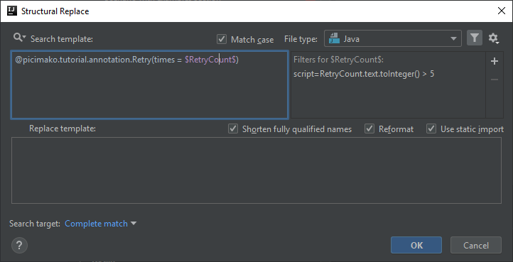

# Annotation attribute value is greater than the max allowed

There is one case I mentioned in [Annotation with a certain attribute value is invalid](https://ijnspector.wordpress.com/2018/11/05/annotation-with-a-certain-attribute-value-is-invalid/) but haven’t covered because it needed a little bit of insight how Script filters work. It is:

> The times attribute is set explicitly to a too high value

But the time has come, so brace yourselves for the first inspection with custom Script filter.

To get a sense of how template variables can be handled in script filters I encourage you to read [this forum post](https://intellij-support.jetbrains.com/hc/en-us/community/posts/360000045970-Search-and-Replace-Structurally-Script-Constraints-Documentation).

## Template creation

You have a choice whether you want to provide a possible quick fix for this issue or you just want it to be signaled.
I’m going to explain the creation of a replace template but at the end of this post I will provide you a simple search template as well.

The search template part of this inspection is based on the one in [Annotation with a certain attribute value is invalid](https://ijnspector.wordpress.com/2018/11/05/annotation-with-a-certain-attribute-value-is-invalid/)

```java
@picimako.tutorial.annotation.Retry(times = 0)
```

Your aim is to signal when the times attribute is greater than an arbitrary number, let's say greater than 5.

Having a hardcoded value as the value of the times attribute won’t help doing the magic, thus replace it with a template variable, so that we can compare the value of that to our arbitrary max value.

```java
@picimako.tutorial.annotation.Retry(times = $RetryCount$)
```


## RetryCount variable

To quote the aforementioned forum post:

> Say you have a SSR variable that matches a method, for example a toString() method. Then the variable is in fact a PsiMethod node. Retrieving variable.parent will produce a PsiClass node, and so forth. So naturally variable.text will give you the entire text of the method. If we just need the name of the method, variable.name will suffice.

Considering this, to be able to retrieve the value of the `$RetryCount$` variable we will need to use its `.text` attribute. Also, using `.nam` would not make sense as a literal value only has a text (value) but not a name.

In a script filter, template variables can simply be referenced by their name, without the enclosing $ characters.

Thus our template looks the following so far:

```java
RetryCount.text
```

This returns a string value, so we need to convert it to an integer to be able to compare with the max number of retries. Since the script filter uses Groovy as the script language, you can call `toInteger()` on the variable text to convert it to integer:

```java
RetryCount.text.toInteger()
```

Then the only remaining thing is to compare it to the max retry count, which is nothing special:

```java
RetryCount.text.toInteger() > 5
```



## Creating the replacement template

So to provide an optional quick fix that replaces the current retry count value to the max allowed value, you just need to specify the value explicitly in the replacement template like this:

```java
@picimako.tutorial.annotation.Retry(times = 5)
```


## Finalization

The inspection message in case of the search template will look like this:


and will behave as following in case of the replacement template, also applying the quick fix:


Below you can find the replacement template providing the quick fix:

```xml
<replaceConfiguration name="Retry count is greater than the max allowed (5). Apply quick fix to use the max allowed value." text="@picimako.tutorial.annotation.Retry(times = $RetryCount$)" recursive="true" caseInsensitive="true" type="JAVA" reformatAccordingToStyle="true" shortenFQN="true" useStaticImport="true" replacement="@picimako.tutorial.annotation.Retry(times = 5)">
    <constraint name="__context__" within="" contains="" />
    <constraint name="RetryCount" script="&quot;RetryCount.text.toInteger() &gt; 5&quot;" within="" contains="" />
</replaceConfiguration>
```

and also the simple search template that only signals the issue but doesn’t give you the ability to use a quick fix:

```xml
<searchConfiguration name="Retry count is greater than the max allowed (5)." text="@picimako.tutorial.annotation.Retry(times = $RetryCount$)" recursive="true" caseInsensitive="true" type="JAVA">
    <constraint name="__context__" within="" contains="" />
    <constraint name="RetryCount" script="&quot;RetryCount.text.toInteger() &gt; 5&quot;" within="" contains="" />
</searchConfiguration>
```
