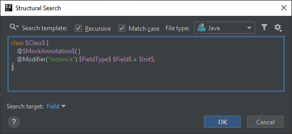
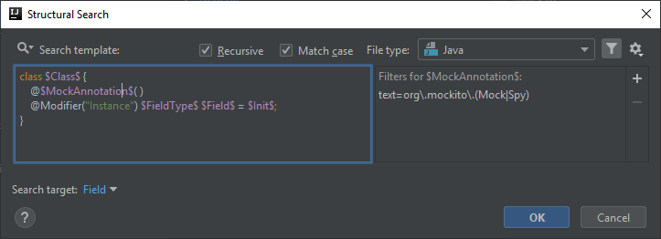
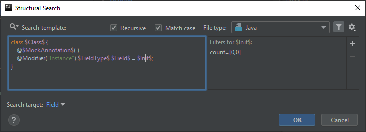
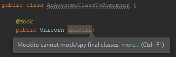

# Mockito cannot mock/spy final classes

Before version 2.1.0 Mockito wasn't able to mock and spy final classes, and after this version it is still an experimental feature that is disabled by default.

This inspection can help spotting fields whose type is final and the fields are annotated as either `org.mockito.Mock` or `org.mockito.Spy`. The followings are articles related to mocking final classes:
- [GitHub - Mock the unmockable: opt-in mocking of final classes/methods](https://github.com/mockito/mockito/wiki/What's-new-in-Mockito-2#mock-the-unmockable-opt-in-mocking-of-final-classesmethods)
- [Baeldung - Mock Final Classes and Methods with Mockito](https://www.baeldung.com/mockito-final)

## Template creation
You can casually start with the existing template called *Instance fields of the class*:

```java
class $Class$ { 
  @Modifier("Instance") $FieldType$ $Field$ = $Init$;
}
```

then all you need to do is add a template variable for the Mock/Spy annotation:

```java
class $Class$ { 
    @$MockAnnotation$( )
    @Modifier("Instance") $FieldType$ $Field$ = $Init$;
}
```



## MockAnnotation variable
The first thing to configure is the `$MockAnnotation$` variable which needs to reference the `@Mock` and `@Spy` annotations,
therefore we need to set up a **Text filter** with the following value:

```
org\.mockito\.(Mock|Spy)
```



## Init variable
The only filter that is required for `$Init$` is a Count filter having it set to *0-0*, as it is not a valid construct to mock a field and initialize it explicitly.



## Field variable
There are two constraints for this variable that it needs to meet.

The first one is a **Count filter**. Since there should be at least one `@Mock` or `@Spy` annotated field, but there can an unlimited number of them, this filter needs to be set to *1-Unlimited*.

The other constraint is that the type of the field should be final in order to find this field with the inspection. That requires us to create a **Script filter** with which we will dive into
the soul of IntelliJ a little bit, and see some interesting things in the internals of it.

### Some basics

Before we begin, it is important to know that when the inspection is parsed, an AST (Abstract Syntax Tree) is created where each template variable is a node in the tree. IntelliJ has its own types for
working with AST nodes.

Based on this information we can move on and handle `$Field$` as a node whose type we want to examine.

In a Script filter a template variable can simply be referenced by its name, without the enclosing `$` sign on which we can call different methods.

> **NOTE:** Don't expect much API suggestions in the Script filter edit window.

### The steps I took to assemble the script
First, since I wanted to examine whether the type of a field (not the field itself) is final or not I needed a method that actually validates that.
For that I came across `com.intellij.psi.PsiModifierListOwner#hasModifierProperty(String)`. This method does exactly that, so I will be able to call it like `hasModifierProperty("final")`. 

After that I needed to have access to the type of the field as some kind of class node instead of a field node.
I found that the field related template variables are handled as a `com.intellij.psi.PsiField` so I started to look into that.

In that class you can find the `getType()` method that returns a `com.intellij.psi.PsiType` which will probably be a class in case of at least something has a final modifier.

At this point I was looking for a Psi type that has something to do with classes and I found that `PsiType` (which is an abstract class) has a sub-class called `com.intellij.psi.PsiClassType`.

The big challenge came here. `PsiClassType` doesn't implement `PsiModifierListOwner` so from that I cannot call `hasModifierProperty("final")`. After a while I figured out that there are separate
classes called `Psi[Something]` and `Psi[Something]Type`, so I ran into `com.intellij.psi.PsiClass` which actually implements `PsiModifierListOwner` providing access to `hasModifierProperty()`.

Now I just needed to find out how I can convert `PsiClassType` to `PsiClass`. That can be done by calling `PsiClassType#resolve()`.

After all these investigations the final script looks like this:
```
Field.getType().resolve().hasModifierProperty("final")
```

With their corresponding types at each call:
- `Field` -> `PsiField`
- `Field.getType()` -> method return type is `PsiType`, and the actual type is a subclass of this: `PsiClassType`
- `Field.getType().resolve()` -> `PsiClass` that implements `PsiModifierListOwner`
- `Field.getType().resolve().hasModifierProperty("final")` -> boolean value determining the result of the inspection 


## Finalization

The inspection message in case of the search template will look like this:



and below you can find the XML representation of the inspection:

```xml
<searchConfiguration name="Mockito cannot mock/spy final classes." text="class $Class$ { &#10;    @$MockAnnotation$( )&#10;    @Modifier(&quot;Instance&quot;) $FieldType$ $Field$ = $Init$;&#10;}" recursive="true" caseInsensitive="true" type="JAVA">
    <constraint name="__context__" within="" contains="" />
    <constraint name="Class" within="" contains="" />
    <constraint name="FieldType" within="" contains="" />
    <constraint name="Field" script="&quot;Field.getType().resolve().hasModifierProperty(&quot;final&quot;)&quot;" maxCount="2147483647" target="true" within="" contains="" />
    <constraint name="Init" minCount="0" maxCount="0" within="" contains="" />
    <constraint name="MockAnnotation" regexp="org\.mockito\.(Mock|Spy)" within="" contains="" />
</searchConfiguration>
```
