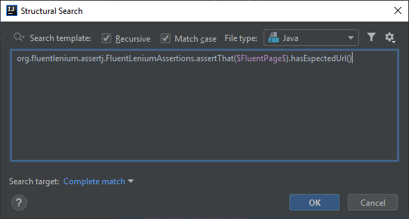
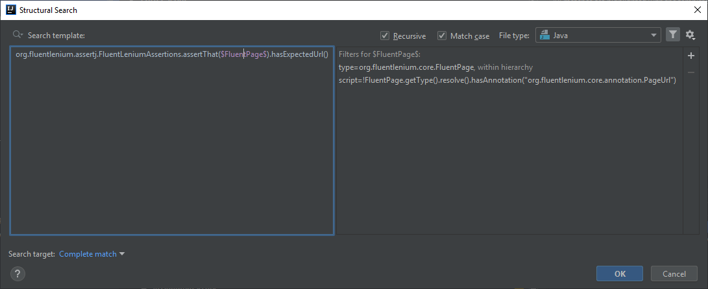
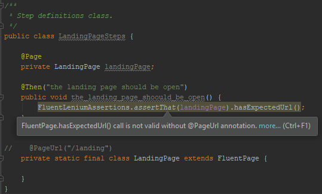

# FluentPage hasExpectedUrl() assertion is not valid without @PageUrl annotation

I haven't made a tutorial for [FluentLenium](https://fluentlenium.com) related inspections but the time has come. Quoting its official website
> FluentLenium is a React ready website automation framework which extends Selenium to write readable, reusable, reliable and resilient UI functional tests.

I have been quite involved in its development lately and I use it on a real project as well, so it was a no-brainer to create a couple of inspections for it.

## Some context to start with

With FluentLenium, as with other UI automation frameworks too, you can create Page Object classes. With this library you can achieve it (as one of the ways) by extending its `FluentPage` class
and annotating the class as `@PageUrl`.

The value of the `@PageUrl` annotation is a relative URL which may be used for navigation and URL validation.

So one Page Object class may look like this:

```java
@PageUrl("/landing")
public class LandingPage extends FluentPage {
    
    @FindBy(id = "hero")
    public FluentWebElement heroImage;
}
```

One of its AssertJ support classes, `PageAssert` has a method called `hasExpectedUrl()` which validates whether the current `WebDriver` instance is on the URL defined by the page object class in its `@PageUrl` annotation.

However if this annotation is not added on the class, this validation will not work and fail with an error message saying that the annotation is missing.

That is what I'm going to create an inspection for in this post.

## Template creation

So, FluentLenium has AssertJ support and with that comes the class called `FluentLeniumAssertions`. One of its assertThat methods accepts the aforementioned `FluentPage` type objects and returns a `PageAssert` one
to call actual assertions on it.

Since we know the type `FluentLeniumAssertions`, the method called from it (`assertThat()`) and also that we want to have the inspection for the `hasExpectedUrl()` of `PageAssert` we can put together the following starting template:

```java
org.fluentlenium.assertj.FluentLeniumAssertions.assertThat().hasExpectedUrl()
```

Of course it has a missing piece, the method parameter for assertThat that we are doing the actual assertion on. Let's add it as a template variable so that we can further configure it. That will be the most important part of the template.

```java
org.fluentlenium.assertj.FluentLeniumAssertions.assertThat($FluentPage$).hasExpectedUrl()
```

It's important to point out that I intentionally did not end the template text with a semicolon. If I did so, than it would search for complete statements matching this template,
but with the current template - without the semicolon - `hasExpectedUrl()` method calls are found even when there are one or multiple other method calls chained after that. 



## FluentPage variable

### Validating the parameter type

Although `hasExpectedUrl()` pretty much restricts what the type of `$FluentPage$` may be, due to the chance that another assertion type may also get this method in the future, it is better to define the type of the parameter explicitly.

For that we need to use a Type filter. In a Type filter you can define the exact full reference of a type. (Don't confuse it with the Text filter's text which is a regexp field.) We know that it may be any descendant of `org.fluentlenium.core.FluentPage`, so at first we'll set the filter text as
```java
org.fluentlenium.core.FluentPage
```

But that is not enough. In its current form it would check only those objects whose exact type is `FluentPage` but not any descendants. To make that work we also need to tick the **Within type hierarchy** checkbox.

### Validating @PageUrl presence

The second part is to validate whether the parameter is annotated as `@PageUrl`. That is a little bit more difficult but with the experiences gained from the [Mockito cannot mock/spy final classes](https://ijnspector.wordpress.com/2019/03/25/mockito-cannot-mock-spy-final-classes/)
tutorial it is much easier. So we have to use a Script filter for that.

We need to validate whether the annotation is present on the **type** of the parameter and not on the parameter itself, so we can reuse the type conversion from that:

```java
FluentPage.getType().resolve()
```

At this point there is a need for a little bit of investigation and digging in the IntelliJ project how can we check the presence of an annotation.

We can quickly find out that the `PsiClass` type inherits a method called `hasAnnotation(String)` from `PsiModifierListOwner` which
we can use for this validation. At this point our script looks like this:

```java
FluentPage.getType().resolve().hasAnnotation()
```

Then we need to specify which annotation we are checking, by setting the full reference of that annotation type:

```java
FluentPage.getType().resolve().hasAnnotation("org.fluentlenium.core.annotation.PageUrl")
```

And as the final step, since the inspection should mark code snippets where the parameter doesn't have the `@PageUrl` annotation applied, we need to negate the script condition:

```java
!FluentPage.getType().resolve().hasAnnotation("org.fluentlenium.core.annotation.PageUrl")
```



## Caveats

Though this all looks and sounds great, there is one case that can only be achieved with a workaround at this moment, and this is applicable not just for `FluentLeniumAssertions`
but any classes that work with chained method calls.

Let's say we have the inspection from this post up and running. It can find the problematic code snippets in calls like these:

```java
FluentLeniumAssertions.assertThat(fluentPage).hasExpectedUrl();
```

and

```java
FluentLeniumAssertions.assertThat(fluentPage).hasExpectedUrl().hasExpectedElements()....
```

but not in snippets where `hasExpectedUrl()` is not the first assertion called, like this one:

```java
FluentLeniumAssertions.assertThat(fluentPage).hasExpectedElements().hasExpectedUrl()....
```

Unfortunately there is no short solution for this, to ignore intermediate method calls, but one can create multiple inspections having and addressing 1, 2, 3 and up to X number of intermediate chained calls
(in case we are talking about permanent templates and not just a one-time search in your project).

You can find some more details on [this IntelliJ support ticket](https://intellij-support.jetbrains.com/hc/en-us/community/posts/360003733580-SSR-Ignore-intermediate-chained-method-calls).

## Finalization

The inspection message in case of the search template will look like this:



and below you can find the XML representation of the inspection:

```xml
<searchConfiguration name="FluentPage.hasExpectedUrl() call is not valid without @PageUrl annotation." text=" org.fluentlenium.assertj.FluentLeniumAssertions.assertThat($FluentPage$).hasExpectedUrl();" recursive="true" caseInsensitive="true" type="JAVA">
    <constraint name="__context__" within="" contains="" />
    <constraint name="FluentPage" script="&quot;!FluentPage.getType().resolve().hasAnnotation(&quot;org.fluentlenium.core.annotation.PageUrl&quot;)&quot;" nameOfExprType="org\.fluentlenium\.core\.FluentPage" expressionTypes="org.fluentlenium.core.FluentPage" exprTypeWithinHierarchy="true" within="" contains="" />
</searchConfiguration>
```