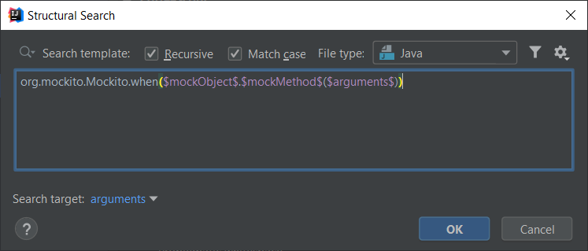
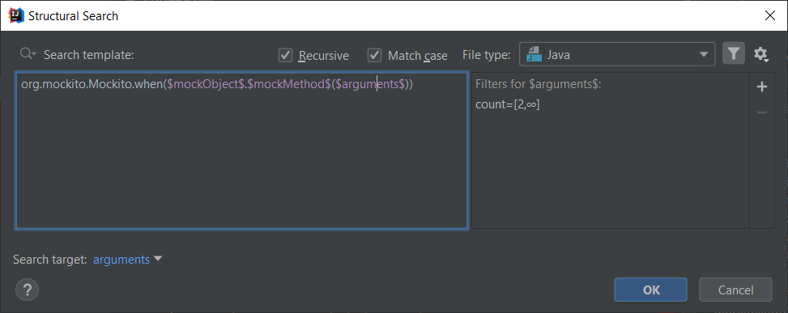
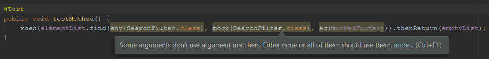

#### Mocked method arguments are inconsistent

In Mockito when a method is being mocked, its parameters may be verified with exact values or one can use so called `ArgumentMatchers` with which restrictions on argument values may be relaxed
or made more complex in the good sense of the word.

When specifying the arguments for mocked methods the rule that Mockito enforces is that either all or none of the arguments must use argument matchers,
so the following code snippet is considered as invalid:

```java
when(mockObject.mockMethod(ArgumentMatchers.any(SomeClass.class), "some string")).thenReturn(aReturnValue);
```

This validation is implemented in [`org.mockito.internal.exceptions.Reporter#invalidUseOfMatchers(int, List)`](https://github.com/mockito/mockito/blob/53e8a93141e1f8c41d6b6d4fd72c20488826269a/src/main/java/org/mockito/internal/exceptions/Reporter.java).

## Template creation

Since we want to check the usage of argument matchers within `Mockito.when()` calls, it is kind of straightforward to start with this snippet:

```java
org.mockito.Mockito.when()
```

Not adding a semicolon at the end of the template is intentional, so that it wouldn't match entire statements but only parts of it, because after a `Mockito.when()` there must be a `then...()` method call.

Next, we need to implement a method call on a mock object that may be done as following:

```java
org.mockito.Mockito.when($mockObject$.$mockMethod$())
```

And as the final step we also want to make sure that the mocked method arguments are also targeted, that is the most important part of this template. So we can add a template variable for arguments as well:

```java
org.mockito.Mockito.when($mockObject$.$mockMethod$($arguments$))
```

For the template it doesn't matter where in the argument list the inconsistent arguments are (be it matcher or non-matcher), it will signal it as a problem.



## mockObject variable

In this template it is irrelevant what the mocked object is, so no configuration is needed for this variable. 

## mockMethod variable

In this template it is irrelevant what the mocked method is, so no configuration is needed for this variable.

## arguments variable

This is the most important part of the template of which I'm going to explain how I got to the final solution.

It was kind of evident that a Script filter is going to be inevitable in order to make this template work.

However the first restriction I had to make is the number of arguments in case this template would find a match.
The template should not match methods with 0 arguments, that just doesn't make sense, and in case of 1 argument there is or isn't an `ArgumentMatcher` used. The real challenge comes from
2 arguments to infinity and beyond. Thus this variable needs a Count filter set to the [2,Infinite] range.

The other part of the validation looks like this:
- iterate through the arguments list,
- find out whether the use of parameters are inconsistent in terms of argument matchers and return true or false based on that.

My first attempt was to write and add the Script filter to this variable but I quickly found out that it doesn't work entirely the way I imagined.

I wanted to work with a list of arguments but in this case it would match the `$arguments$` variable only to the first argument of the method and I could validate only that one.

So basically I had to get a broader view of this template variable and the only way to do that (as per my current knowledge) is to move the Script filter to the **Complete Match** variable.



## Complete Match filters

Once I moved the script to Complete Match I could work with the `$arguments$` variable as a list, specifically (at least in this case) an `ArrayList`.
On that I can easily iterate through and inspect each item.

Below you will find the script filter in its entirety but first I'd like to explain it in detail.

So for each argument there are three possible cases what they can be (and what are also relevant to this template):
- a method call from the `org.mockito.ArgumentMatchers` class
- a method call from something other than `org.mockito.ArgumentMatchers`
- anything else

When an argument is a method call it is handled as a `com.intellij.psi.PsiMethodCallExpression` type node. First we need to check whether the argument is a method call, then we can further
inspect that method call. You can do this by calling an `instanceof` on the argument:

```groovy
if (it instanceof com.intellij.psi.PsiMethodCallExpression) {
}
```

In the next step we need to check whether the method call is an actual `ArgumentMatcher` and I did this by validating whether the method signature of the method call is defined in the `org.mockito.ArgumentMatchers` class.

In the script I referenced the current argument (a method call in this case) as `it` of which we need to get the method definition of. We can do this by calling:

```java
it.resolveMethod()
```

On this new node type (`com.intellij.psi.PsiMethod`) we can retrieve the class type (`com.intellij.psi.PsiCLass`) that the method is defined in calling:

```java
it.resolveMethod().getContainingClass()
```

After that the only thing we need is to check whether this class is `org.mockito.ArgumentMatchers`:

```java
it.resolveMethod().getContainingClass().getQualifiedName() == "org.mockito.ArgumentMatchers"
```

You can find the whole script filter below, with some comments to make it easier to understand what is happening: 

```groovy
boolean hasOnlyMatchers = true
boolean hasMatcher = false
arguments.each { it ->
	//If the argument is a method call
    if (it instanceof com.intellij.psi.PsiMethodCallExpression) {
    	//A method call from ArgumentMatchers
    	try {
            if (it.resolveMethod().getContainingClass().getQualifiedName() == "org.mockito.ArgumentMatchers") {
                hasMatcher = true
            //A method call from a non-ArgumentMatchers class
            } else {
                hasOnlyMatchers = false
            }
        //NullPointerException may happen on 'it' when an argument implementation is not complete
    	} catch (NullPointerException npe) {
    	    false
    	}
    //Not a method call, but an other type of expression
    } else {
    	hasOnlyMatchers = false
    }
}

//If there is not only matchers, or not only non-matchers, then it will signal a problem.
!((hasMatcher && hasOnlyMatchers) || (!hasMatcher && !hasOnlyMatchers))
```

There is an additional try-catch block because `it` may be null is some cases e.g.:

```java
when(mockObject.mockMethod(mock(), any()))
```

You can see there is a call to `Mockito.mock()` but without any parameter what class to mock. That may cause NullPointerException,
but since that is not a correct code, we can tell IntelliJ to basically ignore that case by returning `false` in the catch block.

We could have also enforced that the method called from `ArgumentMathers` is a static method but since that class contains only static methods that doesn't seem necessary.
    
## Finalization

The inspection message in case of this template will look like this:



and below you can find the XML representation of the inspection:

```xml
<searchConfiguration name="Some arguments don't use argument matchers. Either none or all of them should use them." text="org.mockito.Mockito.when($mockObject$.$mockMethod$($arguments$))" recursive="true" caseInsensitive="true" type="JAVA">
    <constraint name="__context__" script="&quot;boolean hasOnlyMatchers = true&#10;boolean hasMatcher = false&#10;arguments.each { it -&gt;&#10;&#9;//If the argument is a method call&#10;    if (it instanceof com.intellij.psi.PsiMethodCallExpression) {&#10;    &#9;//A method call from ArgumentMatchers&#10;    &#9;try {&#10;            if (it.resolveMethod().getContainingClass().getQualifiedName() == &quot;org.mockito.ArgumentMatchers&quot;) {&#10;                hasMatcher = true&#10;            //A method call from a non-ArgumentMatchers class&#10;            } else {&#10;                hasOnlyMatchers = false&#10;            }&#10;        //NullPointerException may happen on 'it' when an argument implementation is not complete&#10;    &#9;} catch (NullPointerException npe) {&#10;    &#9;    false&#10;    &#9;}&#10;    //Not a method call, but an other type of expression&#10;    } else {&#10;    &#9;hasOnlyMatchers = false&#10;    }&#10;}&#10;&#10;//If there is not only matchers, or not only non-matchers, then it will signal a problem.&#10;!((hasMatcher &amp;&amp; hasOnlyMatchers) || (!hasMatcher &amp;&amp; !hasOnlyMatchers))&quot;" within="" contains="" />
    <constraint name="arguments" minCount="2" maxCount="2147483647" target="true" within="" contains="" />
    <constraint name="mockObject" within="" contains="" />
    <constraint name="mockMethod" within="" contains="" />
</searchConfiguration>
```
