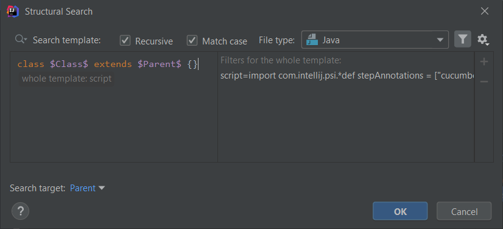

# Iterate through methods of a superclass

Recently I've come across a Cucumber exception that states classes that define Step Definitions or hooks are not allowed to be
extended. This is a perfect candidate to create an inspection for since you don't need any runtime information to inspect
a class' methods.

## Template creation

The idea to implement the inspection was to check the class that is defined in the extends part of a class signature,
iterate through its methods and if one method is annotated with any of the step or hook annotations, then mark
the class that extending it is a no-no. 

The template itself looks like this:

```java
class $Class$ extends $Parent$ {}
```



It is worth noting that inspecting the methods of the current class and a superclass are a bit different because in the current
class the check can be implemented right in the search template without needing to create any script filters, something like
this:

```java
class $Class$ { 
  @$StepOrHookAnnotation$
  $ReturnType$ $Method$ ($ParameterType$ $Parameter$);
}
```

But the search template cannot match something that is not in the current context but somewhere else. So because of that
we need to implement a Script filter that will iterate through and check the methods of the direct superclass.

To make things easier I implemented all of this in the *Complete Match* variable.

So first we need to have access to the methods of the superclass, and in order to achieve that we also need a `PsiClass`
instance from that superclass from which we can query them.

After some investigation and debugging I found out that the `$Parent$` template variable
is resolved to `PsiJavaCodeReferenceElement` type. We somehow need to make a `PsiClass` type object from that.

For that first we can call `resolve()` on `Parent` which results in a `PsiElement` object:

```groovy
import com.intellij.psi.*

PsiElement superclass = Parent.resolve();
```

After some more investigation I also found out that `PsiClass` is actually an extension of the `PsiElement` interface so it
can be used to access the methods, after a type check, just to make sure nothing goes wrong with the inspection:

```groovy
PsiElement superclass = Parent.resolve();
if (superclass instanceof PsiClass) {
}
```

The next step is to iterate through the methods of the superclass:

```groovy
PsiElement superclass = Parent.resolve();
if (superclass instanceof PsiClass) {
    //PsiMethod
	for (method in superclass.getMethods()) {
	}
}
```

Now that we have access to individual methods, we can inspect their annotations, so let's iterate through them as well:

```groovy
PsiElement superclass = Parent.resolve();
if (superclass instanceof PsiClass) {
	for (method in superclass.getMethods()) {
        //PsiAnnotation
		for (methodAnnotation in method.getAnnotations()) {
		}
	}
}
```

We've already finished, the most important thing comes now, to execute the actual validation, that the currently checked annotation
is a step or a hook. For that we can query the qualified name of the annotation which returns its fully qualified name
like `cucumber.api.java.en.Given`.

To be able to check whether the qualified name is a step or a hook annotation we have to store those annotations somewhere,
therefore I introduced a simple list (`stepAnnotations`) with some of the annotations, and also added the actual check:

```groovy
def stepAnnotations = ["cucumber.api.java.en.Given",
                       "cucumber.api.java.en.When",
                       "cucumber.api.java.en.Then"]
PsiElement superclass = Parent.resolve();
if (superclass instanceof PsiClass) {
    for (method in superclass.getMethods()) {
        for (methodAnnotation in method.getAnnotations()) {
            if (stepAnnotations.contains(methodAnnotation.getQualifiedName())) {
				return true
			}
		}
	}
}
```

There is one more thing we need to take care of, to make sure that the template doesn't highlight code snippets that are
correct. For that I added a simple return statement at the end of the Script filter, with which the complete filter script
looks as follows:

```groovy
import com.intellij.psi.*

def stepAnnotations = ["cucumber.api.java.en.Given",
                       "cucumber.api.java.en.When",
                       "cucumber.api.java.en.Then"]
PsiElement superclass = Parent.resolve();
if (superclass instanceof PsiClass) {
    for (method in superclass.getMethods()) {
        for (methodAnnotation in method.getAnnotations()) {
			if (stepAnnotations.contains(methodAnnotation.getQualifiedName())) {
				return true
			}
		}
	}
}
false
```

## Possible improvements

Though the Script filter in its current form is easily extendable with additional annotations, it might still not be the
perfect solution due to having to add each annotation one-by-one.

I could imagine an update where you only specify the package or packages (may a regexp for them) that you match the
annotation fully qualified names against, then that way the extension of this script would become much easier.  

## Finalization

The inspection message in case of this template will look like this:


and below you can find the XML representation of the inspection:

```xml
<searchConfiguration name="Classes defining Step Definitions or hooks are not allowed to be extended." text="class $Class$ extends $Parent$ {}" recursive="true" type="JAVA" pattern_context="default" case_sensitive="true">
    <constraint name="__context__" script="&quot;import com.intellij.psi.*&#10;&#10;def stepAnnotations = [&quot;cucumber.api.java.en.Given&quot;,&#10;                       &quot;cucumber.api.java.en.When&quot;,&#10;                       &quot;cucumber.api.java.en.Then&quot;]&#10;PsiElement superclass = Parent.resolve();&#10;if (superclass instanceof PsiClass) {&#10;    for (method in superclass.getMethods()) {&#10;        for (methodAnnotation in method.getAnnotations()) {&#10;            if (stepAnnotations.contains(methodAnnotation.getQualifiedName())) {&#10;                return true&#10;            }&#10;        }&#10;    }&#10;}&#10;false&quot;" within="" contains="" />
    <constraint name="Class" within="" contains="" />
    <constraint name="Parent" target="true" within="" contains="" />
</searchConfiguration>
```

This inspection is also available in the [Cucumber inspections collection](../../inspections/cucumber.md) but it might
change in the future.
