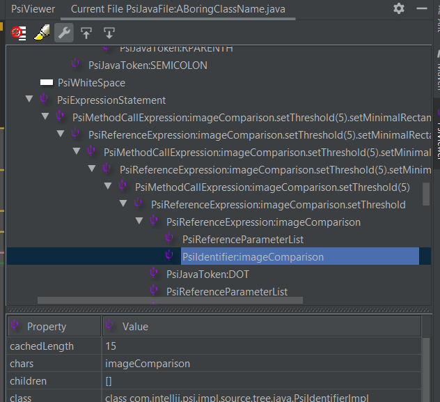
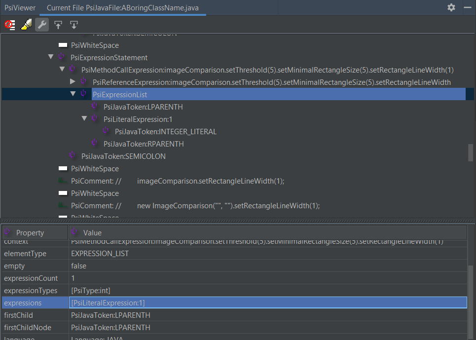
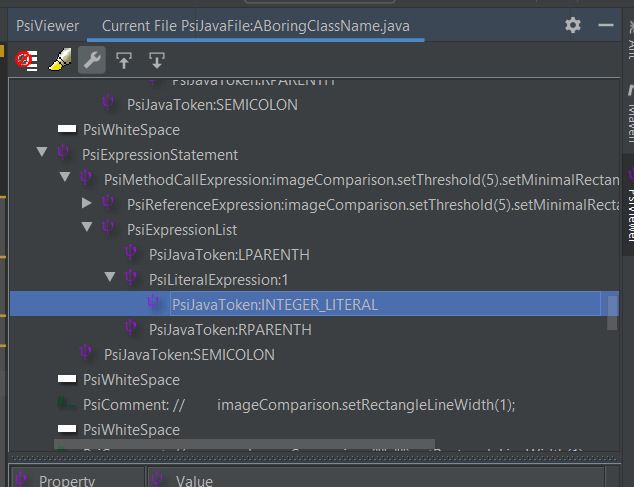

# Validating ImageComparison setter method default values

Recently I have come across a library called [image-comparison](https://github.com/romankh3/image-comparison) that, as its name suggests,
provides options for comparing images that, among other things, can be useful for visual comparison based UI test automation.

Although there were not many inspections I could think of implementing for this library, I noticed that one particular class,
`ImageComparison`, has chainable setter methods, and many of their respective fields have default values.
So I thought why not create a common inspection for them, to signal whether a setter is called with its respective field’s default value.

An example call would be:

```java
ImageComparison imageComparison = new ImageComparison(expectedImage, actualImage);
imageComparison.setThreshold(5).setRectangleLineWidth(1);
```

It seemed trivial at first but it got trickier as I was getting into the implementation.

## The naive approach

The probably fastest solution would be to create a separate template for each setter method, which might be:

```java
$ImageComparison$.setThreshold($threshold$)
```

with the following configuration:

- `$ImageComparison$` - Type filter: *com.github.romankh3.image.comparison.ImageComparison*
- `$threshold$` - Script filter:
    ```java
    try {
        threshold?.text?.toDouble() == 5
    } catch (NumberFormatException e) {
        false
    }
    ```

However handling 6 different templates is cumbersome, and obviously violates the well-known DRY (Don’t Repeat Yourself) principle.

## A more sophisticated approach

A more sophisticated solution is to handle all 6 setter methods within one inspection,
so it becomes much easier to extend and update it later. Also, anyone who uses these templates will have to do much less work adding them into their projects.

I began with the following template text:

```java
$ImageComparison$.$setterMethod$($setValue$)
```

with this configuration:

- `$ImageComparison$` - Type filter: *com.github.romankh3.image.comparison.ImageComparison*
- Complete match variable - Script filter (note: this is not a proper/working implementation, but demonstrates the concept well):
    ```groovy
    def setterDefaults = [setPixelToleranceLevel: 0.1d, setThreshold: 5, setRectangleLineWidth: 1, setMinimalRectangleSize: 1, setMaximalRectangleCount: -1, setDrawExcludedRectangles: false]
    setValue.value == setterDefaults[setterMethod.text]
    ```

The idea is to store the setter method names and default values in a map, query the default values by the currently inspected method's name,
and compare the value passed to the setter and the default value associated to it.

### Determining the Script filter's place

The reason I want to configure a Script filter in the Complete match variable is because I need access to both the `$setterMethod$` and `$setValue$` variables.
If I added it to the `$setterMethod$` variable, I would not have access to `$setValue$`.

It is also worth noting that when querying the text of `$setterMethod$` in Complete match,
the value returned is different than if the Script filter would be added to the `$setterMethod$` variable itself.

My guess is that since the context is broader, (at least) some types of variables are interpreted (and resolved) in a broader sense.
Let’s say the call is `imageComparison.setThreshold(5)`, the text of `$setterMethod$` will be the following based on which variable the Script filter is added to:

- In `$setterMethod$`: *setThreshold*
- In Complete match: *imageComparison.setThreshold(5)*

Unfortunately this makes implementing the template a bit trickier. Or maybe fortunately, because that means you can learn something new.

## Validating the method call chain

A feasible solution might be to iterate through the list of chained setter method calls and inspect their names and passed-in values,
and if there is at least one call where the default value is set, signal the whole call chain as incorrect.

> NOTE: As for setting the Search target you will find some details in the "Setting the Search target" section at the end.

After some investigation it turned out that `$setterMethod$` in this case represents the whole method call chain, and not just a single method call, so it may be one or multiple
call chained together. Knowing this we can come up with a logic that iterates through the PSI structure of calls and compares their parameters to the default values. 

To avoid doing unnecessary validation, we can also consider stopping at the first match, and skip the inspection of all the other method calls.

In order to implement the iteration we need to find out `$setterMethod$`'s type and what data is available in it, so we can find out what we are going to
iterate on exactly.

A good start seemed to be looking into the children of that node. So for a method call like:
`imageComparison.setThreshold(5).setMinimalRectangleSize(5);` some of the data I thought might be useful were:

| Variable query | Result |
|---|---|
| <pre>setterMethod.firstChild</pre> | <pre>PsiReferenceExpression:imageComparison.setThreshold(5).setMinimalRectangleSize</pre> |
| <pre>setterMethod.firstChild.getType()</pre> | <pre>PsiType:ImageComparison</pre> |
| <pre>setterMethod.firstChild.getOriginalElement()</pre> | <pre>PsiReferenceExpression:imageComparison.setThreshold(5).setMinimalRectangleSize</pre> |
| <pre>setterMethod.firstChild.firstChild</pre> | <pre>PsiMethodCallExpression:imageComparison.setThreshold(5)</pre> |
| <pre>setterMethod.getType()</pre> | <pre>PsiType:ImageComparison</pre> |

Checking the structure of the method calls in the PsiViewer plugin we can see that each method call is a `PsiMethodCallExpression` containing a `PsiReferenceExpression`,
and so on, until it reaches the caller object. Based on this we can can rely on handling `$setterMethod$` as an instance of `PsiMethodCallExpression`.



The next step is to query the children of this node and see how can we iterate through those children:

- `setterMethod.children`: *[PsiReferenceExpression:imageComparison.setThreshold(5).setMinimalRectangleSize, PsiExpressionList]*

The first child of this node is a `PsiReferenceExpression`, a reference to the called method,
the second child is a `PsiExpressionList` containing the elements of the parameter list (including the left and right parenthesis).



The name of the method from a `PsiMethodCallExpression` object can be retrieved by getting its first child's (the `PsiReferenceExpression` type object) **referenceName** property
which contains only the name of the called method (a reference to the method name).

To get the parameter value, you can query the `PsiMethodCallExpression` object's last child, which is a `PsiExpressionList` containing a `PsiLiteralExpression`,
and a `PsiJavaToken:INTEGER_LITERAL` one level deeper. For this particular example it is enough to get the first expression from the PsiExpressionList which is the first method parameter.



This is the point where a call chain with only setter methods are properly validated, and is highlighted if there is at least one setter method in it called with its default value.

```groovy
import com.intellij.psi.*;

def setterDefaults = [setPixelToleranceLevel: 0.1f, setThreshold: 5, setRectangleLineWidth: 1, setMinimalRectangleSize: 1, setMaximalRectangleCount: -1, setDrawExcludedRectangles: false]

//Store the currently inspected part of the method chain.
//PsiExpression is the closest common superclass of PsiMethodCallExpression and PsiReferenceExpression
PsiExpression methodCall = setterMethod;

//This iterates through the method call in a reverse order, from the last to the first
while (methodCall instanceof PsiMethodCallExpression) {
    def methodName = methodNameOf(methodCall)
    def methodParamValue = methodParamValueOf(methodCall)

    //If the current method's parameter value is equal to its default value,
    //then mark the call as incorrect
    if (methodParamValue == setterDefaults[methodName]) {
        return true
    }

    //Move on to the next method in the chain
    methodCall = methodCall.firstChild?.firstChild //firstChild: PsiReferenceExpression, firstChild.firstChild: PsiMethodCallExpression
}

return false //fallback return value

//Retrieves the method name
String methodNameOf(PsiMethodCallExpression expr) {
    expr.firstChild.referenceName //firstChild: PsiReferenceExpression
}

//Retrieves the method's parameter value from the 'expressions' property
Object methodParamValueOf(PsiMethodCallExpression expr) {
    expr.lastChild.expressions[0].value //lastChild: PsiExpressionList, lastChild.expressions[0]: PsiLiteralExpression
}
```

### Skipping non-setter methods

Of course it is not just setters that can be called from `ImageComparison` but due to the chainable construct of setters they may be called in the same expression as setters.
One example is `compareImages()`:

```java
ImageComparisonResult result = imageComparison.setRectangleLineWidth(1).setMinimalRectangleSize(5).compareImages();
```

This can be solved in two steps:

1. Add a Count filter with *[0, inf.]* value to the `$setValue$` variable.
Since there may be methods in `ImageComparison` that have 0, 1 or more parameters, this allows us to let methods with any number of parameters pass through and be handled by the Script filter.
2. Add a condition into our Script filter to skip the validation of methods whose names start with *set*:
    ```groovy
    //variable declarations
    //...
   
    while (methodCall instanceof PsiMethodCallExpression) {
        def methodName = methodNameOf(methodCall)
        if (!methodName.startsWith("set")) {
            //Move on to the next method in the chain
            methodCall = methodCall.firstChild?.firstChild
            continue
        }
        //method name and parameter validation
        //...
    }
    return false
    
   //support method implementations
   //...
    ```

### Skipping setter methods with no parameter specified

When there is an already implemented method call and someone is meaning to change its parameter value,
removed it, but not yet specified another one, the Script filter would throw an *ArrayIndexOutOfBoundsException (Index 0 out of bounds for length 0)* in `methodParamValueOf()`,
since right now it expects at least (and exactly) one parameter. But when the value is removed, the script filter is still executed.

We need to update the "skip" condition to handle this case as well, by defining a `hasParameterDefined()` function.

```groovy
if (!methodName.startsWith("set") || !hasParameterDefined(methodCall)) {
    methodCall = methodCall.firstChild?.firstChild
    continue
}

//PsiExpressionList's expressions property contains the parameters in this case
boolean hasParameterDefined(PsiMethodCallExpression expr) {
    expr.lastChild.expressions.length > 0
}
```

### Skipping calls to setters with non-literal parameters

The implementation of `methodParamValueOf()` expects a `PsiLiteralExpression` (boolean, String, int, etc. literals) as the method parameter but the specified values are not always literals.
Sometimes methods are called from external sources to provide values, or even the simple case of starting to type the `false` or `true` literals causes the PSI tree to have a different structure
and not have a `PsiLiteralExpression` at hand, or have a different type of expression.

Since it would be complex to handle every case, I'm just going to simply skip non-`PsiLiteralExpression` type parameters.
Those are either
- invalid values,
- values that may be evaluated only during runtime, or
- values that may be evaluated before runtime but would require some extra logic.

To handle this case I added a third check to the "skip" condition, implementing an `isFirstParamLiteral()` check:

```groovy
if (!methodName.startsWith("set") || !hasParameterDefined(methodCall) || !isFirstParamLiteral(methodCall)) {
    methodCall = methodCall.firstChild?.firstChild
    continue
}

//Checks if the first method parameter value is a literal
boolean isFirstParamLiteral(PsiMethodCallExpression expr) {
    expr.lastChild.expressions[0] instanceof PsiLiteralExpression
}
```

## Setting the Search target

At first glance we have three options to choose from as Search targets, that would provide the best visibility: **setterMethod**, **setValue** and **Complete Match**.

However **setterMethod** is out of the equation because it represents the whole call chain (including the caller object), so it wouldn't highlight the problematic setter method only.

**setValue** is also out because it would highlight only the last method call's parameter, not the problematic one's.

Unfortunately I am also not aware of any solution with which we could highlight only a certain part of the template as problematic, besides using the Search target dropdown,
therefore we are left with Complete Match, but in terms of visibility and readability it may not be worst. 

## Final thoughts

It's important to stress that the data retrieval solutions in the Script filter may (but not necessarily) vary based on factors such as:
- the number of method arguments,
- presence of annotations,
- presence of generic types,
- and any additional language elements that are permitted to use in case of method calls.

Also there might be proper utility methods available in IntelliJ's internals to query method and parameter data but a) I haven't come across one,
and b) this current implementation might be a good demonstration of how such problem can be solved from scratch.

When matched the inspection will look like this:


This inspection and the template XML is also available in the [Image-comparison inspections collection](../../inspections/image_comparison.md) but it might
change in the future.
