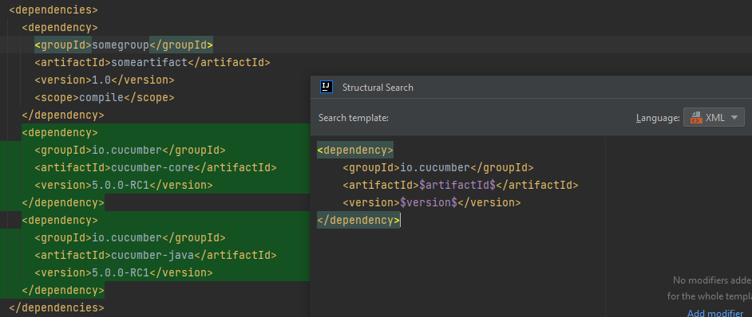
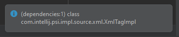

# Same version for all Cucumber dependencies in pom.xml

The [Cucumber-JVM documentation](https://cucumber.io/docs/installation/java/) states:
> Make sure the Cucumber version is the same for all Cucumber dependencies.

Thus, we are going to create a template in which we check the Cucumber dependency versions specified in a project's Maven pom.xml,
and report them, if at least one dependency's version differs from the other ones.

## Identifying the dependency versions

There are two ways in Maven to specify dependency versions: either explicitly as for example `4.6.8`, or via Maven properties such as `${cucumber.version}`.

We're going to handle only the explicit values: if the texts of the dependency versions are the same, the template won't match.

## Dependency format in pom.xml files

Dependencies in pom.xmls are specified in the following format (in this case specific to Cucumber):

```
<dependency>
    <groupId>io.cucumber</groupId>
    <artifactId>cucumber-java</artifactId>
    <version>5.6.7</version>
    <!-- ... -->
    <!-- other tags like <scope>, <type> or <exclusions> -->
</dependency>
```

## Template creation

### Match a single dependency

To target Cucumber specific dependencies, we'll start with the following template:

```
<dependency>
    <groupId>io.cucumber</groupId>
    <artifactId>$artifactId$</artifactId>
    <version>$version$</version>
</dependency>
```

where `$artifactId$` and `$version$` will match any text.

So far, so good. It matches the dependencies with the `io.cucumber` group id.



### Match multiple dependencies

The next step is to figure out how can we match multiple `io.cucumber` dependencies, and potentially be able to fetch the version numbers from all of those matched elements.

One straightforward way is to duplicate our template and define separate template variables for their artifact ids and version numbers. This way, the template handles those variables as separate elements, even if their values/texts are the same.

```
<dependency>
    <groupId>io.cucumber</groupId>
    <artifactId>$artifactId$</artifactId>
    <version>$version$</version>
</dependency>
<dependency>
    <groupId>io.cucumber</groupId>
    <artifactId>$artifactId_2$</artifactId>
    <version>$version_2$</version>
</dependency>
``` 

To check if the two version numbers are different, you can add a Script filter for the whole template (otherwise, adding it to a specific variable e.g. `$version$`, you wouldn't have access to the other variable, in this case `$version_2$`):

```groovy
version.text != version_2.text
```

This will make the template report dependencies where the two version numbers are different. Note: this doesn't handle the case when the versions are referenced via Maven properties.

This is great so far, but there are three major problems with this:
- if the `<scope>` or other extra dependency tags are specified in the tested code, the template won't match them,
- it matches only and exactly the first two `io.cucumber` dependencies in the examined file, but doesn't cover the case when there are more than two of them,
- it matches only consecutive `io.cucumber` dependencies, but not ones that have other dependencies in-between.

Let's try to handle these cases.

### Extra, optional dependency elements

So far, we had the `<groupId>`, `<artifactId>` and `<version>` tags in our template, but what if there are other tags as well within the dependencies, like `<scope>`?

One way to define optional extra elements is to add a new tag as a placeholder inside both of our `<dependency>` tags, so that both are 'told' to expect additional tags:

```xml
<dependency>
    <groupId>io.cucumber</groupId>
    <artifactId>$artifactId$</artifactId>
    <version>$version$</version>
    <$tag$/>
</dependency>
<dependency>
    <groupId>io.cucumber</groupId>
    <artifactId>$artifactId_2$</artifactId>
    <version>$version_2$</version>
    <$tag2$/>
</dependency>

```

`$tag$` and `$tag2$` are also added a Count filter with the *[0,inf.]* range, so that they indeed become optional.

There is only one problem with this: what if the additional tags are not specified after the `groupId`, `artifactId` and `version` tags in this order, but somewhere between them, or before them?

Now, we could do something like this (each `$tag*$` configured with the *[0,inf.]* range):

```xml
<dependency>
    <$tag$/>
    <groupId>io.cucumber</groupId>
    <$tag1$/>
    <artifactId>$artifactId$</artifactId>
    <$tag2$/>
    <version>$version$</version>
    <$tag3$/>
</dependency>
<dependency>
    <$tag4$/>
    <groupId>io.cucumber</groupId>
    <$tag5$/>
    <artifactId>$artifactId_2$</artifactId>
    <$tag6$/>
    <version>$version_2$</version>
    <$tag7$/>
</dependency>
```

but we can see that this can get out of hand quickly (and has just happened), especially if we want to include even more relevant tags, like `<scope>$scope$</scope>`, in the template.

We'll "handle" (rather ignore and work around) it in a Script filter later.

### Match more than two dependencies

For now, let's return to our simpler template. To match more than two `io.cucumber` dependencies, first, we could go with something like this:

```xml
<dependency>
    <groupId>io.cucumber</groupId>
    <artifactId>$artifactId$</artifactId>
    <version>$version$</version>
</dependency>
<dependency>
    <groupId>io.cucumber</groupId>
    <artifactId>$artifactId_2$</artifactId>
    <version>$version_2$</version>
</dependency>
<dependency>
    <groupId>io.cucumber</groupId>
    <artifactId>$artifactId_3$</artifactId>
    <version>$version_3$</version>
</dependency>
```

It quickly gets clear that this way, we can match only a fixed number of, and only consecutive dependencies, and handling a varying number of dependencies becomes difficult.

We could go with a template like this:

```xml
<$dependency$>
    <groupId>io.cucumber</groupId>
    <artifactId>$artifactId$</artifactId>
    <version>$version$</version>
</$dependency$>
```

where `$dependency$` is added a Count filter with the *[2,inf.]* range. It would solve the matching of varying number of elements, but would still report only the first matching ones, and moreover the first **consecutive** matching ones.

### Match not only consecutive dependencies

The following snippet (see `<$dependency2$/>`), to make the template order- and consecutiveness-insensitive, could be one quick solution, but we'll quickly learn that it doesn't really does the job for us:

```xml
<$dependency1$/>
<dependency>
    <groupId>io.cucumber</groupId>
    <artifactId>$artifactId$</artifactId>
    <version>$version$</version>
</dependency>
<$dependency2$/>
<dependency>
    <groupId>io.cucumber</groupId>
    <artifactId>$artifactId_2$</artifactId>
    <version>$version_2$</version>
</dependency>
<$dependency3$/>
```

Unfortunately, although this partially solves the matching more than two dependencies problem, this also matches dependencies other than `io.cucumber` via the numbered dependency template variables (`dependency1`, `dependency2` and `dependency3`).

Furthermore, if we replace the numbered dependency variables with `io.cucumber` specific ones, we would get a template that matches 5 consecutive `io.cucumber` dependencies, and we would still have the problem of having to handle their order and non-consecutiveness.

## Time to rethink

At this point it is becoming apparent that solving this with a (mostly) static template won't cut it.

Also, if we want to consider dependency tags in `<dependencies>` and `<dependencyManagement>` as well, not even mentioning parent and child poms (which this article won't discuss), we'll need a rather programmatic solution, and this is when some Script filtering comes into the picture.

## Let's start over

Let's establish that we want to report incorrectly versioned dependencies only within the `<dependencies>` element. That makes our job a bit easier.

The idea is to
- collect all `<dependency>` tags in the current file
- filter them by `io.cucumber` groupId
- compare their versions
- report them if they have different versions

The reporting part is a little tricky because in SSR templates either elements represented by template variables or the whole template can be selected as the target to highlight.

That would not necessarily be problematic with a static template, but Script filters return a true or false value, and they cannot register individual issues.

So, although not the most informative way, but we'll report the `<dependencies>` element if we find differing Cucumber package versions.

We can start with this template:

```xml
<$dependencies$/>
```

with a Text filter configured as *dependencies*, or this one:

```xml
<$dependencies$>
    <$dependency$/>
</$dependencies$>
```

with corresponding Text filters configured as *dependencies* and *dependency*, and a Count filter with *[2,inf.]* range for `$dependency$`.

I will demonstrate a few slightly different solutions, for which we'll make use of [IntelliJ's PSI API](https://plugins.jetbrains.com/docs/intellij/psi.html) for XML.

### The Script filter

We can handle the Script filter from the following perspectives:
- the `$dependencies$` variable
- the Complete Match variable

Targeting them from the `$dependency$` variable's perspective would not work, since we'd be able to target only a single `<dependency>` tag, not all of them.

#### The `$dependencies$` variable

First we need to find out the PSI class of the object that the `$dependencies$` variable holds.

A simple way is to log its class with the `__log__` variable available in Script filters.

```groovy
__log__.info(dependencies.getClass())
```

You'll get a notification message saying:



so we'll be able to use the [`XmlTagImpl`](https://github.com/JetBrains/intellij-community/blob/master/xml/xml-psi-impl/src/com/intellij/psi/impl/source/xml/XmlTagImpl.java)'s parent interface type [`com.intellij.psi.xml.XmlTag`](https://github.com/JetBrains/intellij-community/blob/master/xml/xml-psi-api/src/com/intellij/psi/xml/XmlTag.java).

First, let's make sure that if, for some reason, the type is not an `XmlTag`, then the script filter doesn't throw an exception:

```groovy
import com.intellij.psi.xml.XmlTag

if (!(dependencies instanceof XmlTag)) return false
```

In script filters, template variables can be referenced by their names without the enclosing $ symbols.

The next step is to collect all `<dependency>` tags inside `<dependencies>`.

We can call `dependencies.findSubTags('dependency')` to return all `<dependency>` tags, then to filter by the `io.cucumber` group id, we can use the following:

```groovy
var ioCucumberDeps = dependencies
    .findSubTags('dependency')
    .findAll { it.getSubTagText('groupId') == 'io.cucumber' }
```

In case there is no dependency returned, the template won't match, so we can just return without a match:

```groovy
if (ioCucumberDeps.isEmpty()) return false
```

There are a couple of ways we can go from here:

1) Get one of the dependency versions and use that as a reference when comparing with the rest:

   The final step is to retrieve one dependency version, the first one for simplicity, with which we'll compare the rest of them, and if at least one doesn't match, code highlighting is necessary:

    ```groovy
    //Get the <version> tag's text inside the first <dependency> tag
    var firstVersion = ioCucumberDeps[0].getSubTagText('version')
    ```

   a) Filter the complete collection of `<dependency>` tags by whether their version differs from the reference one. If there is at least one such item, do the highlighting.
    ```groovy
    !ioCucumberDeps
        .findAll { it.getSubTagText('version') != firstVersion }
        .isEmpty()
    ```

   b) Find the first dependency whose version differs from the reference one. If one is found, do the highlighting.
    ```groovy
    //Exclude/drop the first <depedency> tag from the comparison, because that is the one we are comparing the rest with.
    //Find the first dependency version that doesn't match the reference version.
    //If there is at least one, it is certain that highlighting is needed.
    ioCucumberDeps
        .drop(1)
        .find { it.getSubTagText('version') != firstVersion } != null
    ```
2) Use `unique()` from groovy collections to determine whether there is a different version.

    ```groovy
    ioCucumberDeps.unique { it.getSubTagText('version') }.size > 1
    ```

Using the latter comparison logic, the complete filter will look like this:


```groovy
import com.intellij.psi.xml.XmlTag

if (!(dependencies instanceof XmlTag)) return false
var ioCucumberDeps = dependencies
    .findSubTags('dependency')
    .findAll { it.getSubTagText('groupId') == 'io.cucumber' }
if (ioCucumberDeps.isEmpty()) return false
ioCucumberDeps.unique { it.getSubTagText('version') }.size > 1
```

#### The Complete Match variable

This solution is very similar to the previous one. The only difference is in how the `<dependency>` tags are collected. While in the previous version, they were retrieved as the sub tags of `<dependencies>`, here we are handed them automatically via the `$dependency$` variable.

It is important to mention that the type of PSI object `$dependency$` holds is different when the Script filter is used in the Complete Match variable compared to when it is used in `$dependency$`.

In case of `$dependency$`, it would be an `XmlTag`, while in the Complete Match variable, it is an `java.util.ArrayList` of `XmlTag`s (the `<dependency>` tags in this case), since the context the variable sees is broader.

Based on this information, only the beginning of our previous Script filter becomes slightly different, to handle the different variable type:


```groovy
import java.util.List

if (!(dependency instanceof List)) return false
var ioCucumberDeps = dependency.findAll { it.getSubTagText('groupId') == 'io.cucumber' }
```

So, the complete Script filter looks like this:

```groovy
import java.util.List

if (!(dependency instanceof List)) return false
var ioCucumberDeps = dependency.findAll { it.getSubTagText('groupId') == 'io.cucumber' }
if (ioCucumberDeps.isEmpty()) return false
ioCucumberDeps.unique { it.getSubTagText('version') }.size > 1
```

## Closing thoughts

Of course, there may be other various ways of building the Script filter, additional logic to handle different edge cases, Maven properties, dependencies within `<dependencyManagement>`, and more, but I wanted to keep this article fairly simple. (I'm saying this after I wrote a short novel worth of material in this article :)).

I might delve into those aspects in the future, but can't make any promises.
